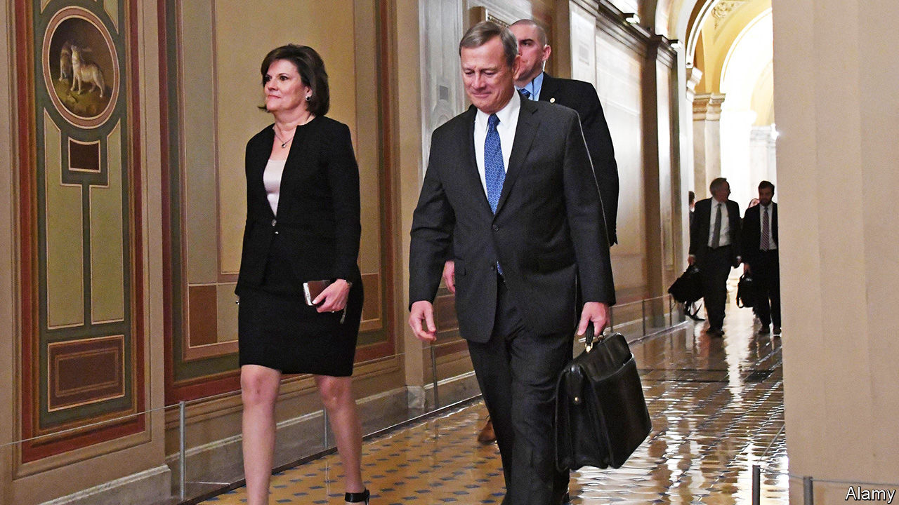

## Hail to the chief

# Justice John Roberts joins the Supreme Court’s liberal wing in some key rulings

> But he is not tilting left

> Jul 2nd 2020NEW YORK

FOR A THIRD time in as many weeks John Roberts, America’s conservative chief justice, has sided with his liberal colleagues in a big case. After his votes on LGBT rights and immigrant protections, on June 29th he was the linchpin in a 5-4 decision striking down a law that would have limited abortion access in Louisiana. This brought cheers from liberals and howls from conservatives. Josh Hawley, a senator from Missouri and Chief Justice Roberts’s former clerk, called June Medical Services v Russo, the abortion decision, a “disaster” and accused his old boss (without naming him) of “perpetuat[ing] bad precedent while barely bothering to explain why.”

The precedent Mr Hawley deplores is Whole Woman’s Health v Hellerstedt, a decision in 2016 rejecting a Texas law that purported to protect women’s health while regulating about half of the state’s abortion clinics out of existence. Chief Justice Roberts is no fan of Whole Woman’s Health, either: he was among the dissenting trio of justices in the 5-3 ruling. This week in June Medical he repeated his disdain for the earlier decision, but explained that stare decisis—Latin for “let the decision stand”—required the court “to treat like cases alike”. Since the Louisiana requirement that abortion providers must secure admitting privileges at a hospital within 30 miles was “nearly identical” to the doomed Texas rule, and imposed a similarly “substantial obstacle” to abortion access, the outcome should be the same. The court must not upend its own judgment a mere four years on.

Yet, with an eye on future cases, the chief justice proceeded to undercut the very precedent he had relied upon to reject Louisiana’s law. Whole Woman’s Health said judges should consider both the benefits and burdens of a regulation. But weighing the two against each other, Chief Justice Roberts wrote, is a job for the legislature, not the courts. If a regulation does not make it exceedingly hard for women to procure abortions it would probably pass constitutional muster, no matter how slight or illusory the benefit. This may be read as an invitation to Republican-run states to cook up restrictive abortion laws as long as they can be pitched as not too burdensome—and are not replicas of a law the court has already rejected.

A more radical opportunity to turn the tide on abortion lurks in the chief justice’s opinion. He emphasises that June Medical is not about Roe v Wade, the ruling in 1973 that protects a woman’s right to abortion. Though Justice Clarence Thomas, in dissent, charged that the court’s abortion jurisprudence “remains in a state of utter entropy” and ought to be thrown out in its entirety, Chief Justice Roberts demurred. “Neither party has asked us to reassess the constitutional validity” of the abortion right itself, he wrote. If plaintiffs come asking—as they are in Georgia and Alabama, where near-blanket abortion bans are working their way through the courts—he might be willing to reconsider Roe.

There are loopholes in the other liberal victories, too. Though Chief Justice Roberts joined the left side of the bench (and Justice Neil Gorsuch) to bar workplace bias against gay and trans people, the majority opinion leaves open whether employers with religious objections to hiring LGBT workers might, in some circumstances, have a licence to discriminate. And in the case halting President Donald Trump’s cancellation of DACA (Deferred Action for Childhood Arrivals), the chief justice noted that the merits of ending Barack Obama’s programme were not the question. Mr Trump could still kill DACA if he would only follow basic standards of administrative law. The chief justice sent the president the same message a year ago when he refused to bless the administration’s flubbed quest to add a citizenship question to the 2020 census, but hinted it could try again.

Two other decisions penned by Chief Justice Roberts this week also came out 5-4—but with the liberals in their more familiar position as dissenters. The first of these was Seila Law v Consumer Financial Protection Bureau (CFPB), a challenge to the design of a federal agency set up after the recession of 2007-09. The majority did not break up the CFPB but, dampening its independence, gave the president the power to fire its director whenever he pleases. Then, on June 30th, the chief justice anchored Espinoza v Montana Department of Revenue, requiring any state that funds secular private schools to fund religious schools, too. Both rulings, cloaked as inevitable outgrowths of earlier cases, were in fact profound shifts in the law.

Acting boldly through superficially small steps—and getting credit for aisle-crossing while giving liberals at best temporary solace—seems to be panning out well for Chief Justice Roberts. He is cultivating a reputation for non-partisanship at the Supreme Court while advancing primarily conservative goals. And he’s winning: of the 53 cases decided so far this term, he has been in the majority in 52. ■

## URL

https://www.economist.com/united-states/2020/07/02/justice-john-roberts-joins-the-supreme-courts-liberal-wing-in-some-key-rulings
