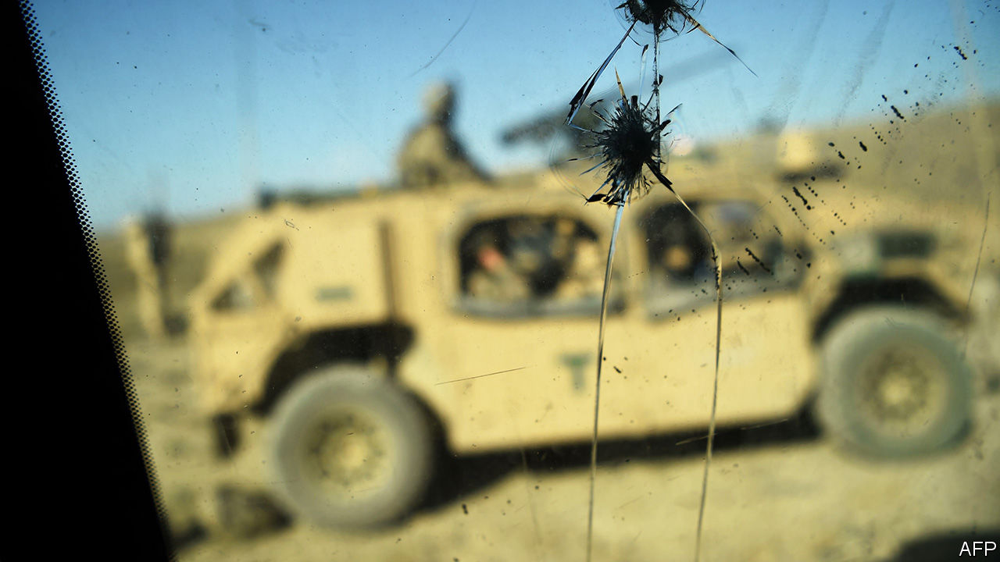

## Pandering to the bear

# Russia allegedly offered bounties for killing American soldiers

> The president doesn’t believe it

> Jul 2nd 2020

DONALD TRUMP’S blind spot for Russian aggression might seem like a stale fact of American political life by now—were it not that the aggression keeps getting worse. The latest example, according to an intelligence leak to the New York Times, which has since been widely corroborated, was a Russian scheme to pay bounties to Islamic militants in Afghanistan in return for killing American soldiers. A possible attempt to derail the peace deal signed between America and the Taliban in January, the scheme may have been behind the killing of three US marines last year.

Evidence of it is reported to include testimonies from captured militants and half a million dollars retrieved by Afghan agents. There are reported to have been initial doubts about the intelligence’s reliability. But it was nonetheless thought solid enough to be included in Mr Trump’s daily intelligence briefing dossier in late February. It was discussed in an inter-agency meeting at the National Security Council in March. Possible American reprisals for the alleged plot are said to have been drawn up—ranging from raising the issue with Russia to slapping sanctions on it. Yet the matter appears to have ended there.

Mr Trump claims to have known nothing about any of this, his gatekeepers having ruled the intelligence too flaky to be worth his time. His spokeswoman, Kayleigh McEnany, did not deny that it had been included in his daily brief. (Having thus implied the well-established fact that Mr Trump does not read his intelligence briefings, she uttered the memorable defence: “The president does read.”) Mr Trump subsequently upped the ante, calling the alleged bounty plot “just another HOAX”. However by then members of Congress from both parties had been briefed on the evidence and ruled it worrying enough to warrant further investigation. As The Economist went to press, the Gang of Eight—which includes the congressional leaders of both parties and their foremost representatives on the House and Senate intelligence committees—were awaiting an additional briefing from Gina Haspel, the CIA director.

What explains Mr Trump’s softness on Russia? According to his former national security, John Bolton, the president “repeatedly objected to criticising Russia and pressed us not to be critical of Russia publicly.” Even if Mr Trump had not known about the alleged bounty scheme, the alacrity with which he sought to rubbish it this week is in itself remarkable. There is no good explanation for this weakness. Yet at least two things can be said of it with certainty.

First, it has already made a nonsense of the administration’s decision to place Russia alongside China as a “revisionist power” in its 2017 National Security Strategy. Sceptics warned from the start that elevating the threat of a country with an economy smaller than Canada’s to this degree made no sense. And to be thus aggrandised could only delight, and probably embolden, Russia—as seems to have happened. It has celebrated its “revisionist” status in all manner of needling and worse ways: including assassinations in NATO allies, stepped-up cyber operations, sabre-rattling jet flights off the coast of Alaska. And instead of pushing back hard on this misbehaviour—which his administration unwittingly encouraged—Mr Trump has downplayed and denied it, while meanwhile lobbying for Russia to be readmitted to the G7.

Second, the damage this is doing to US democracy is significant. Half of Americans think their president is a shill for the Kremlin. The other half think Russia isn’t so bad after all. This is an even bigger win for Mr Putin than whatever his killers were up to in Afghanistan.