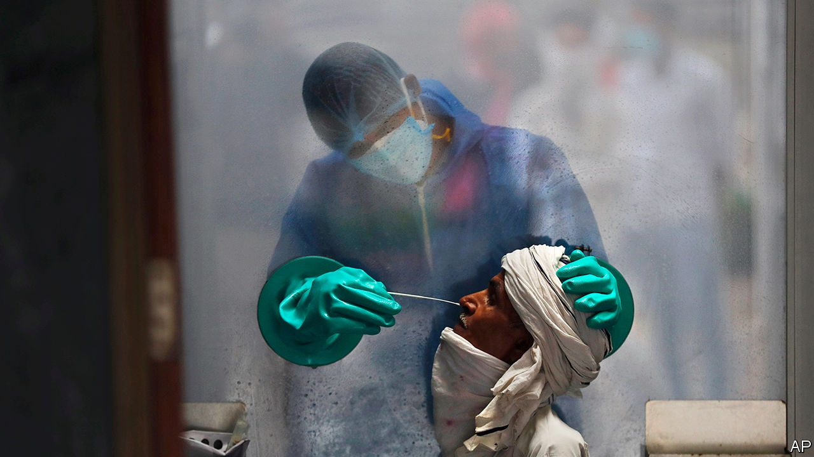
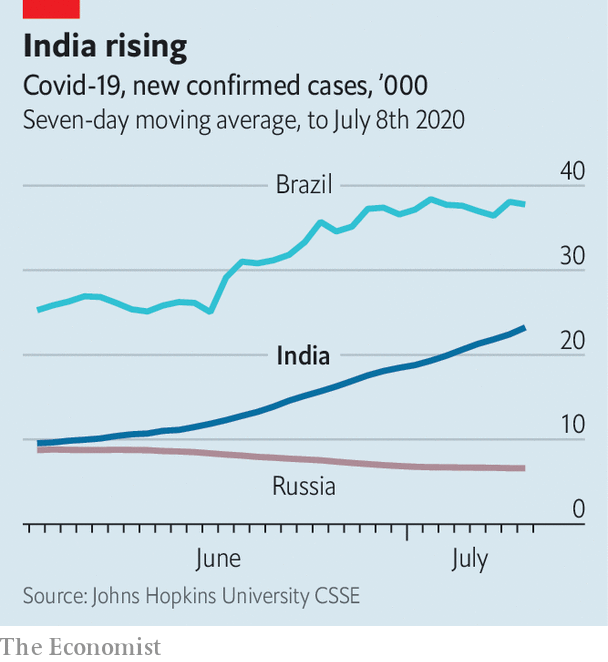

## Testing times

# Infections in India are soaring, but increased testing will help

> Covid-19 has spread from big cities to country towns with alarming speed

> Jul 9th 2020DELHI

Editor’s note: Some of our covid-19 coverage is free for readers of The Economist Today, our daily [newsletter](https://www.economist.com/https://my.economist.com/user#newsletter). For more stories and our pandemic tracker, see our [hub](https://www.economist.com//news/2020/03/11/the-economists-coverage-of-the-coronavirus)

SANDEEP IS ANXIOUS. A few days ago the owner of the clinic where his wife works as a receptionist came down with covid-19. Authorities sealed the building and whisked her off to quarantine, then sent him to a different isolation centre. Stuck now in a hostel, he worries that even if he tests negative, the families whose clothes he irons for a living will be afraid to let him back. They won’t appreciate that he covered for them, lying when asked if he had been visiting houses lately. “I didn’t want to inconvenience customers who might get forced to be tested,” he explains. With the clinic also holding up his wife’s salary, the couple will have to borrow to stay afloat.

Sangli, the big country town where Sandeep (not his real name) lives, is 300km (190 miles) south-east of Mumbai. Until recently the pandemic had spared such places. Now, even as the curve has flattened or fallen in Delhi and Mumbai, it is arching sharply upwards in satellite towns, and penetrating ever further into the interior. It is this surge that is pushing India inexorably upwards in the league of covid cases and which, given its population of 1.3bn, will probably see it rise to the top. The wave is moving beyond those parts of the country that are best equipped to manage it, to places that may prove far more vulnerable.

With nearly 800,000 confirmed cases so far, India ranks third after America and Brazil in infections. The tally of covid deaths, over 21,000, is relatively modest. It works out at fewer than 15 per million, a quarter of the world average and a fraction of the 651 per million in Britain. But, for reasons ranging from the relatively low level of testing to spotty medical record-keeping to political interference, many experts believe India is undercounting deaths by a third or more. With cases rising by some 25,000 a day (see chart), fatalities are anyway bound to soar.

Unlike Brazil and America, India responded quickly and forcefully to the pandemic. Perhaps too quickly: two months of nationwide lockdown shattered the economy, but only slowed the disease. “You flattened the wrong curve,” is how Rajiv Bajaj, a prominent businessman, puts it. One deadly error was to freeze all travel with no warning, trapping millions of migrant workers where they were no longer wanted, in big cities with the highest rates of infection, and then later to let them go, carrying the infection with them. Local edicts have caused similar spikes: the state government in Tamil Nadu has declared several sudden lockdowns, prompting crowding in markets that have proved dangerous vectors for covid.

At Sulerikadu, south of the state capital Chennai, fishermen complain that when lockdown was lifted after eight weeks, a seasonal ban on fishing kept the fleet grounded. This was followed by a closure of the market, so that when they could at last catch fish they had no place to sell it. Nearby farmers voice similar despair. A transport ban at harvest time kept many from selling their crops. Individuals are not the only ones hurt. In the last two weeks of June, with shops everywhere mostly open for the first time since March, nationwide sales remained a dismal 67% lower than in the same period last year, says the Retail Association of India.

Yet even as tales of economic woe multiply, and are compounded by the spreading tragedy of covid itself, lessons are being learned. Some Indian states, such as Kerala in the far south and Punjab in the north, have ably contained the disease. Dharavi, a sprawling slum in Mumbai whose density and poor sanitation seemed likely to create conditions for covid to spin out of control, has instead proved a model of how thoughtful, local interventions in co-operation with residents can stem its spread. From hundreds a day in May, new daily infections among the slum’s 850,000 people are down to a handful.

In India’s big cities, fears that hospitals would be overwhelmed have for the most part failed to materialise, largely because medical protocols have been revised to keep all but those who are very ill from occupying beds. Hospitals, for example, can now send covid patients home as soon as they feel better, rather than having to wait for test results to prove they are free of the virus. One district of Delhi requisitioned more than 900 hotel rooms for use as isolation wards. In the end it has used just 25. The change in rules has also meant a welcome drop in what had become a nationwide rash of stories about patients being turned away from one hospital after another, for want of beds.

Another fear, that India would run out of ventilators, turned out to be still more misplaced. Even as doctors were finding that few patients benefited from forced ventilation, Indian manufacturers boosted production from 300 a month to some 30,000. Indian industry has proved so responsive to the crisis that it is now lobbying the government to drop restrictions on exports of medical equipment and protective gear. Makers of covid tests complain that their production was far outstripping the number of tests conducted, owing to cautious government guidance. At the centre’s behest, local authorities in Mumbai changed the rules no fewer than nine times. Often, even medical staff could not get tested—one reason why India has lost more than 100 doctors to the disease.

With the price of tests dropping and restrictions on their use lifted, the country should soon be conducting more than the current 200,000 a day. Mylab, a company based in the city of Pune, says it alone has the capacity to process 2m samples a week. This could be a big help, since testing allows a better understanding of the disease’s trajectory. Researchers at MIT recently suggested that India could have as many as 287,000 new infections a day by January, based on the old level of testing. That picture should now improve. Yet Sandeep, for one, is not reassured. Even in a relative backwater like Sangli, 28 neighbourhoods have been quarantined. “The number of cases is increasing a lot,” he says. “People should take it seriously. Only when it hits you do you know how bad it is.” ■

## URL

https://www.economist.com/asia/2020/07/09/infections-in-india-are-soaring-but-increased-testing-will-help
