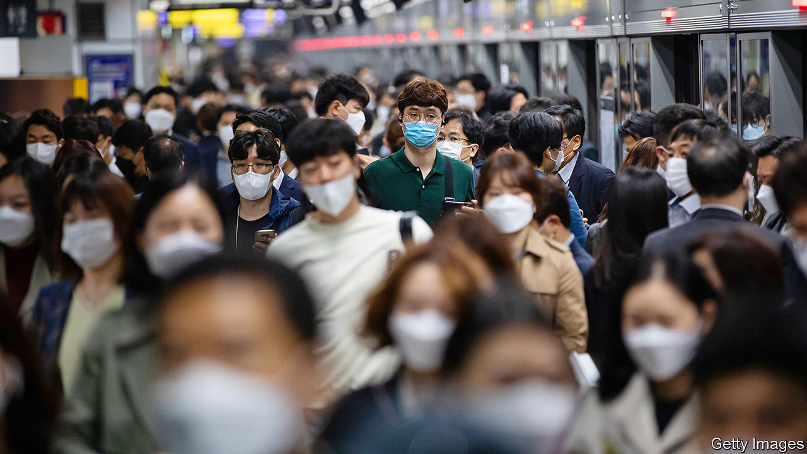

## Seoul v everywhere else

# South Korea is rethinking its efforts to spread the wealth

> Instead of trying to build spiffy new cities, it is buffing up old ones

> Jul 9th 2020JINJU

THE ROAD from Jinju’s high-speed train station towards the outskirts of town winds past row after row of brand-new high-rise apartment blocks decorated in dark grey and ochre. The buildings are surrounded by half-finished strip malls with mock-European brick facades. Construction is frantic, though large posters advertise steep discounts on flats in the finished complexes.

The buildings are the beginnings of Jinju’s “innovation city”, one of 12 such projects dotted around South Korea that are meant to reduce the concentration of politics, wealth and culture in the capital, Seoul. Jinju is supposed to become a hub for biotech and aerospace, creating tens of thousands of jobs in a region with comparatively little industrial heritage and thus encouraging internal migration.

Seoul, the neighbouring city of Incheon and the surrounding province of Gyeonggi are home to half of South Korea’s 52m people and produce half of its wealth. Vibrant and full of opportunity, the capital region is also congested, expensive and stressful to live in. The innovation cities, conceived in the mid-2000s and modelled on earlier plans for “balanced development”, are one of a long series of policies aiming to help less buoyant places advance.

The same impulse led to the creation of Sejong, the new administrative capital, 100km (60 miles) south of Seoul. A decade ago it was little more than a handful of building sites amid peach farms. Now wide streets and leafy paths surround ranks of apartment buildings, through which snakes an enormous glass-panelled government complex. More than half of South Korea’s ministries and dozens of government agencies have been relocated there since 2012. Around 300,000 people live in the area. Some are civil servants who have moved from Seoul, but most are locals whose former communities have been absorbed into the new city.

But for all the rapidity of its development, Sejong is a far cry from Seoul. Yoo Kyung-weon, a young official from the capital, moved to Sejong for her job but says a lot of her colleagues did not. “It’s cheaper than Seoul and I can cycle to work in a few minutes, which is nice,” she says. “But there’s nothing to do here, and every time I go out I worry about bumping into someone I work with.” She frequently spends her weekends back in Seoul.

Urban planners doubt that new cities will dent the capital’s supremacy. “Over the past 20 years, the economic disparity between Seoul and elsewhere has actually increased, despite all of these policies,” says Kang Myoung-gu of Seoul University. “People used to move to Seoul because they had to if they wanted to find work,” he says. “Now they come or stay because they want to. They like urban amenities, restaurants, green spaces, texture. You’re not going to convince anyone to move across the country if you can’t provide that.” He thinks the solution to Seoul’s problems is local. “We need to expand infrastructure and make public space better for everyone.”

Back in Jinju, a young mother who used to live in the older part of town says she enjoys life closer to schools and green spaces. Rather then enticing Seoulites, innovation cities seem to attract people from the surrounding areas. Villages and towns in poorer regions around innovation cities have higher-than-usual vacancy rates, which suggests the cities may simply be sapping economic vitality in their hinterland. As South Korea’s population declines, such trends will accelerate.

As a result, the government has begun to emphasise urban regeneration over building towns from scratch. Residents have a say in what they feel needs doing to improve their environment. In Jochiwon, a town half an hour from the government complex in Sejong, locals have planted a public garden around the old train station, installed a co-working space and convinced the city to pedestrianise some nearby streets.

Planners such as Mr Kang dismiss this approach as “planting flowers and painting walls”, but residents consider the place much improved from a few years ago. “The idea is to improve quality of life while preserving the fabric of a place,” says Lee Ji-hye of the Ministry of Land, which is now located in Sejong. ■