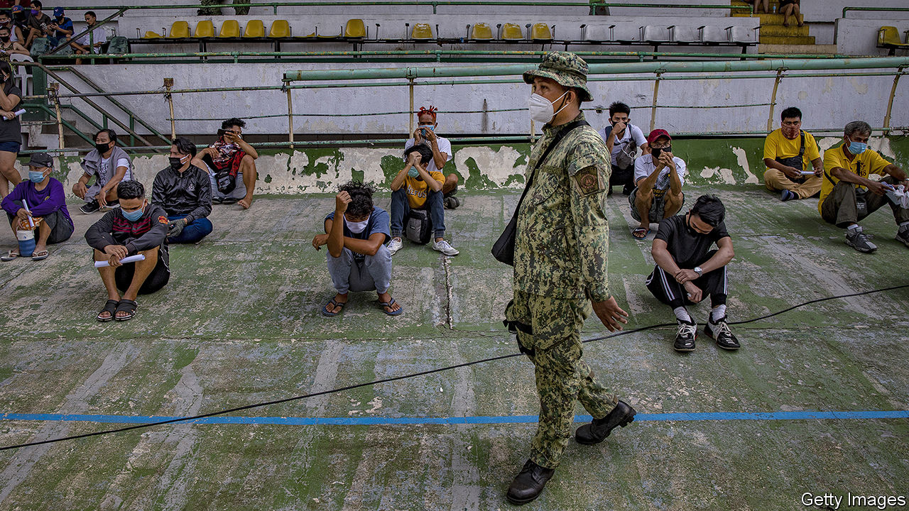

## Four months and counting

# The Philippines’ fierce lockdown drags on, despite uncertain benefits

> Enforcement has been vigorous but patchy

> Jul 11th 2020

“I’M CONSTANTLY AFRAID that we will get infected,” frets Diverson Bloso, “We don’t have money to bring us to the hospital, in case that happened.” A messenger at a printing press in Quezon City, part of Manila’s sprawl, he prays he keeps his job. His boss told workers that the business might have to close because of quarantine measures to stop the spread of covid-19. But at least Mr Bloso still has regular income. A woman who lost her job at an online casino says the restrictions have prevented her from attending interviews for new jobs. With her husband in jail, she worries about how she will pay the bills for her and her child. “It’s been terrible for me and my family,” she says.

The Philippines’ lockdown, among the fiercest and longest-lasting in the world, has been terrible for millions of others too. On March 16th the government imposed “Enhanced Community Quarantine” (ECQ) across the island of Luzon, home to Manila and about half the country’s 107m people. Schools and offices closed and public transport shut down. People were only supposed to leave home to buy food and other essentials. In many areas, even then, they were required to obtain a special pass from a local official to be able to move around. Other parts of the country adopted similar rules. Some provinces sealed their borders. Manila’s residents were supposed to be free again by April 13th. Instead, the lockdown has been repeatedly extended. It was relaxed slightly on June 1st to make it easier to work, but will remain in place at least until July 15th.

Enforcement has been ferocious. Some 130,000 people, including those pictured, have been arrested or fined, often for small infractions such as failing to wear a mask. Were the army and police to encounter any violent lockdown violators, instructed Rodrigo Duterte, the president, with characteristic compassion, they should “shoot them dead”. But the rules have also been applied unevenly: Manila’s police chief hosted himself a boozy birthday party in May despite the ECQ’s stipulations and a ban on liquor sales.

In the meantime, more than 50,000 Filipinos have tested positive for covid-19. The University of the Philippines reckons there might have been 3.6m cases without the lockdown, a figure the government likes to trumpet. The number of deaths each day has dropped sharply since late March, and the ECQ bought the government time to ramp up laboratory capacity and to ready beds for patients. But the number of cases detected each day has been rising fast, despite a relative dearth of testing.

The Department of Health’s response to the virus has been plagued by “irregularities and anomalies” that have attracted the attention of the government ombudsman. An investigation is under way into confused reporting of infections and delays in purchasing protective equipment for health-care workers, among other matters.

This bureaucratic fiasco and the uncertainty over case numbers may help to explain why the lockdowns have lasted so long. They have been lifted in some cities outside Luzon, only to be reimposed when cases began rising wildly. Ronald Mendoza of Ateneo de Manila University argues for more targeted quarantines. Metaphorically speaking the government has been using an axe, he reckons, when it really needs only a scalpel.

Relaxing restrictions should soothe the country’s pummelled economy: the World Bank forecasts that it will shrink by almost 2% this year. The coronavirus has brought to an end 84 quarters of uninterrupted growth in the Philippines. The quarantine on Luzon alone may displace 11m workers from their jobs, reckons IBON, a research firm in Manila. And the lifelines that helped Filipinos stay afloat during the global financial crisis are fraying, too: remittances from Filipinos working abroad, as domestic helpers, nurses and the like, look set to fall by a fifth this year.

According to surveys carried out in May via mobile phone by Social Weather Stations (SWS), a pollster, 83% of working-age Filipinos say their quality of life has declined versus a year ago. That is the worst result in the 37 years that SWS has been conducting surveys. The government’s efforts to help have been as patchy as the lockdowns. It has distributed 200bn pesos ($4bn) to 18m poor families. But delays have beset other schemes, including one offering wage subsidies for employees at small and medium-sized businesses.

Mr Duterte’s priority appears to be boosting his own authority. A temporary law, approved by Congress in March but allowed to expire in June, gave him special powers to deal with the pandemic. On July 3rd he signed into law a sweeping anti-terrorism bill which, among other things, allows suspects to be detained without a judge’s approval for up to 14 days. How this will help the Philippines through its current trauma is anyone’s guess. ■

Editor’s note: Some of our covid-19 coverage is free for readers of The Economist Today, our daily [newsletter](https://www.economist.com/https://my.economist.com/user#newsletter). For more stories and our pandemic tracker, see our [hub](https://www.economist.com//news/2020/03/11/the-economists-coverage-of-the-coronavirus)

## URL

https://www.economist.com/asia/2020/07/11/the-philippines-fierce-lockdown-drags-on-despite-uncertain-benefits
