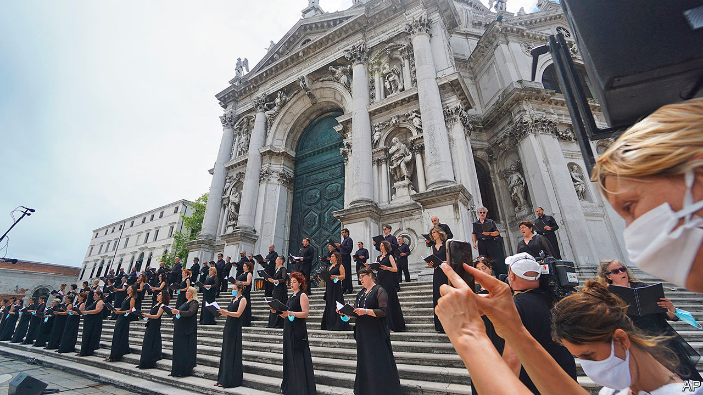

## Voices off

# Choral singing has been hit hard by the pandemic

> Its social aspect—the main appeal for many singers—now makes it seem risky

> Jul 8th 2020

A FEW MONTHS ago Emilia Olsson, a social worker in Sweden, received an email from her amateur choir informing her that, because of covid-19, there would be no rehearsals for a couple of weeks. Then they were cancelled until the summer. She missed the music-making, Ms Olsson says, but especially the sense of community, which had prompted her to join the choir in the first place.

A quintessentially social art form, choral singing has been devastated by the pandemic. Suddenly, groups of people exhaling together in close proximity seem dangerous. According to Sonja Greiner of the European Choral Association-Europa Cantat (ECA-EC), an umbrella group for choirs, rumours of super-spreading at rehearsals were unfounded. In any event, they were suspended en masse, along with concerts and church services.

All this is causing financial hardship for professional singers and heartbreak for amateurs. According to Chorus America, a networking group, 42.6m Americans regularly sing in choirs; the country has almost 270,000 choruses, most of them religious. In Europe an estimated 37m people take part. In many places, choirs bring together individuals who have little in common besides a love of music. Researchers at Oxford University, and at the universities of Oldenburg and Vienna, have found that amateur choral singing helps establish bonds and boosts feelings of connectedness.

In a recent survey by the ECA-EC, virtually all respondents said their choirs had been affected by the virus. Some are able to rehearse online, but the social aspect—the main appeal for many singers, which now makes the activity seem risky—is harder to replicate. “The joy of making music with others,” says Annie Sedley, who sings with the Royal Free Music Society Choir in north London, “the excitement of the performance—all that has gone.” Her choir meets for Zoom sessions while its members “dream of getting together again”. “The choir plays an important role at our church,” says Charles Olson, who sings at North Park Covenant Church in Chicago, “so this situation is devastating.”

Like other artists, meanwhile, professional singers, most of whom are freelancers, are struggling financially. “There’s just no work,” laments Lawrence Wallington, a British bass who has sung with the choir of Westminster Abbey, among others. Mr Wallington doesn’t know when he will perform again; he is hoping that a concert scheduled for November will prove feasible. By then he will have gone more than half a year without choral singing—and without an income.

Westminster Abbey’s choir, which kept singing through the second world war, is bound to survive the pandemic. Others will adapt to a new, socially distanced reality. Justin Doyle, conductor of the RIAS Chamber Choir in Berlin, suggests the disruption could be a spur to new formats. After the hiatus, his group’s live performances may involve three teams of singers taking turns to deliver the same programme to small audiences. “We can innovate more than football can,” Mr Doyle reckons.

But without targeted financial support, many other ensembles may have to fold; the prospects of the highly regarded Vienna Boys’ Choir, among others, look bleak. For many enthusiasts, life after lockdown will be less melodious, and lonelier. ■