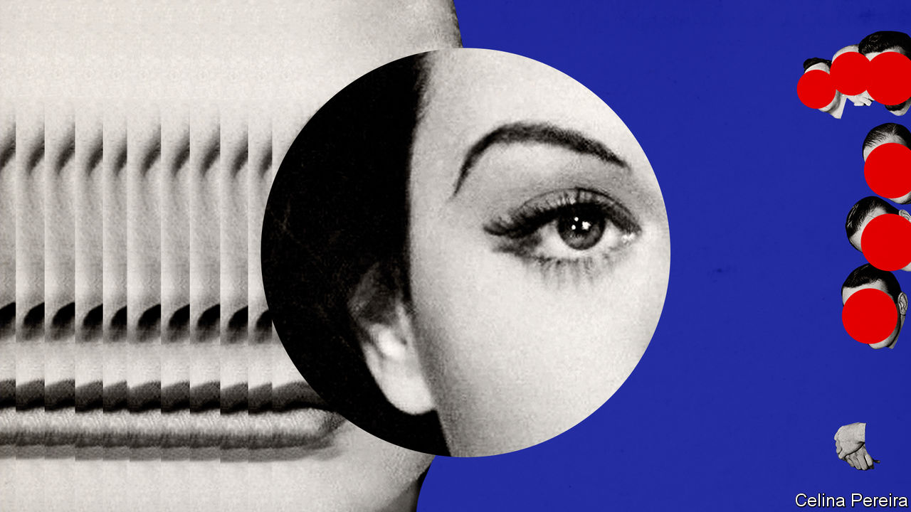

## Party like it’s 1999

# How the intellectual coalition forged by the cold war collapsed

> It splintered amid the rise of populism, as Anne Applebaum recounts in “Twilight of Democracy”

> Jul 11th 2020

Twilight of Democracy. By Anne Applebaum. Doubleday; 224 pages; $25. Penguin; £16.99.

FOR AT LEAST a decade after the end of the cold war, anti-communist intellectuals rode the crest of a wave. The Soviet system had imploded, miraculously, but there was work—important, exhilarating work—to be done in eliminating its vestiges and uncovering its misdeeds. As an American-born chronicler of communism, Anne Applebaum surfed that wave with aplomb. She wrote incisive books about the Soviet penal system and the Western fools who failed to see its horrors; about Stalin’s campaign, after 1945, to crush democracy in half of Europe; and about the appalling famine he inflicted on Ukraine in the 1930s.

In “Twilight of Democracy”, her tone is more personal and vulnerable. The informal transatlantic coalition of politicians, scholars and writers to which she belonged has broken up, and the worst parts have, for now, come out on top. From Brexit Britain and Donald Trump’s America to the cynical politics of Poland and Hungary, she feels beset by a new chauvinist right that has no regard for rules, truth or institutions.

Ms Applebaum evokes an acute sense of betrayal as people she trusted turn against her, quicker than she thought possible. Her personal story is a parable of what can happen to alliances in the absence of a common adversary, and when the hardships such enemies inflicted fade from memory. It has another implication, too. As she shifts between ruminations over political science and anecdotes meant to expose the nastiness of the new political right, she sometimes brings home the complacency of her own tribe of liberal internationalists who thought that history, if not quite over, was bound to evolve benignly.

The author, who in the late 1980s and early 1990s wrote for The Economist, is frank about herself: an insider with stratospheric links to the American and above all British commentariat, married to Radek Sikorski, a Pole who studied in Britain and hobnobbed with its gilded Conservative youth, including Boris Johnson (now the prime minister). The book begins with an exuberant party which the couple threw at their manor house in Poland in 1999, gathering in foreign and Polish friends for stew, liquor and a few celebratory pistol-shots. Since then, both have flown high—she as a prizewinning writer, he as Poland’s defence and foreign minister.

But in other ways, life has delivered shocks. She no longer speaks to many of the guests, because they succumbed to the authoritarian temptations of the Law and Justice party that has dominated Polish politics since 2015. They have thus adopted an outlook that sees imaginary enemies everywhere, plays on anti-immigrant and anti-gay sentiment and has no respect for independent judges or media. Ms Applebaum, a product of secular Jewish America, has been singled out for opprobrium.

In various political case studies, she finds a style that assuages a yearning for simple answers. In Poland, a master-narrative was provided by conspiracy theories about the plane crash in Russia in 2010 that killed President Lech Kaczynski. (He recklessly insisted on landing in fog.) In Hungary, the Jewish philanthropist George Soros has become a bogeyman. Ms Applebaum’s erstwhile British friends see leaving the European Union as a panacea. Mr Trump excoriates the liberal elite and even the moderate Republicans who are Ms Applebaum’s natural allies.

What interests her most is the phenomenon described by a French writer in 1927 as the treason of the intellectuals: the way many academics, editors and leaders of civil society have been supine or collaborative in the face of populist authoritarianism. Her sharpest passages describe the milieu of British Tory journalism in which she once sat at the top table in every sense. Few gain entry into this charmed circle only to break out of it. As deputy editor of the Spectator, a right-of-centre weekly, and co-host of its networking lunches, the author joined a scene where every conversation was laced with multilayered irony—a baffling British subculture in which real feelings are carefully hidden.

She reveres Margaret Thatcher’s memory, but her account lays bare the inherent contradictions of Thatcherism—an appeal to preserve old mores and communities combined with economic change that wrecked them. Once the EU was identified as the enemy, she suggests, the mawkish nostalgia felt by her former friends could let rip. But newcomers like her had no place in that fiercely sentimental world.

In the United States and Hungary, her personal ties are weaker and her observations more abstract. But she mournfully anatomises the breakdown of America’s anti-communist coalition. She thought she was part of a moral crusade to spread constitutional principles and the rule of law. Now she realises that there were other agendas at work. Some American conservatives were most concerned with spreading Christianity; for them, Vladimir Putin’s Russia has (bizarrely) become an attractive alternative to the decadent West. Some saw the defence of America’s narrow national interests from all comers, including immigrants, as paramount. Many never had that much interest in advancing democracy.

This is too short a book to probe deeply into the roots of the conservative camp’s embrace of coarse populism. In any case, though, Ms Applebaum evinces relatively little interest in why ordinary voters are tempted by that option. She notes that neither economic hardship nor migration flows are correlated in any linear way with rightward political lurches (Hungarians, for instance, are obsessed with migrants who do not actually exist). But those factors are surely not irrelevant either.

Elites and would-be elites concern Ms Applebaum far more—and these, she knows and describes well. Her approach is touchingly intimate; “Twilight of Democracy” ends with the onset of the pandemic, which forced her and one of her sons to race back to Poland before the borders closed. But her fine book would have been even better if there were clearer hints of self-awareness in her description of the liberal internationalist project. The effervescent mood of 1999 reflected not just a moral victory over Soviet darkness but the apparently unchallenged might of the United States. Ronald Reagan and Thatcher had helped bring down communism; Bill Clinton and Tony Blair felt they could export liberal democracy everywhere. But even then, plenty of conservatives had doubts, including some of Ms Applebaum’s Tory friends, brought up as they were on Rudyard Kipling’s imperial pessimism.

Given the finitude of all human endeavours, and of individual careers, that whole enterprise was always in danger of stalling as global power balances shifted. As a result, defending truth, law and liberty has again become a hard job for principled characters prepared to put friendships, livelihoods and even lives on the line. Such people continue to exist; Ms Applebaum herself is one of them, albeit among the less imperilled. Meanwhile, pandemics permitting, she and her husband will still throw parties—the book features another shindig, held 20 years after the first. But now the guest list is shorter. ■