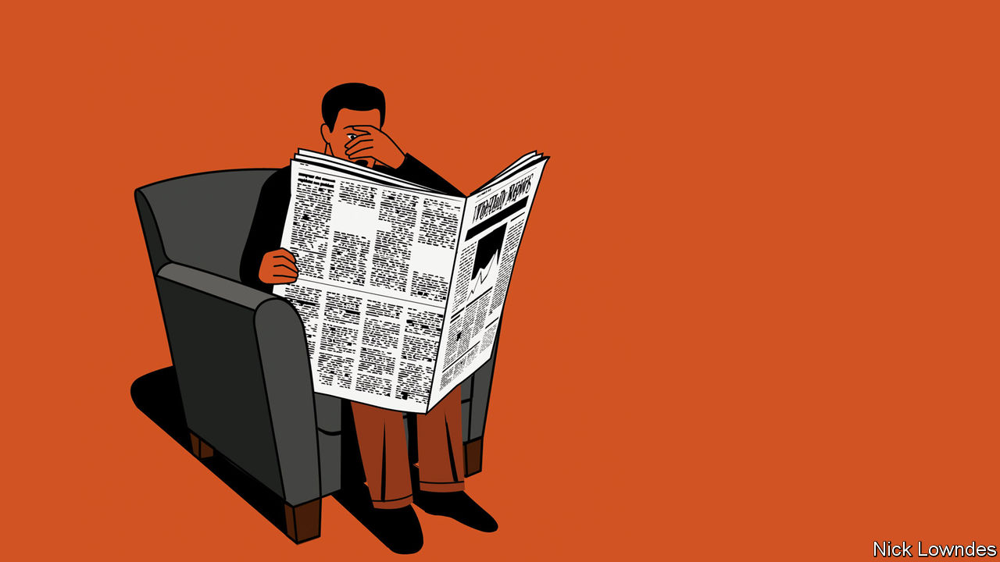

## Johnson

# Papers should print offensive language if it is crucial to a story

> The issue is part of a larger question: should they publish upsetting material?

> Jul 9th 2020

THIS COLUMN comes with an unusual warning—the type that is sometimes called a trigger warning. It will mention a word that was once in common usage in parts of the United States, but which many people have come to regard as the foulest in the English language.

On June 24th three policemen in Wilmington, North Carolina, were sacked because of conversations that had been accidentally recorded in a patrolman’s car. In the most egregious of the taped exchanges, one of the cops, boasting about plans to buy an assault rifle, said: “We are just gonna go out and start slaughtering them”—proceeding to refer to black people with an expletive and a racial slur.

That is how the New York Times reported the story, in any case. What the policeman actually said was: “We are just gonna go out and start slaughtering them fucking niggers.” Such vicious racism in police departments should cause shock (though perhaps not surprise: some activists argued that the incident proved a point they had been making for ages). Yet the redacted account of the episode given in the Times conveyed very little shock at all.

Other news outlets, including the Washington Post, replaced the slur with “f------ n------”. This might seem a best-of-both-worlds policy, in which the facts are clear, but the reader is spared the experience of the abhorrent terms in full. But as with all halfway solutions, it can also be seen as the worst of both. Readers have the vocabulary clearly in their minds, yet they have also been treated as too delicate to handle it.

Philosophers of language distinguish between “mention” and “use” of words. In this case, the cop used the word, but those discussing the story are mentioning it. Black public figures have disagreed on whether the “n-word” should even be mentioned in its uncensored form. At an academic discussion of racism your columnist once attended, a black speaker sought the audience’s permission to do so. One black attendee did object, but after a polite disagreement the speaker continued, and said the word. Barack Obama mentioned the term quite deliberately in a podcast during his presidency, in the course of arguing that the naked racism it represented was hardly the only kind left to fight against.

Hearing obscenities, including slurs, causes a physical stress response—increased blood pressure, skin conductance because of sweat, dilated pupils and the like. But the experience of racist attitudes (even without slurs) causes the body to react similarly. Given that overlap in responses, the issue of whether to print insulting terms may be considered part of a larger question: should newspapers include shocking material? They routinely report on violent events, but such coverage might itself trigger a post-traumatic stress response in people who have experienced violence of the same kind.

Consider, as an emblematic case study, the appearance of gruesome photographs in print. A picture has more direct power to arouse emotion than any reporter’s description. Newspapers do, and should, use caution when deciding, for example, whether to run images of dead or injured bodies. But sometimes they do—and should.

In other words, the decision over whether to reproduce a vile slur is also a judgment about what role emotion should play in journalism. If humans were perfectly rational, f------ n------ might be enough. Readers get what they need to understand the story and will react accordingly.

But people are not entirely rational, as good editors, along with advertisers and politicians, know. The photograph of a single dead three-year-old washed up on a Turkish beach in 2015 is often credited with galvanising a response to the European refugee crisis in a way that accounts of thousands of faceless deaths had failed to do. Not without reason do journalists often begin stories with heart-rending vignettes before going into systemic injustices. One of the core tools of journalism is emotion, used judiciously to reach readers’ hearts as well as their minds.

No one thinks that papers should casually toss around hurtful words. (And, by the by, no one serious about the issue thinks that because some African-Americans have reclaimed the slur for themselves, outsiders are now free to use it, too.) But The Economist’s style book says of obscenities that “if you do use them, spell them out in full.” Let the shock, sadness and anger that readers feel upon hearing them turn into action.

## URL

https://www.economist.com/books-and-arts/2020/07/09/papers-should-print-offensive-language-if-it-is-crucial-to-a-story
