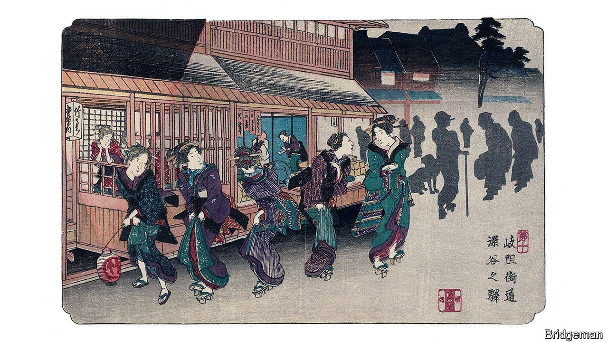

## Japan under the shogunate

# The experiences of an obscure woman illuminate Japanese history

> Tsuneno’s life was not heroic—but Amy Stanley’s patient reconstruction of it is

> Jul 11th 2020

Stranger in the Shogun’s City. By Amy Stanley.Scribner; 352 pages; $28. Chatto & Windus; £16.99

IN THESE TIMES of self-isolation, it is worth remembering that for more than two and a half centuries, from 1603 to 1868, Japan cut itself off almost entirely from the outside world. The imperial line was cloistered in Kyoto, the capital. But real power was wielded by shoguns, or military chieftains, from the Tokugawa dynasty, whose seat was Edo (modern-day Tokyo).

Their fear of Christianity induced them to shut the country’s borders to most foreign traders. Their obsession with stability led to a strictly hierarchical class system. They suppressed internal dissent by demanding that every other year feudal lords leave their homelands and take up temporary residence near the shogun’s palace in Edo. It was an era of stifling political orthodoxy. Yet at the same time, self-reliance led to a flowering of art, theatre and craftsmanship. These traits still echo beneath the post-modern surface of Tokyo, in the form of kabuki, noodle and eel bars, dolled-up hostesses and manga comic books, which date back to the beautifully illustrated story books of the Edo era.

Amy Stanley, an American historian, is enchanted by this faintly remembered world. And she has found a key to unlock some of its most hidden secrets. It comes, she writes, in the form of an extraordinarily extensive archive, comprising letters, diaries, ledgers, tax bills, receipts, petitions and other documents. These were compulsively filed away and preserved by a population in which both men and women were, for their time, relatively well-educated and literate; village priests and farmers kept meticulous records, as did the elite samurai. The result is a visit to the past that is a refreshing antidote to the histories of great men—and the occasional great woman—at times of flux.

It does not dwell on the feats of the shogunate; it barely mentions the shoguns’ women, drafting letters at their lacquered desks. Instead, the book follows the restless footsteps of a crotchety priest’s daughter, Tsuneno, born in 1804 in a snowy village far from Edo, through letters and other documents in the care of a brother (who would often tear out his hair at her behaviour). It tells the story of her hapless love life, her failed marriages, the numerous men who courted and abandoned her, her reckless decision to desert her birth family and travel to Edo, and the excruciating difficulties she encountered there as it slowly became her home.

Tsuneno’s life was not a heroic one. The heroism lies rather in Ms Stanley’s efforts to decipher her story from scraps of paper written in archaic Japanese up to 200 years ago. Yet the paper trail Tsuneno left behind is remarkable; it makes clear the obstacles a strong-willed woman faced in trying to make a living in a man’s world. Tsuneno was a defiant letter-writer, not a charming one. She tells of the hardship of maid’s work in a samurai household, her desperation to retrieve the clothes she has pawned to survive, her vexations with men. Yet there are flickers of rapture about Edo, a city she knew from its teeming streets to the chambers of its elite; enough to persuade her to defy the entreaties of her family to return home and get married (again).

What her letters lack in lyricism, Ms Stanley makes up for by painting a vivid portrait of village life and of the parts of Edo where Tsuneno lived. For women, life was often brutal. One of Tsuneno’s sisters was caged by her in-laws for her behaviour. A sister-in-law was sexually assaulted (as Tsuneno, too, probably was). Sometimes the author overdoes her attempts at reconstructing Tsuneno’s life from the fragmentary evidence that remains. Her task might also have been easier if her protagonist were more lovable.

To add to the poignancy of the tale, though, Tsuneno lived in the decades just before the arrival of Commodore Matthew Perry’s “black ships” from America in 1853, which led to the opening of Japan and the downfall of the shogunate. As Tsuneno struggles to make ends meet amid famine, rice riots, inflation and failed efforts to modernise the regime, her story becomes a portent of Edo’s doom. ■

## URL

https://www.economist.com/books-and-arts/2020/07/11/the-experiences-of-an-obscure-woman-illuminate-japanese-history
