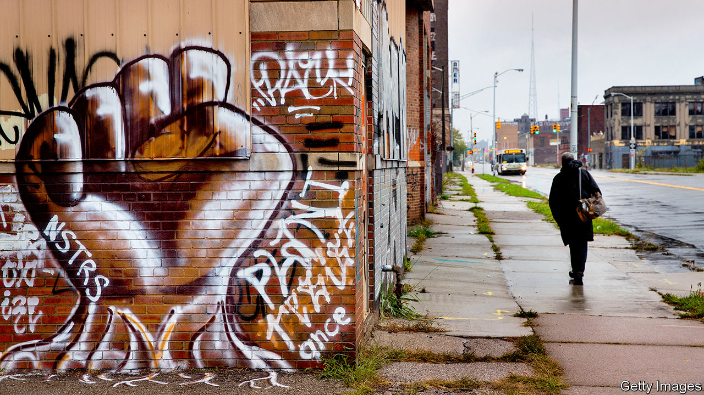
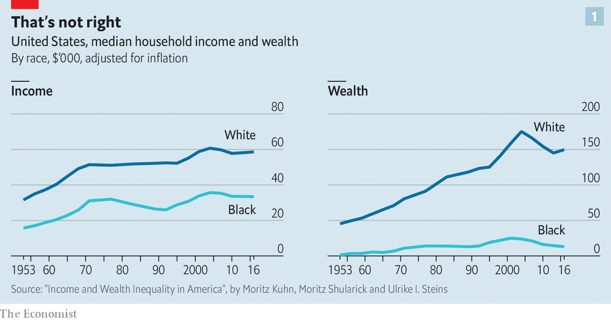
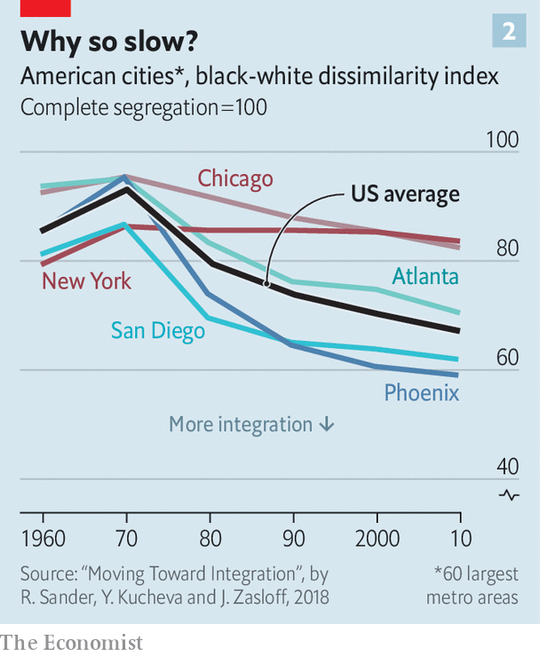
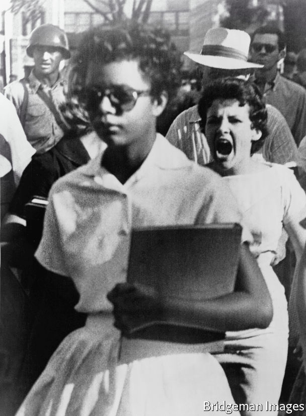

## How black lives can get better

# Segregation still blights the lives of African-Americans

> There are policies that could improve things a lot

> Jul 9th 2020WASHINGTON, DC

“IF SOMETHING isn’t done, and done in a hurry, to bring the coloured peoples of the world out of their long years of poverty, their long years of hurt and neglect, the whole world is doomed,” Martin Luther King Jr told striking workers the day before he was shot dead in Memphis, Tennessee. In 1968 black Americans had only just realised formal legal equality after two centuries of slavery and one of Jim Crow, indentured servitude, lynchings and enforced residential segregation. They had been deliberately excluded from economic supports such as Social Security, mortgage guarantees and subsidised college for veterans. As a result, black American households earned around 60% of what white households did, and the typical black family had less than 10% of the assets of a typical white family.

The past half century has seen visible progress. The ceiling white society once imposed on black opportunity and ambition has started to lift. Barack Obama became president. Yet systemic prejudice persists. Unarmed citizens killed by American police forces are disproportionately black. That most brutal of injustices explains much of the power, the extent and the focus of the protests spurred by the killing of George Floyd, protests that have drawn a level of attention to race relations unseen since the 1970s.

The criminal-justice system is a baleful presence in black lives. The incarceration rate for black men and women more than tripled from 1960 to 2010. One in three African-American men born in 2001 can expect to be imprisoned at some point in his life, compared with one in 17 white boys. The sons of black families in the top 1% of America’s income distribution are as likely to go to prison as white sons from the bottom third. If today’s protests achieve real reform in the criminal-justice system, it will be welcome.

But those are not the only reforms needed to put right the hurt and neglect Dr King spoke of. The economic disadvantage that black America labours under is, in many ways, as stark now as it was 50 years ago. The household income gap is the same as it was in 1968. So is the wealth gap (see chart 1). Crime and the criminal justice system are part of that story of stagnation, as is persistent, if lessened, racism. Changes in individual behaviour and in the economy at large have also played a role. The most important factor is the degree to which the concentrated poverty in largely segregated black communities shuts their members off from opportunity.

“We got rid of ‘whites only’ signs and legal segregation is no longer possible. But why are we at this moment? There’s a lot of things that didn’t change and probably won’t change with only focus on police brutality and reforming the police,” says Clayborne Carson, a historian at Stanford who edited Dr King’s letters and papers. “Yes, that should be done. But don’t expect that to have any impact on the race problem. It’s the tip of the iceberg. You can have polite police—that would be wonderful. You can have social workers. But unless people have the ability to basically change the opportunity structure, the changes are not going to be apparent.”

Children who grow up poor—as 32% of African-American children do, a rate nearly three times that of white children—all tend to do badly by various measures. But children who do so in communities where over 20% of the population is poor do very badly indeed. Whatever their race, such children face increased risks of dropping out of school, getting pregnant while still teenagers, being incarcerated, experiencing poverty in adulthood and dying early.

And for black children in America, as for Native American children, concentrated poverty has been the norm. Only 6% of white children born between 1985 and 2000 spent part of their childhood in neighbourhoods with at least a 20% poverty rate. For black children the figure was 66%, according to Patrick Sharkey, a sociologist at Princeton; experience of such neighbourhoods was normal for middle-class black families. Today’s generation is in a similar position. Twenty-six per cent of black children currently live in neighbourhoods where the poverty rate is higher than 30%. Only 4% of white children do.

Poor neighbourhoods impose environmental costs, as well as social ones. Black families are 70% likelier than the rest of the population to live in substandard housing, and black children are nearly three times as likely to have high levels of lead in their blood, which stunts intelligence and leads to greater violence in adulthood. Compared with white children they are almost one and a half times as likely to have asthma—and five times likelier to die from it. Greater exposure to fine particulate matter—the sort of pollution which most damages lungs—and delays in treatment brought on by a lack of good health insurance may explain why covid-19 now seems to be killing African-Americans at twice the rate of it does white Americans.

This concentrated poverty is the legacy of enforced segregation. When, in the Great Migration of the early and mid 20th century, millions of African-Americans moved to the cities of the north, a mixture of law and prejudice required that they live in neighbourhoods that became almost exclusively black. In 1970 American cities were almost completely segregated, in that 93% of black residents would have needed to move to ensure complete integration. At the time of the most recent census, in 2010, this number was 70%, an improvement that is hardly worth cheering (see chart 2 ).

Zoning rules which keep the cost of housing high by restricting supply make it very hard for poor black families to move to better neighbourhoods. As income inequality has risen, well-to-do families have bid up the price of homes near good schools, further concentrating poverty. Public-housing programmes, which could break up these patterns, do little. Continuing discrimination makes matters worse. A recent investigation into rentals in Boston showed that in situations where a white applicant secured a viewing 80% of the time a black applicant with identical financial credentials would get a viewing just 48% of the time.

In the absence of integrated neighbourhoods, it might be possible at least to try to integrate education—a cornerstone of the civil-rights movement since racial segregation in schools was deemed unconstitutional in 1954. Attempts to reduce school segregation by busing black students into white neighbourhoods began in the 1960s and were extended in the early 1970s. By the mid-1970s, though, such efforts had fizzled in the face of massive resistance from white parents. School segregation has not changed since the 1980s.

Rucker Johnson, an economist at the University of California, Berkeley, studied the outcomes of black children who attended integrated schools during the peak of efforts to end educational segregation. He found they had enormous effects on adult life. Integrated schooling increased wages by 30% and reduced the chance of incarceration by 22 percentage points. Other studies estimate a 68% increase in the chance of attending a four-year college. “There’s nothing magic about sitting next to white children,” says Francis Pearman, a professor of education at Stanford. “But one thing that’s consistent in the history of American schooling is that resources follow white children.”

The racial achievement gap on test scores between black and white students has narrowed in the past four decades, but remains at roughly two to four years of learning. Mr Pearman’s research has documented that poor neighbourhoods adversely affect students’ maths scores even if their schools are good. Black students who get to college are less likely than others to complete their courses; black men have an especially poor chance of making it to graduation. In 2016 only 29% of black adults above the age of 25 had an associate degree or higher, compared with 44% of white adults. At a time when the premium that a degree adds to lifetime earnings has increased a lot, this disparity is a big economic disadvantage.

There are aspects of black American private life that exacerbate these gaps. Well-intentioned, left-leaning commentators in America shy away from discussing the role that the increasingly unstable families play in passing black disadvantage down the generations. Seven in 10 African-American babies are born out of wedlock; their parents are overwhelmingly likely to have broken up five years after birth. Those rates are significantly higher than for other ethnic groups, even after controlling for education and income.

The rate of joblessness and the number of out-of-wedlock births in black communities both increased after the 1960s, notes William Julius Wilson, a sociologist at Harvard. The ravages urban deindustrialisation and mass incarceration inflicted on black men permanently reduced the pool of eligible partners for black women, he argues. Kathryn Edin, of Princeton, and Maria Kefalas, of St Joseph’s University in Philadelphia, two sociologists, note the sense of self-worth poor women with little social capital get from early child-rearing, whether in the presence of a father or not

Behaviour, policy, present-day discrimination and the unfair initial conditions seeded by centuries of historical discrimination are tied together in a complicated knot of pathology. Some of the tangled factors—persistent racism, or family breakdown—make it easy to develop a narrative which apportions blame. Looking at it in the whole, though, the threads which will yield the most if tugged at are fairly obvious. The priorities are segregation, education and childhood poverty.

Addressing segregation is paramount. Most of the other problems—exposure to violence, a paucity of public services, segregated schooling and the persistence of stereotyping—can be traced back to it. The most obvious starting-point is stripping away the zoning rules that ban apartments in high-cost cities. They deny opportunity to poor families of all colours even as they drag down economic productivity.

Rental assistance from the federal government could help more than it does. Currently it is, quite literally, a lottery. Winners get most of their housing costs paid for; losers whose claim may be equally sound—and who outnumber the winners three to one—get nothing at all. And most of the poor households lucky enough to receive subsidised housing still live in places of concentrated poverty; the typical recipient lives in an area with a poverty rate of 26.3%.

A promising randomised experiment in Seattle recently showed how this might be changed, at least in some cases. A modest amount of help in terms of finding properties and dealing with prospective landlords increased the share of families with rental vouchers living in high-opportunity areas (those with a history of greater upwards mobility for children born into poverty) from 15% to 53%.

Obviously not everyone can move to the most promising places. But the Seattle experiment strongly suggests that today’s government spending could get better results, thus strengthening the case for more tomorrow. Abolishing the mortgage-interest tax deduction, which subsidises the home-buying of the already wealthy and well-capitalised, would allow the federal government to double the size of its housing-assistance programmes for the poor.

Increasing integration of neighbourhoods will in time produce more integrated schools. Until that happens, however, there are more immediate solutions to present-day educational disparities. Higher spending helps performance. An influential study by Kirabo Jackson, Rucker Johnson and Claudia Persico, three economists, found that boosting schools’ spending per pupil by 10% reduced poor children’s chances of poverty in adulthood by 6.8 percentage points.

Schools in poor neighbourhoods need particularly good teachers. But the schools that require the greatest talent often receive the most inexperienced instructors, in part because there is little financial encouragement for the best to work in them. Care in recruitment and the pairing of new instructors with experienced ones goes some way to explaining why charter schools often deliver enormous educational returns for poor black and brown children stuck in otherwise-failing urban schools. For all that teachers’ unions and many on the left dislike them, charter schools that prove to be engines of opportunity should be expanded. Those that do not should have their charters revoked.

Keeping students in college is also an area where a little money can do a lot if applied with good sense. In New York a system that gives students access to an adviser, subway tickets and modest cash grants has been shown to double graduation rates from community college, and to have particularly beneficial effects on black and Hispanic students.

Then there is child poverty. Expanding the earned-income tax credit (EITC), which tops up the wages of working low-income adults, and a universal child tax credit could drastically reduce child poverty—and reduce the tremendous costs to be incurred decades from now in lower tax revenues and higher expenses on incarceration, homelessness services and health care. A programme combining a $2,700 annual child allowance and a 40% expansion of the EITC would reduce child poverty by half, and cost $110bn a year, according to a report by the National Academies. Canada’s implementation of a similar programme in 2016 took just two years to reduce child poverty by a third.

A more radical idea is that all children should get government-funded trust accounts—“baby bonds”—with the funding for children born into poverty more generous than for the rest. A scheme in which the bonds were worth $50,000 by the time a child born into poverty turned 18 would reduce the wealth disparity between young white and black Americans from 16:1 to 1.4:1 even if it were strictly race neutral, according to calculations by Naomi Zewde of the City University of New York.

This proposal has a price tag close of about $80bn a year. This means that enacting a child tax credit, EITC expansion and baby-bond programme would still cost less than the $207bn the government will forgo this year by taxing dividends and long-term capital gains at lower levels than income. The idea of paying reparations to the descendants of slaves—a bill that might cost upwards of $4trn to settle—would be much costlier. Nor are they obvious cause for a white backlash, since unlike reparations—or, for that matter, affirmative-action policies at universities and elsewhere—they would be based purely on economic criteria, not racial ones.

Unfortunately, the fact that the benefits of such programmes would accrue disproportionately to African-Americans might make it hard to build broad political support. Safety-net programmes such as cash welfare or the expansion of health coverage for the poor, part of Mr Obama’s health-care reform, have been unpopular with some white Americans. That could make it politically expedient to concentrate on universal programmes. Social Security, which provides pensions, and Medicare, which provides health insurance for the elderly, have become close to politically untouchable in part because they are universal. Child tax allowances and baby bonds might aspire to similar standing.

“My parents literally had to get a white couple to pose as us in order to buy a home in an affluent area of suburban New Jersey with great public schools,” remembers Cory Booker, now a senator from that state. As well as promoting a bipartisan bill on criminal-justice reform, Mr Booker has also pushed a programme to remove lead pipes in schools; baby bonds formed a major plank in his run for the Democratic nomination.

“[Dr King] eloquently said that we have to repent in our day and age, not just for the vitriolic words and violent actions of the bad people, but the appalling silence and inaction of the good people,” Mr Booker says. “Well, I fear that we will have to repent in our generation, if more of us who are good people—and that is the overwhelming majority of Americans—let another generation go by where we don’t correct these persistent injustices.”■

## URL

https://www.economist.com/briefing/2020/07/09/segregation-still-blights-the-lives-of-african-americans
