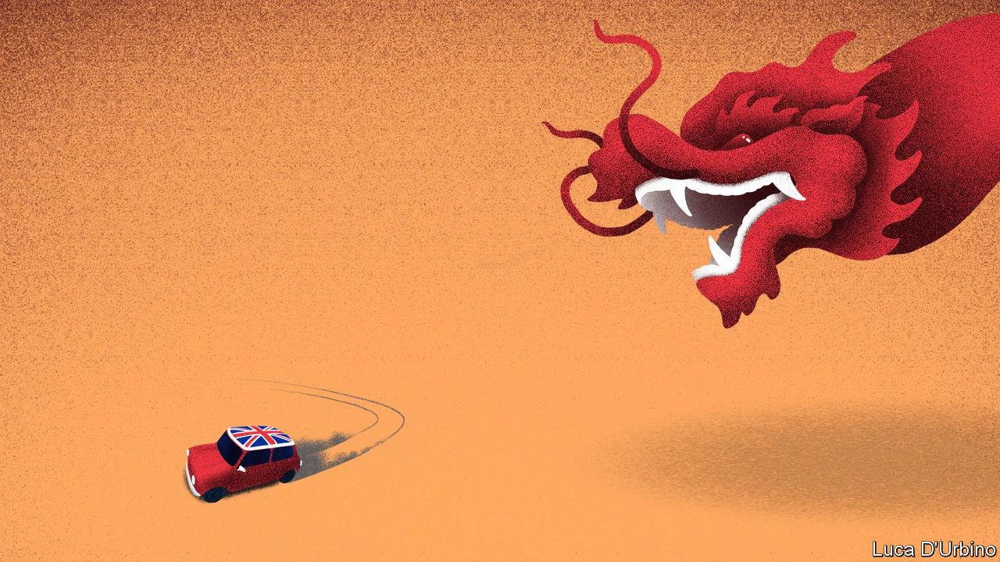

## Global Britain

# A ban on Huawei further worsens Britain’s relations with China

> As they deteriorate, China could make Britain squirm

> Jul 11th 2020

Editor’s note (July 14th 2020): This article has been updated to incorporate the announcement of Huawei’s exclusion from 5G telecoms networks.

IN NOVEMBER 2010, addressing students at Peking University, David Cameron was asked what advice he would give the Communist Party in an age of growing pluralism. “An amazing noise went around the room, half admiration and half shock,” he later recalled. “As I looked around the sea of faces I thought: is this system really going to last? My conclusion was that, in its current form, it couldn’t.”

Mr Cameron hoped his premiership would be the dawn of a “golden era” of Anglo-Chinese relations. Behind this notion lay the belief that Britain could shape China’s approach to trade and human rights by doing business with it. That hope has not survived the decade. Trade and investment have increased, but China has become more repressive at home and more assertive abroad.

British politicians have found that tension increasingly hard to live with. On July 14th, Boris Johnson’s government announced it would ban the purchase of new kit made by Huawei, a Chinese telecoms company, for use in Britain’s fifth-generation (5G) mobile networks from next year. Operators will be obliged to remove it entirely by 2027. That reversed a decision made in January to cap Huawei’s market share at 35% and to exclude it from the most sensitive parts of the network. It followed new advice from GCHQ, Britain’s signals intelligence agency, that American sanctions would shut off the supply of reliable components to the company and make it “potentially impossible” to verify their security.

Britain will change its immigration rules to allow up to 2.9m Hong Kongers to gain citizenship in Britain, following the Chinese authorities’ decision to impose a draconian national-security law on the former British colony. Two MPs have called for Dominic Raab, the foreign secretary, to put Carrie Lam, Hong Kong’s chief executive, on the new sanctions list that Britain has published (see [article](https://www.economist.com//node/21789098)). Mr Johnson intends to push on with long-delayed plans for a tougher investment-screening regime, which would allow a broader range of foreign takeovers of British companies to be blocked on national-security grounds.

Mr Johnson declares himself to be a “sinophile”, and as Mayor of London was even more enthusiastic than Mr Cameron in chasing trade and tourism. His office says that it wants China as a partner on climate change and global health, but “this relationship does not come at any price.” British business leaders are wearied by the hot-cold relationship, and wish the government would take a more consistent line.

Several factors are behind the hardened stance. One is China’s own policy. Britain says that China is in breach of the Hong Kong handover treaty that guaranteed the territory’s rights and freedoms, and the repression of Muslims in Xinjiang has appalled many MPs. Another is pressure to ditch Huawei from America and Australia, who are Britain’s allies in the Five Eyes intelligence pact and with whom Britain hopes to seal speedy trade agreements.

In Parliament, a new caucus of Conservative lawmakers who think China poses a threat to global norms and free societies has formed. The China Research Group’s appeal is broader than that of the European Research Group of Brexit hardliners. Tom Tugendhat, its leader, is a former army officer from the party’s liberal wing. “The UK has been hopeful and ambitious, and sadly that hope and expectation has met the cold reality of an authoritarian state,” he says. The Labour Party under Sir Keir Starmer has also become more hawkish. Lisa Nandy, the shadow foreign secretary, says Britain must find “homegrown alternatives” to Chinese telecoms and nuclear power.

Chinese officials have been telling foreign visitors that they expected post-Brexit Britain to be a biddable place because it needed to increase non-EU trade and preserve the City as a financial centre. This rapid change of course may therefore be an unpleasant surprise. The Chinese made their displeasure known at a press conference on July 6th at which Liu Xiaoming, the ambassador to London, accused British politicians of having a “colonial mindset”, and said that ditching Huawei would send a “very bad message” to Chinese investors about Britain’s economy. “We want to be your friend, we want to be your partner, but if you want to make China a hostile country, you have to bear the consequences.”

China routinely chastises states that say or do things that upset it. The first step is to cancel meetings between politicians, as happened when Mr Cameron’s government was put in the freezer for a year after he met the Dalai Lama, Tibet’s spiritual leader. Economic threats come next. China is Britain’s third-largest trading partner after America and the European Union, with 5% of total trade, and its government is skilled at targeting symbolic and politically sensitive exporters. Norwegian salmon exports were hit after the Nobel peace prize was awarded to a Chinese dissident. Australia’s beef and barley exports were choked after it called for an international probe into the coronavirus outbreak. The decisions to limit, and then ban, Huawei’s involvement in Britain’s 5G network will delay the roll-out by two-to-three years and cost £2bn ($2.5bn), said Oliver Dowden, the culture secretary. 

If China has an appetite to hurt Britain then it has a range of brands and sectors to choose from. A list of likely targets might include Scotch whisky or Jaguar Land Rover, the carmaker which makes about a fifth of its sales in China. In general, the City of London is not badly exposed, but two banks with roots in Britain’s colonial past, HSBC and Standard Chartered, make two thirds and a half of their profits, respectively, in China and Hong Kong. An insurer, Prudential, is also heavily involved there. “If China really wanted to pinch us...by sanctioning British companies there is form there,” says George Magnus of Oxford University’s China Centre. HSBC and Standard Chartered have announced their support for the new Hong Kong security law, but Mr Magnus doubts that will insulate them.

Charles Parton, a veteran British diplomat and senior associate fellow at the Royal United Services Institute, a think-tank, argues that such measures may spook leaders but are usually short-lived, do not prevent overall exports from rising, and should not deter politicians from challenging Chinese policy when Britain’s interests are threatened. Chinese investment in Britain is linked to profit-seeking, not politics or charity. “The pain gets put on the politicians,” says Mr Parton. “The real world goes on. Students study. Tourists tour. Business does its business.”

Yet the main cost may not be in present pain but in future benefits forgone. A falling-out with China would scotch new initiatives designed to give Britain a competitive advantage over its European peers. The spat may kill the tie-up between the London and Shanghai stock exchanges and hinder emerging fields, such as the issuing of green bonds in London by Chinese firms. Few MPs would notice that. But many fret that the lost advantages are stacking up. “We’ve had covid, we’re doing Brexit—do we need to pick a fight with China?” asks a former cabinet minister of the “golden era”. That will soon become clear.■

## URL

https://www.economist.com/britain/2020/07/11/a-ban-on-huawei-further-worsens-britains-relations-with-china
