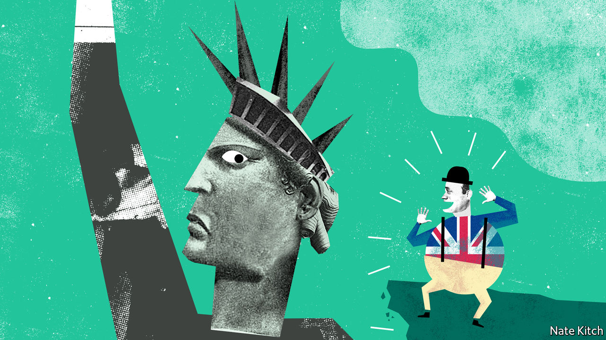

## Bagehot

# Anglophilia is fading in America

> But the British still have something to teach the Americans

> Jul 9th 2020

WHEN GHISLAINE MAXWELL arrived in New York in 1991 her life was in pieces. Her father’s corpse was found floating near a yacht that bore her name; her family business had imploded; the Maxwell name was mud. Yet within a few years she was back on top: living in style on the Upper East Side and sitting at the very heart of New York society.

Why was the newcomer such a hit? The dark pact that she formed with Jeffrey Epstein, a paedophile for whom she is accused of procuring minors, provided her with access to lots of money. Her wit and charm made her stand out. But being British also helped. Ms Maxwell was invariably described as an “Oxford-educated British socialite”. She dropped dinky British phrases into her conversation and traded on the smart British names in her address book, the most valuable of which was Prince Andrew’s.

Ms Maxwell was part of a generation of Britons who went to America in the 1990s and 2000s in search of fame and fortune. The invasion was driven by talent and ambition: with the advent of globalisation many Britons decided that if they wanted to play in the premier league, they needed to move to the United States. Britons rose to the top of a striking number of journalistic and cultural institutions from the New Yorker through Vogue to the Metropolitan Museum. Christopher Hitchens and Andrew Sullivan became America’s leading contrarians. Simon Schama and Niall Ferguson were among the academics who fled the low pay and heavy teaching loads at British universities and won profitable stardom at Ivy League institutions.

Anglophilia greased the entry of the British into the American establishment. Institutions such as the Council for Foreign Relations fostered it. A British accent was regarded as proof of intelligence and wit. Some of the immigrants were genuinely talented, but Anglophilia lifted plenty of flotsam and jetsam too, and allowed clever Brits to get away with things that Americans never could. Hitchens even lit a cigarette on television, leaving his interviewer speechless.

The British invasion was further eased by the Atlantic alliance, which was revived by Ronald Reagan and Margaret Thatcher, and flourished through Tony Blair’s relationships with Bill Clinton and George Bush. It was, in part, a convenient fiction for both sides, allowing America to claim that it was acting in something bigger than its own interests and Britain to believe that it still had a seat at the top table. But it also had some substance to it, particularly as globalisation gathered pace. Both countries embraced a distinctive model of finance-driven capitalism; indeed, London was arguably a bigger financial centre than New York.

In recent years, Britain has lost some of its cachet in America. The press regularly—and the president occasionally—portrays the country as a poverty-stricken, crime-ridden dystopia. America’s population is becoming less Anglo-Saxon and more Hispanic and Asian. Students across the country are demanding the “decolonisation of the curriculum”, which means, among other things, less British history and English literature. Walter Lippmann, one of America’s greatest columnists, once described America’s relationship with Britain as one of “discordant intimacy”. Today the discord sometimes drowns out the intimacy.

The combination of Donald Trump’s election and Britain’s decision to leave the European Union has also destroyed two of Britain’s most important assets. Mr Trump used the Atlantic alliance as a way of beating up the EU rather than building an alliance of democracies. Brexit simultaneously deprived Britain of its position as a bridge between America and the EU and destroyed its reputation as a well-run country capable of calming America’s frequent temper tantrums. A New Yorker cover shortly after the Brexit vote displayed a group of bowler-hatted lemmings racing over a cliff. And over the past four years the British have done their best to prove the magazine right, discarding two prime ministers, dismissing their Parliament briefly and—measured by deaths per head of the population—managing the covid-19 crisis even worse than America has.

Britain clearly still needs America, especially now that Brexit has divided Britain from Europe, and China’s clampdown in Hong Kong limits Asian options. Aspiring Britons will still go there to try to make their names. For all its recent travails America still offers fabulous rewards and continent-sized opportunities.

The more intriguing question is whether America needs Britain any longer. It still has an appetite for British talent, and not just of the floppy-haired ersatz-upper-class Hugh Grant-style variety: it has taken to comedians with non-U accents such as James Corden and John Oliver, as well as writers who chronicle the experience of minorities such as Zadie Smith. It will also have much more use for the old Atlantic alliance if Mr Trump loses the election, as looks increasingly likely. Joe Biden’s America will be in the business of rebuilding relationships across the board; and despite leaving the EU, Britain, with its deep military, diplomatic and security relations with the United States, will be an important part of that process.

Americans may also discover that they can profit from advice in an area the British know all too well—decline and stagnation. America bears more than a passing resemblance to early-20th-century Britain, which saw itself overtaken in one area after another by a rising and much more disciplined Germany. “The Coming Neo-Feudalism”, a new book by Joel Kotkin of Chapman University, describes a world quite familiar to the British, in which a hereditary ruling elite lords it over a compliant intelligentsia and an impoverished middle class. Britons may not have solved the problems of economic decline and neo-feudalism in their own country. But they have had plenty of time to reflect on them—and at the very least they can warn Americans what will happen if they don’t change course. ■