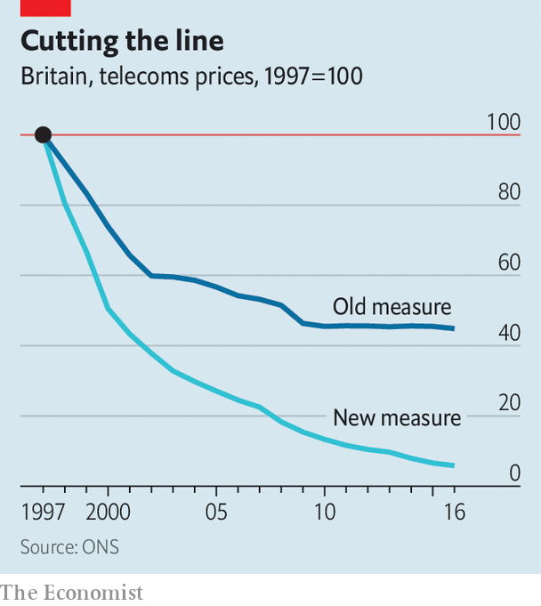

## Economic data

# Has the ONS solved the “productivity problem”?

> Dodgy data may explain a troubling mystery

> Jul 9th 2020

FOR MORE than a decade, Britain’s productivity growth has lagged behind the rest of the world’s. This “productivity problem” has baffled economists and troubled politicians. Now the Office for National Statistics (ONS) has offered at least a partial solution. On July 6th, it published an update on the measurement of prices in the telecommunications industry, which suggests an underestimate of sectoral output so large that it had a sizeable impact on its sums for the economy as a whole.

The review focused on changes between 1997 and 2016, a period in which dial-up 56k modems and bricklike supposedly “mobile” phones gave way to fibre-optic broadband and 5G-enabled smartphones. Measuring output in a time of huge technological change is difficult. Three years of work with industry insiders and academics have led statisticians to better incorporate widening network coverage and faster download speeds. The biggest changes are in how the ONS proposes to weight data usage against older services such as voice calls and texts and in how the underlying index is constructed. The current price index is based on the revenues rather than the volume of usage.

The results are dramatic (see chart). Whereas the ONS previously believed prices for telecoms services fell by around half over the period it now reckons they collapsed by 95%. That means that output in the sector, when deflated by the new measure, grew nearly eight times faster than previously thought.

Just how much that change will boost the headline growth number will not be clear until October, when the ONS will detail the changes’ impact on the wider economy. Some of the newly discovered growth in telecoms output will come at the expense of other sectors, but higher overall growth will translate to a stronger productivity performance.■