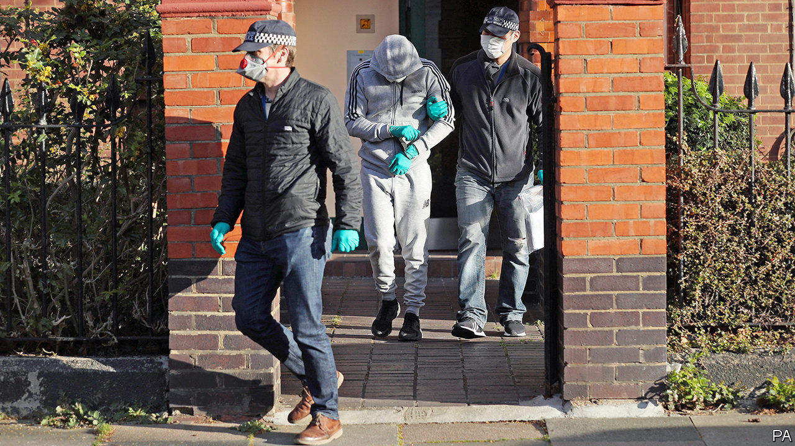

## Policing and the pandemic

# How Britain’s cops spent lockdown

> A decline in crime gives police forces the chance to catch up on their to-do lists

> Jul 9th 2020

WHEN THE nation shut down in March, something both remarkable and utterly obvious happened to everyday crime: it plummeted. Graham Farrell, a criminologist at the University of Leeds who looked at data from the Lancashire Constabulary, found that within a week of lockdown recorded crime in Lancashire declined by 41%. Shoplifting was especially hard hit, falling by 62%. It is a difficult crime to commit when most shops are closed.

But not all crime fell. After lockdown started, even as overall crime declined in London just as it did elsewhere, drug offences recorded by the Metropolitan Police shot up (see chart). Drug offences data are a good indicator of disruption in organised crime since that is the mainstay of such groups, says Rick Muir of the Police Foundation, a think tank.

One reason for the rise is that the drugs trade became easier to disrupt. While other businesses shut down, it kept going. “Organised criminals are innovative people. They responded well, from their perspective, so actually there weren’t long term shortages or price rises within the UK,” says Steve Rodhouse, a director general at the National Crime Agency (NCA). But the business demands face-to-face contact, and drug dealers who were out on the streets when everybody else was inside were abnormally conspicuous.

At the same time, while demands on the police declined, the supply of officers rose as leave was cancelled and new recruits promised by Boris Johnson last year arrived. Police forces used the time to tackle their to-do lists. Among the things they did was “progressing complex investigations, for example county lines”, a national network of drug-runners, says Julia Mulligan, North Yorkshire’s police and crime commissioner. North Yorkshire police worked with their counterparts in areas that supply drugs, including Merseyside, West Yorkshire and Greater Manchester. And as Peter Neyroud, a criminologist at Cambridge University and a former chief constable puts it, “It’s a great time to serve warrants, because everyone has to be at home.”

In London, the Metropolitan Police drew up a list of roughly 1,000 “prolific” offenders engaged in drug-related and violent crimes. Officers visited 733 to encourage them to “diversify away from crime”, says Commander Bas Javid of the Met. In the event, they spoke to 304, of whom 43 have expressed an interest in taking part in the scheme.

Another tactic used by the Met was to identify what it calls “micro beats” of 250 locations in London with high levels of violent crime and drug activity. In one special operation in a week in May the Met arrested 222 people. Long-running investigations also came to a head. On July 2nd the NCA announced that it had arrested 746 people and seized £54m in cash, two tonnes of drugs and 77 firearms as the result of investigations done over four years with various forces and other agencies.

As restrictions are loosened, the trends are reversing. Recorded offences rose in the past few weeks and drugs offences have fallen. That suggests that police once again have their hands full with everyday crime. But it may also mean that their efforts at disrupting the networks responsible for these crimes have had an effect. ■

Editor’s note: Some of our covid-19 coverage is free for readers of The Economist Today, our daily [newsletter](https://www.economist.com/https://my.economist.com/user#newsletter). For more stories and our pandemic tracker, see our [hub](https://www.economist.com//news/2020/03/11/the-economists-coverage-of-the-coronavirus)

## URL

https://www.economist.com/britain/2020/07/09/how-britains-cops-spent-lockdown
