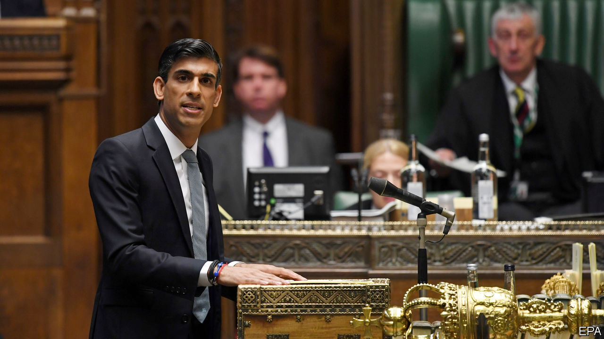

## Fiscal policy

# Sunak’s summer statement

> A giveaway budget, vast in normal times, fails to impress

> Jul 8th 2020

ON JULY 8TH Rishi Sunak, the chancellor, delivered what the Treasury called a “summer economic update”. Although it was not officially a budget, which would have required new forecasts and policy costings by the Office for Budget Responsibility (OBR), a fiscal watchdog, it felt like one. The chancellor spoke for only half an hour and yet still managed to announce around £30bn ($38bn) in new measures, some 1.4% of pre-crisis GDP, for the current fiscal year—a huge deal, in normal times.

Output, which shrank by around a quarter over the course of March and April, almost certainly began to expand again in May, but the pace and the shape of the recovery remain contentious (see [article](https://www.economist.com//finance-and-economics/2020/07/11/some-economies-are-bouncing-back-but-recoveries-can-easily-go-wrong)). Real-time data, which show consumer spending now down by a mere 10% year on year, point to a fairly rapid bounce, but other measures suggest a less rosy outcome. Capital Economics, a consultancy, reckons that the initial bounce-back in activity, as measured by visits to workplaces and shops, has been slower in Britain than in other rich economies. Both the OBR and the Bank of England appear to have been too pessimistic in their respective April and May forecasts on the scale of the plunge but independent forecasters reckon that both were too optimistic about the strength of the recovery. The hole is not as deep as the official forecasters feared but climbing out of it may take longer than they hoped.

In his statement, Mr Sunak outlined a three-phase plan to do that. The first phase was about limiting the fallout of lockdown. The second, current, one is reopening. The third will be rebuilding. The retention scheme, under which the government paid 80% of the wages of over 9m workers, was the centrepiece of the first phase. It worked. Unemployment was still below 4% at the end of May despite a record contraction in the economy.

With the furlough scheme now being tapered down before ending in October, redundancies look set to rise. The Centre for Retail Research, a consultancy, estimates that almost 50,000 jobs have already been lost in the sector this year. The chancellor has responded with a £2bn KickStart Scheme which will provide six-month work placements for 16- to-24-year-olds. The new Job Retention Bonus will pay any firm a bounty of £1,000 for each furloughed employee that they return to work and continuously employ until January 2021.

More conventional stimulus measures were targeted on especially hard-hit sectors. VAT on leisure and hospitality spending will be cut from 20% to 5% until January 2021. A gimmicky, cringeworthily entitled “Eat Out to Help Out” scheme will give a 50% discount of up to £10 a head on restaurant spending between Mondays and Wednesdays during August. With fear of infection being the main thing keeping people away from restaurants and pubs, tax cuts and discounts are unlikely to draw them back.

Commentators were underwhelmed. Samuel Tombs of Pantheon Macroeconomics argues that £30bn will not “fill the void” when the retention scheme ends in October. He still forecasts that GDP will be about 5% below its pre-covid-19 level at the end of the year. With the chancellor keen to emphasise that the policies in the summer statement were merely the next rather than the final step in his plans, more expansionary policies seem likely in the autumn fiscal statement. Adam Marshall, head of the British Chambers of Commerce, thinks that “the scale of the stimulus needed to help the UK economy restart, rebuild and renew will need to be greater still over the coming months.”

There was little mention in the speech or the accompanying documents of the overall health of the public finances. The Resolution Foundation, a think-tank, calculates that the deficit could hit £350bn, about 16% of pre-covid-19 GDP, this year. Phase four of the chancellor’s plan, the necessary tax rises and spending cuts to bring the deficit back to more normal levels, is not something on which the Treasury is keen to dwell.■

## URL

https://www.economist.com/britain/2020/07/08/sunaks-summer-statement
