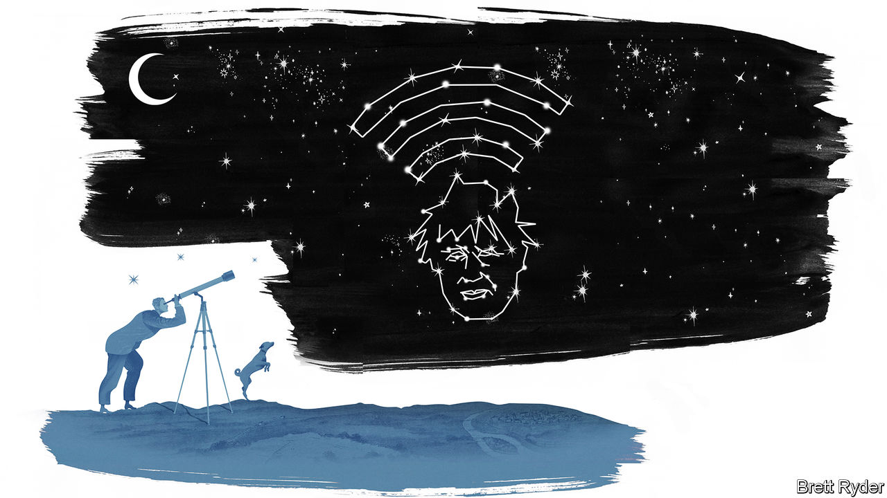

## Schumpeter

# Elon, Masa and Boris in low-Earth orbit

> What could possibly go wrong?

> Jul 9th 2020

SCHUMPETER IS ONLY an amateur stargazer. His equipment is no fancier than a pair of eyes and a place in the countryside, away from London’s light pollution. That is enough to make out Venus, Mars, Jupiter and Saturn—and, occasionally, the International Space Station crossing the firmament. In the past few years a new spectacle has appeared, in the form of the Starlink satellites. Launched in batches by SpaceX, an American rocketry firm founded by Elon Musk, the tech billionaire behind Tesla’s electric cars, they resemble nothing else in the heavens, floating like a train of white dots in tight formation. Bad weather delayed the launch of the latest batch on July 8th. When they do go up, they will total nearly 600, making SpaceX the world’s biggest satellite operator.

SpaceX is a remarkable firm. It was founded in 2002, to further Mr Musk’s dream of colonising Mars. It is a case study in disruption—a startup with no track record has humbled incumbents like Boeing and Lockheed Martin. Its rockets cost half as much as its rivals’ do, thanks in part to their ability to land their first stages for reuse rather than dumping them in the sea in line with standard industry practice. The firm was last valued at $36bn, more than better-known tech darlings such as Airbnb, DoorDash or Palantir.

SpaceX’s rocket business alone does not justify this rich valuation. The market for launches is small and stagnant. Mr Musk himself has said that the most his firm could hope to earn from them is around $3bn in revenue a year. If he is to make it to Mars—and if his investors are to see big returns—he needs another plan. This is where Starlink comes in. Those satellites visible from Schumpeter’s garden are the vanguard of a planned constellation of over 1,000, designed to beam the internet to every corner of the globe.

Satellite broadband is not a new idea. But existing options are expensive and slow. Starlink’s cheap, mass-produced, low-flying satellites would, SpaceX claims, offer a service comparable to earthly broadband at competitive prices. It could serve poorly connected villages in rural Africa (or rural America for that matter), as well as oil rigs or cargo ships at sea. Mr Musk has noted that the global telecoms market is worth roughly $1trn. If SpaceX captured even a fraction of that, Morgan Stanley, a bank, recently opined, it could be worth anywhere from $50bn to $120bn or more, making its present valuation look like a bargain.

The world has been here before. Iridium announced similar plans in the late 1990s with gales of hype: the first call on its network was between Al Gore, then America’s vice-president, and a distant descendant of Alexander Graham Bell. Nine months later the firm went bust, swamped by the upfront capital costs of launching satellites. LeoSat, a firm based in Luxembourg, was founded in 2013. It shut down last year for lack of investor interest.

Starlink’s chief competitor is OneWeb, with 74 satellites in orbit and hundreds more planned. It, too, went bust in March, after failing to persuade even Son Masayoshi (also known as Masa), a Japanese tech billionaire with a stake and a well-documented affection for risky startups, to pony up more cash. But it has new backers. On July 3rd Boris Johnson, Britain’s shaggy-dog prime minister, announced that his government had stumped up $500m for a 45% stake in OneWeb, and a golden share giving it control over its future. Bharti Global, an Indian telecoms firm, also put in $500m.

Mr Johnson’s decision drew general bafflement—and an instant flurry of speculation about its rationale. Could he be trying to safeguard a domestic high-tech gem? Britain has long tried to nurture its small but sophisticated space sector and OneWeb is notionally a British firm; its parent company is based in Jersey, an island in the English Channel. But many of its operations, including satellite manufacturing, are in America. Perhaps the reasons were strategic? China was circling, claims one person close to the deal, and Britain pounced to frustrate its ambitions. Except that the American court administering the bankruptcy may be reluctant to hand OneWeb over to a Chinese firm. Politics almost certainly played a part. Britain’s exit from the European Union has limited its access to Galileo, the EU’s alternative to America’s GPS satellites. A bombastic promise to build an all-British replacement, at a cost of £5bn ($6.3bn) or more, looks dubious. Bolting a less capable navigation service onto OneWeb’s satellites may offer Mr Johnson a face-saving way to back down, while pushing back against the perception that Brexit has made the country parochial.

Yet there are also hopes, according to insiders, that the bizarre acquisition may work on purely commercial grounds. OneWeb has priority over SpaceX for the bits of the electromagnetic spectrum needed to beam the internet from the heavens. Those satellite companies that survived bankruptcy—such as Iridium—have come out on the other side as viable, if somewhat dull businesses. Like railways in the 19th century and subsequent infrastructure projects, globe-spanning satellite broadband may become a viable proposition once the initial investors, who often overpay exuberantly, have been wiped out.

And Mr Musk could use a rival in low-Earth orbit. Jeff Bezos, the biggest tech tycoon of all, is working on a similar project, but has yet to put any satellites into space. In the meantime, competition from OneWeb would spur innovation and prevent SpaceX from settling into a celestial monopoly.

Can the British government be a source of competitive pressure? The politest description of its entrepreneurial record is “spotty”—just ask owners of clunkers such as an Austin Allegro or Morris Marina, produced after the partial nationalisation in 1968 of British Leyland. OneWeb may need a further injection of cash if it is to complete its constellation. British taxpayers may never see a financial return on their investment. But if OneWeb keeps Mr Musk on his toes even for a little while, their loss may turn out to be global consumers’ gain. Stranger things have happened in space. ■