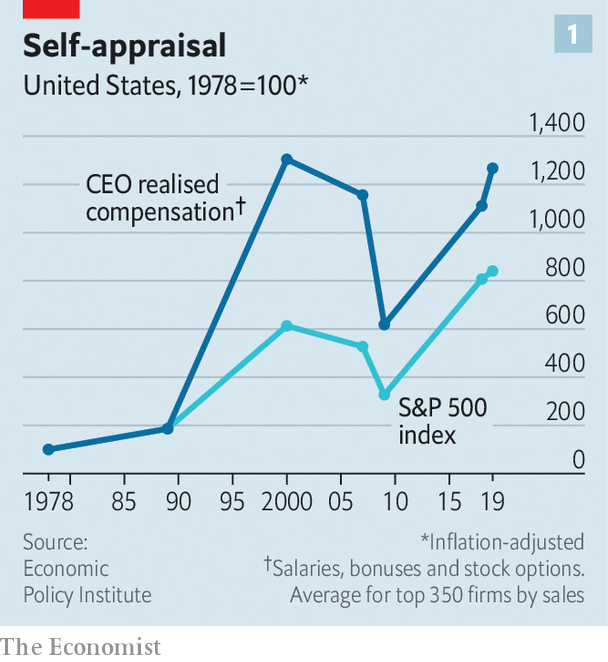
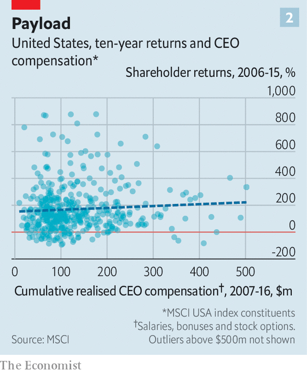
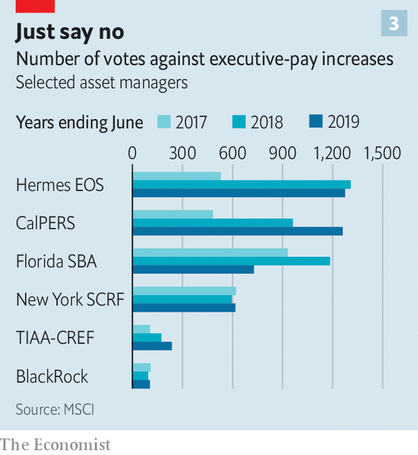

## Pay guaranteed, performance optional

# How CEO pay in America got out of whack

> Bosses claim that their firms’ superior returns justify their own hefty pay cheques. Really?

> Jul 11th 2020NEW YORK

“TOO OFTEN, executive compensation in the US is ridiculously out of line with performance…The deck is stacked against investors.” It was with these words that in 2006 Warren Buffett, a legendary investor and red-blooded capitalist, challenged the received wisdom in corporate America about CEO pay. This maintains that bosses deserve generous rewards because these are tightly linked to their companies’ financial performance. Fourteen years’ worth of evidence later the received wisdom is still looking shaky.

“Pay for performance” has been the mantra of America Inc over the past few decades. A small circle of influential pay consultants, compensation analysts and academics has argued that American firms must pay top dollar for top candidates because they compete in a global market for talent. They argue that firms have grown more complex and bosses must know how to manage new technologies and the vagaries of globalisation. The controversial corollary is that pay should be allowed to rise ever higher because superior CEO performance is maximising shareholder returns.

Rise it has—and then some. According to Bloomberg, a research firm, the median CEO compensation at big American firms in the S&P 500 share index reached $14m last year. America’s top earners made far more. Alphabet’s Sundar Pichai received a cool $281m. The sums are considerably smaller across the Atlantic, where pay practices have historically been more restrained. The ten best-paid British bosses together did not make as much as Mr Pichai in 2019.

A forthcoming report by the Economic Policy Institute (EPI), a left-leaning think-tank, scrutinises how much bosses at the 350 biggest American firms by revenue actually made once stocks and options were vested and exercised (as opposed to their notional values at the time they were granted). Lawrence Mishel of EPI calculates that from 1978 to 2019 the average “realised” compensation swelled nearly thirteen-fold in inflation-adjusted terms, outpacing the stockmarket (see chart 1). It shot up by 14% in 2019 alone.

Such numbers were setting off alarm bells before the covid-19 crisis. Now the mass lay-offs and bleeding balance-sheets resulting from the recession have brought it into stark relief. According to official filings, one in ten members of the Russell 3000, a broad index of listed American companies, has slashed bosses’ salaries in response to covid-19. They include big airlines (like United and Delta), hotel chains (such as Marriott and Wyndham) and industrial conglomerates (for example, GE). Many others plan to review their compensation plans. Todd Sirras of Semler Brossy, a pay consultancy, predicts a busy autumn for his industry.

Though portraying this as a show of solidarity with workers, a few have quietly also handed bosses lucrative perquisites. A week after Hyatt Hotels cut its chief executive’s salary in March, it awarded him shares and options that could, if the company’s share price rebounds, be worth much more than the forgone pay. Courtney Yu of Equilar, a research firm, observes that bonuses, grants of stocks and options tied to performance at big American firms have risen from a small portion of executive compensation two decades ago to more than half today.

The favoured measure of performance is a company’s total returns, which combine share-price moves with any dividend payouts. As a consequence of a record bull market in equities after the global financial crisis of 2007-09, only brought to a halt by the covid-19 pandemic, executive pay in America shot up into the stratosphere. Today, after a rollercoaster ride this year, the S&P 500 is nearly back to where it was before the coronavirus struck; compensation may continue to rise.

In 2017 MSCI, a research firm, published its analysis of realised chief-executive pay between 2007 and 2016 at more than 400 big public American firms. At more than three-fifths of the firms, it showed no correlation with ten-year total returns (see chart 2). Some firms overpaid lousy bosses; others underpaid successful ones. Pay-for-performance “may be broken”, MSCI concluded. A recent paper co-authored by Lucas Davis of the Haas School of Business finds “strong evidence” that bosses of energy firms see clear pay gains when stock valuations rise as a result of an oil-price spike which they have no way to influence.

A fresh analysis by Equilar, commissioned by CalPERS, a big Californian public pension fund, identifies similar trends. It looked at the past five years of realised CEO pay for most firms in the Russell 3000 and compared this with the companies’ total returns. The bosses in the top pay quartile made twelve times what those in the bottom quartile did, but produced financial returns only twice as good. The bosses in the second-lowest pay quartile made nearly three times as much as those in the bottom quartile, even though their firms’ total returns were actually worse. “There is no evidence that boards can tell in advance who is a talented CEO,” sums up Simiso Nzima of CalPERS.

Critics point to problems besides rewarding luck instead of skill. One is rent-seeking by bosses, who can take advantage of the opacity that tends to surround pay-setting. The process was long a dark art, explains David Larcker of Stanford University’s Graduate School of Business. Lucian Bebchuk of Harvard Law School, another expert in the field, has argued that American CEOs, who tend to tower over their boardrooms, have too much influence over this opaque process. Don Delves of Willis Towers Watson, a consultancy with a big pay-advisory arm, points to “lots of positive changes” in pay-setting over the last two decades, from greater independence for compensation committees to more sophisticated setting of performance targets. However, he concedes that bosses retain “more influence over their own pay than any other person”.

Compensation committees often rely on advice—and political cover—from pay consultants. A recent study of 2,347 firms, by Kevin Murphy of the Marshall School of Business and colleagues, finds that companies using consultants pay more. Independently, those with higher pay and more complex pay plans are also likelier to hire advisers. Most problematic is their use of pay benchmarking, which has led to the ratcheting-up of pay for all bosses. As Mr Nzima of CalPERS observes, “Everyone is targeting either median or above-median pay, so median is always going higher regardless of actual performance.” Gregg Passin of Mercer, another consultancy which advises clients on pay, accepts that the ratchet effect is real. “I can’t deny it,” he says. His firm recommends that some bosses, such as first-time CEOs, should be paid below the median.

The good news, says Pamela Marcogliese of Freshfields, a law firm, is that institutional investors are paying more attention to remuneration. She points to a surge in attention among big activist investment funds to “say on pay” proposals, which let investors express dissatisfaction with excessive pay.

Though these votes are non-binding, managements typically respond to negative votes by paring back pay. Even mainstream investors like BlackRock, a giant fund that rarely gainsays the management on pay, are increasingly voting against compensation-committee members promoting egregious pay schemes.

America’s influential Council of Institutional Investors, which represents big asset managers, last year called for simplifying pay structures. CalPERS wants to replace common pay packages, such as those based on three-year performance, with plans reflecting rigorous five-year performance measures, or delay payouts from equity grants for at least five years. It is also rebelling against using median pay as the favoured benchmark.

In May Vanguard, a big American mutual fund, warned boards not to use the pandemics as an excuse to “create ‘easier’ performance targets”, adding that “at-risk pay should remain at-risk.”

Glass Lewis, a shareholder-advisory firm, has said that offsetting bosses’ pay cuts with options packages may lead to lawsuits. Institutional Shareholder Services, the other big proxy adviser, has discouraged sudden changes to long-term compensation, especially the repricing of options. Norges Bank Investment Management, which oversees $1trn in Norwegian pension assets, has criticised the short-termism of current compensation schemes, arguing that “a substantial proportion” of pay should instead be shares that are locked in for five or ten years.

Incentive packages that postpone payouts may, it is true, prompt bosses to demand higher pay to compensate them for the added wait. Martine Ferland, boss of Mercer, admits a tension exists between the short term and the long term. Even so, she is convinced change is afoot. Executives “cannot prosper at the expense” of everyone else. Mr Larcker of Stanford sees the pandemic as “a wake-up call for boards”. About time. ■

Correction (July 9th 2020): An earlier version of this article said that Bob Bakish, chief executive of ViacomCBS, last year received total compensation of $134m. That figure referred to the total compensation of Mr Bakish and Joseph Ianniello, CEO of CBS before its merger with Viacom in December 2019. Mr Bakish's total compensation in 2019 was $36.5m. Similar errors crept into a table of executive compensation, which has been removed. We also exaggerated the pay of Soren Skou, CEO of A.P. Moller-Maersk, as a result of an improper currency conversion. We apologise for the mistakes.

## URL

https://www.economist.com/business/2020/07/11/how-ceo-pay-in-america-got-out-of-whack
