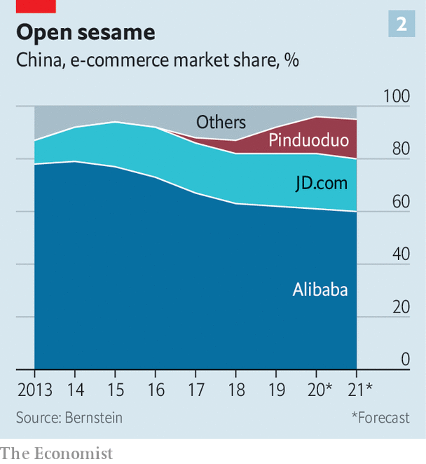

## E-shopping frenzy

# Meituan-Dianping and Pinduoduo embody the excitement over digital China

> Investors cannot get enough of two booming internet companies

> Jul 9th 2020

CHINA’S BUSTLING digital economy has spawned thousands of startups. Yet in the eyes of many it remains “BAT or bust”, to cite a saying among jobseekers from the country’s elite universities. The BAT in question refers to the original trio of Chinese internet stars: Baidu, a search engine; Alibaba, an online emporium; and Tencent, a mobile-payments and video-game titan. The acronym is overdue an update.

Alibaba and Tencent continue to lord it over digital China. With market capitalisations of nearly $700bn apiece, they are the world’s seventh- and eighth-biggest listed companies, respectively. Having struggled to adapt as consumers moved from desktops to smartphones, Baidu languishes in 319th place; its erstwhile equals can gain or lose the equivalent of its entire market value of $45bn in a day or two.

The BAT label also belies another development. Newer arrivals have been busily remodelling the upper reaches of China’s cyberscape. They include firms like JD.com, a $100bn e-merchant listed in New York, Didi Chuxing, a privately held ride-hailing giant valued at $60bn or so, and the $100bn-plus ByteDance, the world’s biggest unlisted startup (which owns, among other things, TikTok, a short-video app popular with Western teenagers).

None has set investors’ pulses racing of late more than Meituan Dianping and Pinduoduo. The duo have much in common. Both began by matching shoppers with discounts (on spa and cinema tickets in Meituan’s case and products from apples to Apple iPads in Pinduoduo’s). Both went public in 2018—Meituan in Hong Kong and Pinduoduo in New York. And both have seen their share prices soar since the start of the year (see chart). They are now worth more than $100bn each. But their routes to these highs look quite different.

Start with the bigger of the two, Meituan. It was founded in 2010 by Wang Xing, an engineering graduate from Beijing’s Tsinghua University, selling those discount vouchers. Like Tencent and Alibaba, it has expanded into other areas. In 2013 it launched a meal-delivery business and a travel arm that lets users book hotels and flights. Two years later it merged with Dianping, a restaurant-review and booking platform similar to Yelp. In 2018 it paid $2.7bn for Mobike, a bike-sharing service, and entered ride-hailing, which it expanded last year to dozens of Chinese cities. Today Meituan can be thought of as “a search engine for services”, says Elinor Leung of CLSA, a broker.

Some of these, like food delivery or bike-sharing, are low-margin, high-volume businesses. In 2019 the firm earned a profit of less than three cents per delivery (chiefly from commissions it charges restaurants). But it makes an awful lot of them. The platform has 700,000-800,000 drivers at its disposal. Two in every three yuan that the Chinese spend on having grub dropped off at their doorstep goes through Meituan.

Like Mobike (which is capital-intensive and still unprofitable), the food business lures users who can then be directed to more lucrative offerings such as travel. Meituan’s operating margins on hotel reservations hover between 20% and 35%. The pandemic briefly halted domestic bookings but by late May they had recovered to 70% of pre-coronavirus levels.

Pinduoduo has taken the opposite tack to Meituan. Rather than spread its bets, it has doubled down on e-commerce. Online retail is growing fast enough in China to justify not being “a jack of all trades”, says David Liu, in charge of strategy at the firm.

He has a point. Chinese e-commerce sales could expand by 16% this year, to 14.4trn yuan ($2trn), according to eMarketer, a research firm, even as total retail sales may dip by 4% to 35trn yuan as a consequence of lockdowns’ toll on bricks-and-mortar shops. Alibaba will capture perhaps half of this growth. Pinduoduo will slug it out with JD.com for the rest. Shoppers hit by the coronavirus slowdown may lean towards Pinduoduo’s bargains. 

Central to the firm’s ascent is the concept of social shopping, which it describes as a fusion of Costco and Disneyland. Products are cheaper if you buy in bulk with fellow bargain-hunters. Users can join existing groups or invite pals using WeChat, a social-messaging app owned by Tencent (which holds a 16% stake in Pinduoduo). Merchants sacrifice margins in exchange for higher volumes.

Colin Huang, Pinduoduo’s founder, who once worked as an engineer at Google in America, did not invent group shopping; Groupon has been doing a version of it since 2008. But he did develop the idea, for instance introducing games which reward players with credits on future purchases.

Chinese shoppers love it. At the end of March 628m of them had made at least one purchase on the app in the preceding 12 months, 42% more than the year before and 60% more than shopped on JD.com; only Alibaba has more active users (726m). Their average annual spending also rose, from 1,250 yuan to over 1,800 yuan. So has Pinduoduo’s share of Chinese e-commerce—from 2% in 2017 to 10% last year. Bernstein, a research firm, expects it to be 18% by 2024, in line with JD.com.

The shopping frenzy has boosted Pinduoduo’s revenues by 44% year on year in the first quarter, to 6.5bn yuan. The money comes from transaction fees and adverts bought by merchants to have their offers promoted in the app. Similarly to eBay but not many e-commerce giants, Pinduoduo does not hold inventory or operate its own logistics network, relying on merchants to ferry products to buyers. Instead, it burns a spectacular, and growing, amount of cash on sales and marketing: 112% of revenues in the first quarter.

Mr Liu insists these costs can easily be dialled back. Experience of other marketplaces suggests otherwise. Uber, which also matches sellers (drivers) with buyers (riders), has been perpetually loss-making. Like Uber, Pinduoduo enjoys some “network effects”—the more buyers use its app, the more sellers it draws, who in turn attract new buyers, and so on. But, again as in ride-hailing, buyers and sellers face few costs in switching to another app that offers a better deal. JD.com and Alibaba have already launched Pinduoduo clones to their vast user base.

The market is giving Pinduoduo the benefit of the doubt. The pandemic appears to have done it no harm; cooped-up Chinese consumers have turned to the firm for necessities and, sometimes, a dose of retail therapy. With negligible business outside China, it is, like Meituan, shielded from the Sino-American tech war making life difficult for TikTok, with its mostly non-Chinese users, or Huawei, China’s telecoms champion. White House threats to expel Chinese firms from American exchanges have not dampened investors’ enthusiasm. Nor has the sudden departure of Mr Huang, who stepped down as its chief executive on July 1st and cut his stake in the company from 43% to 29% (he remains chairman and holds 81% of voting rights).

Meituan’s path to riches is clearer. It ended last year in the black for the first time. Its profitable food and travel arms have been gaining market share from rivals (such as Ele.me, Alibaba’s food-delivery app, and Ctrip, China’s biggest travel agency). That gives its loss-making divisions financial breathing room.

Ultimately, both firms embody the excitement over digital China’s bright prospects. But TAMP will only become the new BAT if both firms can match Tencent’s and Alibaba’s consistently fat profits. ■