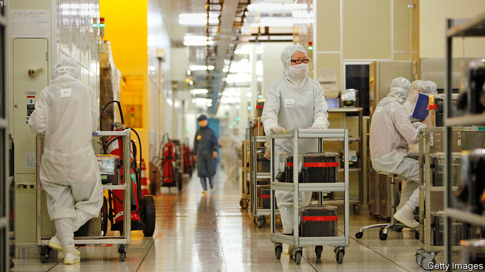
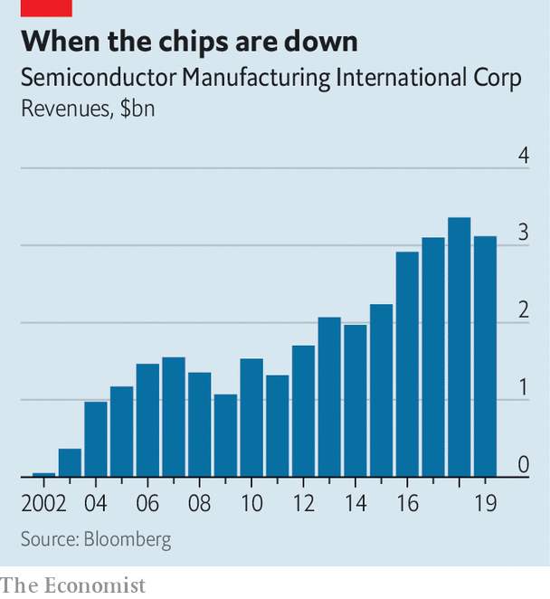

## What goes up, and up and up

# Why SMIC is surging

> China’s leading chipmaker looks unfazed by Uncle Sam’s semiconductor sabre-rattling

> Jul 9th 2020

TIMES SEEM tough for China’s chipmaking champion, the Semiconductor Manufacturing International Corporation (SMIC). Over the past year America has attacked its supply chains, cutting it off from essential high-tech tools. It has slapped export controls on SMIC’s customers and enacted new rules which threaten to designate the firm as subservient to the People’s Liberation Army. The company’s sales slumped by 7% in 2019 to $3.1bn—not the kind of performance expected of a Chinese high-tech titan.

SMIC is one of many corporate casualties in the escalating conflict over access to advanced technology that is playing out between America and China. As the two geopolitical rivals try to decouple their economies, they and their allies have enacted tit-for-tat restrictions on each other’s software and hardware. On July 6th Mike Pompeo, America’s secretary of state, said America might ban TikTok, a Chinese-owned short-video app beloved of Western teenagers. Facebook, Google, Microsoft and Twitter have suspended habitual co-operation with Hong Kong police after the Chinese territory adopted a new security law giving Beijing greater control (of the quartet only Microsoft has significant business on the mainland that could be a target of Chinese retaliation).

You might reasonably conclude that limp revenues and American ire would be a drag on SMIC’s share price. Not a bit of it. The Hong Kong-listed company’s market capitalisation has quintupled in the past year, to $29bn. SMIC is teeing up a new listing of shares worth 46.3bn yuan ($6.6bn) on the Shanghai Science and Technology Innovation Board (better known as the STAR Market). It has set a price for those shares that values the company at 109 times its 2019 earnings, a ratio five times greater than that of more advanced competitors like the Taiwan Semiconductor Manufacturing Company. It could be one of the largest listings anywhere in 2020.

So what is going on? The answers lie in SMIC’s status as China’s best hope of building a domestic semiconductor industry. This is a long-standing strategic objective for the Chinese Communist Party, which is therefore happy to put the might of the Chinese state behind SMIC. Although the company lags behind global competitors at the moment, it is in a strong position to sell chips to the large and growing Chinese electronics market.

Investors who put assumptions about a company’s long-term success over its short-term performance may view the American government’s attention as a signal of SMIC’s potential. Many Chinese patriotic day-traders probably belong to that group. But the immediate risk to their investment from America’s actions is real.

The latest assault came on May 15th, when the Department of Commerce introduced new export-control rules that prevent SMIC from using American chipmaking equipment to produce microprocessors for Huawei, the Chinese telecoms giant at centre-stage in the technological cold war. Bernstein, a research firm, says that if SMIC were to lose Huawei’s custom that would shave 20% from its existing revenue and, crucially, deprive it of “most” of its expected growth. SMIC’s already thin margins may turn negative when $1.7bn in capital spending since 2016 begins to incur depreciation costs, according to Bernstein, which recently said in a report that SMIC’s shares looked overvalued.

SMIC and its investors will hope that the firm can ride out these and future bumps to reach the lucrative position as chipmaker-in-chief to the Chinese market. Being backed to the hilt by China’s government will help. The question hanging over SMIC, and all of the country’s chip ambitions, is whether a combination of stockpiling kit and negotiating with partners can keep existing supply chains in place long enough, even in the face of American disruption, to allow for the development of domestic replacements. If it can, SMIC may flourish. If not, Beijing will miss its objective. ■

## URL

https://www.economist.com/business/2020/07/09/why-smic-is-surging
