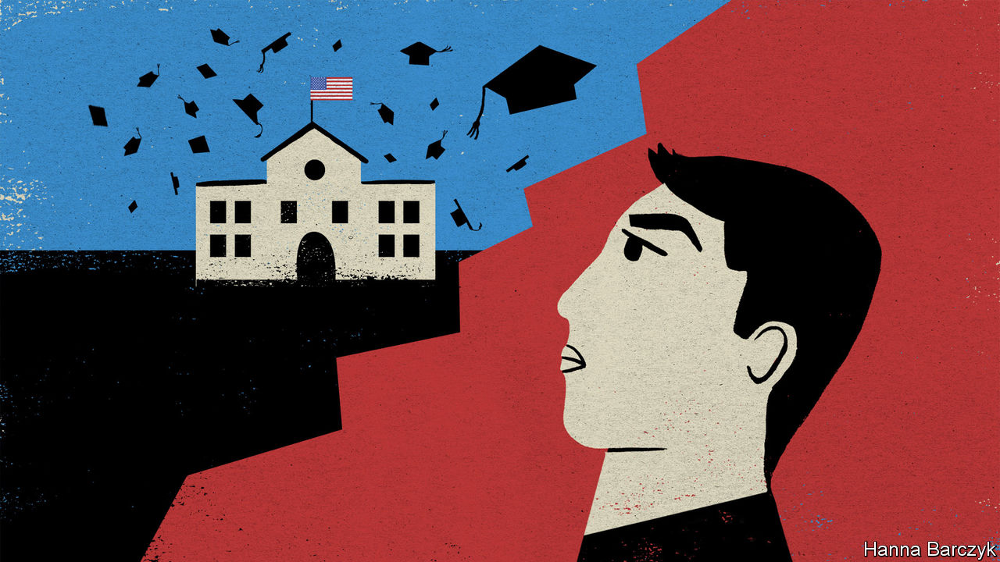

## Chaguan

# A Sino-American bond, forged by Chinese students, is in peril

> Plummeting Chinese demand for a US education will undermine American soft power

> Jul 9th 2020

THE FIRST Chinese graduate from an American university, Yung Wing, deemed his college years the great adventure of his life. Alas, his graduation from Yale in 1854, sponsored by missionaries who spotted his talents as a boy in rural Guangdong, was a high point. Soon political mistrust and prejudice, both in America and China, filled his life with setbacks. These included the ending of his scheme that involved bringing 30 Chinese youths to America each year. Back in Beijing, imperial mandarins saw value in the science that the youngsters studied in New England. These officials were especially eager to take up a promise that the military academies of West Point and Annapolis would admit Chinese cadets. Then, in a mark of disdain for the ailing Qing empire, America broke that promise. Mandarins were further appalled by the irreverent, sports-loving, churchgoing Yankee ways picked up by Yung’s charges. In 1881 they summoned the boys home in disgrace. Yung lost his American citizenship to a xenophobic law passed a year later, the Chinese Exclusion Act.

Yung would recognise the pressures his Chinese heirs face today. In the coming weeks many will have to decide how and whether to pursue studies in America. They are living through a moment when campuses, borders and minds on both sides of the Pacific are being closed by mutual suspicion (including overly sweeping American fears about on-campus espionage) and a pandemic.

There are currently 370,000 Chinese students and fresh graduates in America without an easy route home, after China slashed international flights as a covid precaution. Many who plan to stay face months of online study while campuses remain shut. On July 6th American immigration officials caused panic (and a lawsuit from Harvard University, among others) by declaring that unless foreign students in America attend some in-person classes next term they risk deportation. Another 50,000 Chinese would normally take up new places at American universities this autumn, but visa offices at America’s missions in China are closed, with no word on when they will open. Parents will soon receive tuition bills for the next semester, often for tens of thousands of dollars, even if their child can only watch virtual lectures at home in China.

This is a crisis with large effects, unevenly distributed. Some American schools are offering classes on Chinese satellite campuses, such as New York University Shanghai. Cornell has announced a “Study Away” scheme, allowing students in China to take a mix of American and local classes at prestigious universities in Beijing and other cities. Many wealthy, well-connected Chinese with places at top colleges are not ready to give up their American dreams. Talk to such students and their families, and what they are really describing is a larger plan to become world citizens, of which a degree is one part. Elite Chinese call America a place to learn critical thinking, build social networks, and secure credentials that will help land them jobs and perhaps green cards.

Elle, 18, attends the international section of a top-ranked high school in Beijing, where fees run to 160,000 yuan ($22,800) a year. She has an offer from New York University and wants to accept it. Rival countries do not appeal. Australia is for “those with bad exam results,” she says over coffee in a smart Beijing suburb. In Canada, she adds: “There are so many Chinese students that you don’t even have a chance to speak English.” As for Britain, she attended summer school there, but sensed coldness towards foreigners. “I like America more than the UK, I think I am accepted there.”

Elle’s older brother is studying in New York and wanted to stay, even after rioters smashed windows in his building. “It’s one thing after the other,” sighs Elle’s mother. She remembers holidays in America when the country seemed great “in every way”. But officials there have “failed quite badly on fighting covid”, she laments. She is shocked by ordinary Americans refusing to wear masks. Still, she thinks America offers chances that a Chinese education cannot, starting with the different, thought-provoking ideas that her children may encounter. “It’s more of a globalised experience.”

Families are hedging bets. Half of this year’s 150 clients of Elite Scholars of China, an education counselling service focused on the Ivy League and its ilk, also applied to non-American universities. In the end, though, only four took up places outside America, says Tomer Rothschild, the firm’s co-founder.

Another perspective comes from a larger group: middle-class students from provincial cities, heading to mid-ranked American colleges. To generalise, this group is less likely to enthuse about Western freedoms, from raucous debates to an uncensored internet. Their focus is on which degree will boost their earning power when they return to China to compete with local graduates.

Just now America is doing a remarkable job of making foreign students feel unwelcome. Chinese state media happily reinforce the message, with lavish reporting of American riots, anti-Chinese racism, gun violence and covid infections. Any decoupling may take time to be visible. Francis Miller, a college counsellor based in Xi’an, a western city, notes that the Chinese students he helps have to enroll in special international streams that prepare them for the SAT or other foreign exams from the age of 15 or so. That amounts to a commitment to study abroad, because they are abandoning the fearsome, three-year gaokao curriculum that governs entry to Chinese universities. Future trends are ominous. In the eastern city of Nanjing, a college-entry coach says her employer’s new-client numbers are down by two-thirds in a year.

Yung Wing wanted more Chinese to enjoy an American education to make his country “enlightened and powerful”. His dream involved risks for both sides. America was being asked to help China rise. Chinese rulers had to let youngsters taste new freedoms. Soon afterwards, leaders in both countries rejected that bargain. Over a century later, a folly repeated is still a mistake. ■