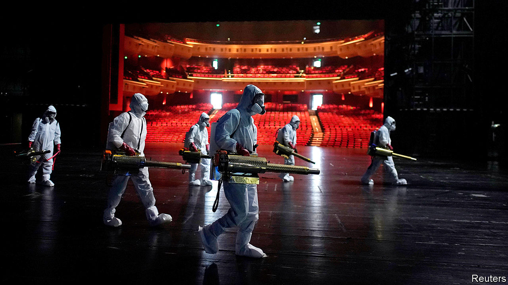

## Directed by the party

# NGOs in China have helped the government provide covid-related relief

> That will not earn them more freedom

> Jul 9th 2020

Editor’s note: Some of our covid-19 coverage is free for readers of The Economist Today, our daily [newsletter](https://www.economist.com/https://my.economist.com/user#newsletter). For more stories and our pandemic tracker, see our [hub](https://www.economist.com//news/2020/03/11/the-economists-coverage-of-the-coronavirus)

THE CHINESE COMMUNIST PARTY winces at the term “non-governmental organisation”: to officials, it smacks of dissent. Search for news about NGOs and their response to covid-19 on Baidu, China’s equivalent of Google, and almost all results relate to other countries. But try the preferred term, “social organisations”, and the results may seem surprising, given the party’s relentless efforts to box in civil society. While endlessly extolling the party’s response to the pandemic, state media also give credit to groups that are not under the government’s direct control. This is not evidence of a softer approach towards NGOs. It is a sign that the party believes it has succeeded in keeping them tame.

Chinese NGOS were quick to respond after officials acknowledged the scale of the outbreak in late January. Some were newly formed groups of good Samaritans, who organised themselves through social media. Members drove their own cars day and night to bring relief supplies to residents of the central city of Wuhan, the first coronavirus hotspot. Others were well-established NGOs, like the Beijing-based Blue Sky Rescue Team. It sent hundreds of volunteers to Wuhan to help deliver emergency medical supplies and disinfect public places (see picture).

For a country that prefers to keep its NGOs small, Blue Sky’s size is remarkable. Founded in 2007, it is described by state media as the country’s biggest non-governmental humanitarian group, with some 30,000 registered volunteers reporting to 31 branches nationwide. Its leader, Zhang Yong, is a former member of China’s paramilitary police force. The government’s trust is evident in the publicity the group receives, including for its work abroad (Blue Sky helped with relief efforts after an earthquake in Nepal in 2015). The group can provide an “excellent supplement” to the government’s relief efforts, Mr Zhang told China Daily, a newspaper.

During the pandemic, other large NGOs have helped, too. One is the Han Hong Love Charity Foundation, named after a famous singer who founded it in 2012. It raised millions of dollars to buy masks, sanitising gear and other supplies, which it then distributed. The Ginkgo Fellows in Covid-19 Relief Action is another. Set up by an existing network of philanthropists, its volunteers have helped patients connect with medical services, provided transport and delivered medical kit to hospitals. They have also offered counselling.

Even the party’s main mouthpiece, the People’s Daily, has praised the “strong support” NGOs have provided. But the lines are clear: any activity, whether organised or not, that appears to challenge the party is off limits. On July 6th police reportedly seized Xu Zhangrun, a law professor in Beijing who has long been an outspoken critic of the government. In February he and several other academics signed an open letter calling for a “national freedom-of-speech day” to be declared in commemoration of a doctor who died of covid-19 after being reprimanded by police for drawing public attention to early cases.

Since Xi Jinping became China’s leader in 2012, the party has stepped up its scrutiny of NGOs, mindful of the role they have played this century in “colour revolutions” against authoritarian regimes. In 2013 the party issued a secret directive, known as “Document Number Nine”. It said civil-society activism was becoming “a serious form of political opposition” in China. In 2016 a new law was passed, barring Chinese NGOs from receiving funds from abroad and requiring foreign ones to find an official sponsor and register with the police.

The party accepts that it sometimes needs help from civic groups. China’s first charity law, also adopted in 2016, made it easier for domestic NGOs to register and to raise funds at home. Between 2013 and 2019, the number of registered social organisations rose from 385,000 to 844,000. But the party has been stepping up efforts to ensure their obedience. This has involved the same tactic that it has used among private firms: setting up party cells within them, or if NGOs do not have enough party members, making sure that any they do have report to an outside party branch.

Blue Sky Rescue has several party cells embedded within it. In February the People’s Daily website, in an article praising the NGO’s response to covid-19, described the organisation as “both blue and red”. Some of the groups that have sprung up during the pandemic are not so well-enmeshed with the party. Guobin Yang of the University of Pennsylvania says early blunders by Wuhan officials, including failings in the distribution of medical supplies, “forced citizens to self-organise and take things into their own hands”. But, desperate for help, officials welcomed them.

This marked a step forward from 2008, when the government was startled by the scale and rapidity of the non-party response to an earthquake in Sichuan province that killed about 70,000 people. “Their thinking then was, ‘Who are you and why are you doing this?’” says Zhang Xuemei of the Sichuan Academy of Social Sciences. “But now they understand what kind of role NGOs and volunteers can play.”

Even in need, officials are twitchy. After the outbreak in Wuhan, the authorities there issued orders—later ignored—that donations be disbursed only by a handful of official organisations. According to Holly Snape of the University of Glasgow, their edicts initially caused “critical bottlenecks”. The government may learn lessons, but it will keep NGOs on a tight rein. Officials nationwide are striving for “complete coverage” of local NGOs by the party, meaning all should have links with it. Hebei, the province surrounding Beijing, says it plans to achieve this by year-end. The pandemic is unlikely to get in the way. ■