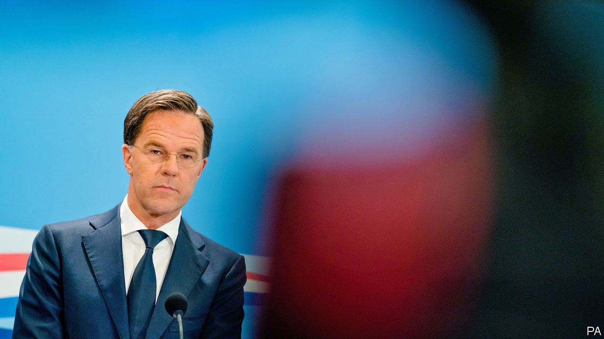

## Charlemagne

# A Dutch dilemma

> The art of compromise without capitulation

> Jul 11th 2020

MARK RUTTE makes an unconvincing villain. In person, the Dutch prime minister resembles an over-caffeinated vicar, mixing manic good-cheer with sermons on the importance of living within one’s means. The 53-year-old lives alone in a modest apartment, cycles to his poky office in The Hague and takes time off from running the country to teach social studies at a local school. Such do-goodery has not stopped Mr Rutte being cast as the bad guy in Brussels as the EU argues over a €750bn ($845bn) fund aimed at pepping up the bloc’s lockdown-hit economies.

The Dutch government is leading opposition to the plan, which involves a mix of grants worth €500bn and loans of €250bn handed to individual countries and paid for by the EU issuing debt collectively at scale for the first time. The scheme, or at least the outline of it, is supported by France, Germany and every other big country. Mr Rutte is the unofficial head of a band of sceptics and refuseniks, consisting of Sweden, Denmark and Austria as well as the Netherlands, known as the “frugal four”. At a summit next week—the first in person since the start of the covid-19 crisis—these two sides will square off. Unanimity is required for the plan to go ahead.

A view exists among Dutch voters and politicians that countries in southern Europe are in trouble because they spent too much or failed to reform their economies. (That Italy has run a primary budget surplus—spending less than it earns through taxes, before interest—since the 1990s receives much less attention.) The Netherlands (and its allies) are happy for the EU to give money to countries in need, but only if such money is paid back. It is a popular position. Dutch voters oppose the EU’s proposal by a margin of two to one. Objections abound. Although designed for countries struggling with the pandemic, one of the biggest beneficiaries of the fund would be Poland, which has been least affected economically. Arguments that the fund is needed to stop the single market falling apart are dismissed as scaremongering. “And China will invade,” adds one Dutch MP, sarcastically.

Opposition is philosophical as well as fiscal. Across southern Europe, collective debt is seen as a path to freedom. Among lawmakers in The Hague, it means tighter control: if Dutch taxpayers must pay then they should have a say, the logic runs. Trust in the European Commission to do the job is low. In a fit of honesty, Jean-Claude Juncker, the previous president of the commission, once declared that France would not be punished for breaking EU rules on deficits “because it is France”. Politicians in Italy and Spain may not like the idea of lawmakers in the Netherlands and other hawkish governments examining their spending, warn Dutch MPs.

These arguments were once common in Berlin. But this was before Angela Merkel underwent a conversion to the merits of debt issued jointly by the EU. In some respects, Mr Rutte is in a similar position to his German counterpart. The duo are the two longest-serving euro-zone leaders. Both have seen their polling soar in recent months. Both lead countries that are historically wary of using common debt to bail southern countries out. But they have responded to the crisis in very different ways. Safe in the knowledge that she will not fight another election, Mrs Merkel spent political capital cajoling a reluctant German establishment into support for the radical step of joint debt. With a Dutch election due in March, Mr Rutte may feel there are better ways to use his popularity.

A soft, flexible Euroscepticism has been one of Mr Rutte’s characteristics since coming to power in 2010. His People’s Party for Freedom and Democracy (VVD) has thrived by stemming the flow of voters to more right-wing rivals. It has done so with tough talk on things such as asylum policy and the EU, while taking care not to scare off more moderate voters. It is a crowded part of the spectrum. Christian Democratic Appeal, the centre-right coalition partners of Mr Rutte, have taken an even firmer line during talks over EU spending. Polls give the parties of Geert Wilders, a perennial populist, and Thierry Baudet, a new challenger, just under a fifth of seats combined. Both offer full-throated condemnation of the EU. Capitulation in Brussels would be leapt on by opponents.

Dutch Euroscepticism is more subtle than the breathless coverage of its populists allows. About 70% of Dutch people would vote to remain in the bloc if offered the choice, in line with the average figure across the EU. In comparison, only 53% of Italians would. This does not mean that Dutch voters want more of Brussels in their life—barely a third do. Euroscepticism, however, rears its head when money is involved. In such circumstances, the EU may require some defending, points out Rob Jetten, the parliamentary leader of D66, Mr Rutte’s Europhile liberal coalition partners. Britain provides a cautionary tale of what can otherwise happen.

In public the Dutch line is firm. The Netherlands will agree only to loans, Mr Rutte told an Italian newspaper. When speaking in the Netherlands, Mr Rutte has tended to focus on other matters, such as whether the money should have strings attached and ensuring the Dutch keep their rebate—a kickback on the EU’s €1.1trn budget, which will be negotiated at the same time as the recovery fund. These demands are more achievable than calling for the €500bn of grants to change to loans. Talks will be messy. But a good scrap in Brussels works wonders with domestic voters.

Flexibility has always been one of Mr Rutte’s skills. If the prime minister does sometimes resemble a man of the cloth, it may be because he has a touch of the famously adaptable Vicar of Bray. Under his leadership, the VVD has been more than happy to drift around the political spectrum. He likes to keep his options open. During one lecture on faith, he hedged his belief in God: 51% of him did, 49% did not. It is a tactic that has served him well for a decade. Compromise on the recovery fund is inevitable. When it arrives, Mr Rutte’s depiction as the villain will be revoked in the EU at large. The trick will be to make sure it is not introduced at home. ■