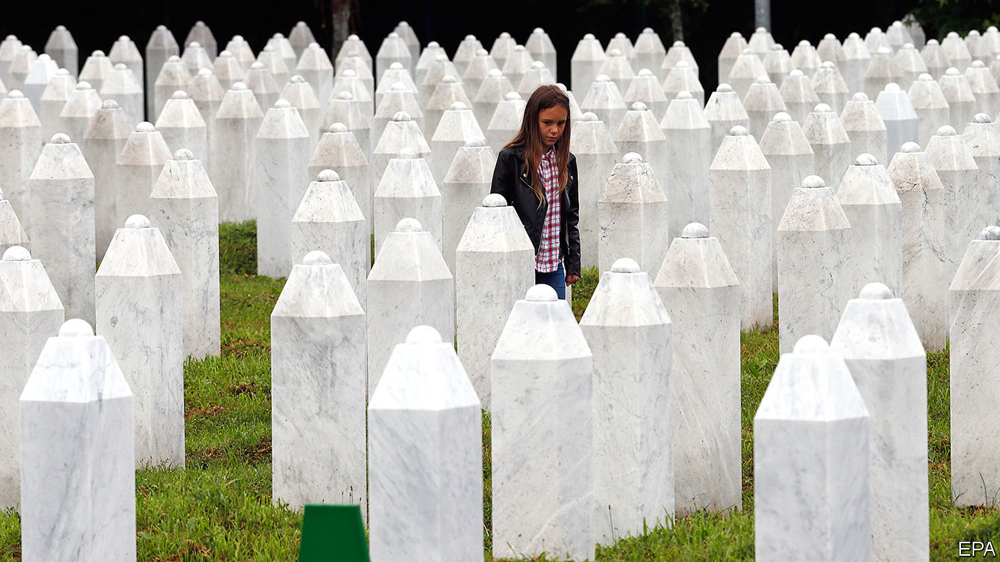

## A genocide denied, 25 years on

# The massacre of Bosnian Muslims is still denied by Serbs

> A Balkan battle of memory is still being fought

> Jul 9th 2020

THEY WILL pour 8,372 commemorative cups of coffee in Srebrenica on July 11th. A quarter of a century after the fall of the Bosniak (Bosnian Muslim) enclave at the end of the Bosnian war, when that number of men and boys are reckoned to have been massacred by Bosnian Serb soldiers, this year’s ceremony will feature videos sent by princes, presidents and leaders from all over the world. But one prominent local figure will be conspicuously absent: Srebrenica’s own mayor.

Like most Bosnian Serbs, Mladen Grujicic will ignore the event. He denies that an act of genocide took place. Other theories widely believed by Serbs and promoted by their politicians and media are that the scale of the crime has been wildly exaggerated, or that the cemetery, where more than 6,600 of the victims are buried, contains the remains of those who had no connection to Srebrenica, which was besieged for three years before it fell to the Serbs in 1995.

Ever since the months after the massacre, when the Bosnian Serb leadership arranged the exhumation of the mass graves in an attempt to hide the corpses in dozens of smaller ones, “Srebrenica denial” has been one of the ugliest legacies of the war. Like Holocaust denial or Turkey’s denial that its troops committed a genocide of Armenians in 1915, it is damaging to the reputation of Serbs.

The UN’s Yugoslav war-crimes tribunal in The Hague convicted the leading perpetrators of the Srebrenica crime and concluded that it was the single act of genocide committed in the Balkan wars that followed the break-up of Yugoslavia. Chuck Sudetic, an American former war-crimes investigator, says it is incredible how much information has been collected, perhaps in greater detail than for any war crime ever committed. Every order has been recorded. We know what happened in virtually “every minute” of those days, he says.

In 2004 the Bosnian Serb president acknowledged what had happened—and apologised. But since then, Serb leaders in Serbia and Bosnia have back-pedalled. Milorad Dodik, the Bosnian Serbs’ representative in Bosnia’s current three-man presidency, says the genocide was “a fabricated myth”. In Serbia government officials admit that a crime took place, but fiercely deny it was an act of genocide.

Across the former Yugoslavia, says Marija Ristic of the Balkan Investigative Reporting Network, a regional group of NGOs that promotes freedom of speech and human rights, the bloody conflicts of the 1990s have given way to “memory wars”. Serbs reject the label of genocide for Srebrenica because “everyone in the Balkans wants to be seen as the ultimate victim”.

After the second world war Germans gradually faced up to the horror of the Holocaust, but a similar process is not yet happening in the Balkans. By the middle of the 1960s, says Eric Gordy, a sociologist, most of those Germans who would be most shamed by an open discussion of the past were dead or retired. Yet in the Balkans the same people are still in power or are competing for it.

A common argument is that almost everyone involved in the war committed crimes. In Bratunac, near Srebrenica, Bosnian Serbs commemorate their own dead. But most of those were soldiers who died in combat, not civilians. Attempts to deny or minimise the crime of Srebrenica fuels bitterness. Emir Suljagic, who runs Srebrenica’s memorial centre, says that “a culture of denial…lays the groundwork for future genocides.” He wants Bosniaks to remember “what our destiny is going to be if we are ever as weak as we were in July 1995”. ■

## URL

https://www.economist.com/europe/2020/07/09/the-massacre-of-bosnian-muslims-is-still-denied-by-serbs
