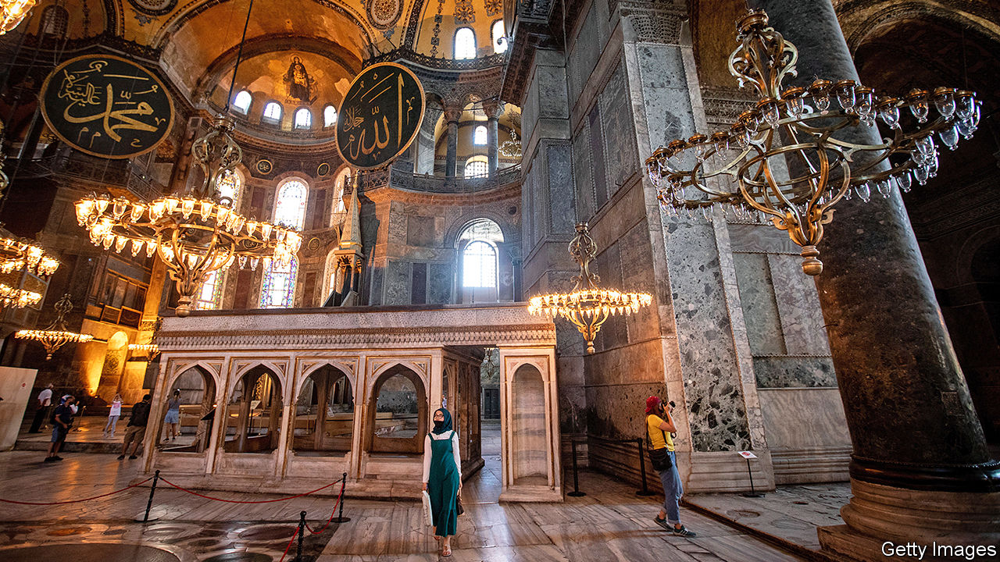

## Converting the Hagia Sophia

# Turkey’s president is playing religious politics

> He wants to turn Justinian’s cathedral from museum back to mosque

> Jul 11th 2020ISTANBUL

IT WAS BORN as a church, one of the icons of the Byzantine world, before being converted into a mosque by the Ottoman Turks and into a museum by their secular-minded successors. But now it would be transformed again. Workers squeezed a bland wooden minbar into a corner of the nave and a mihrab into a nearby portico, drew panels and screens to obscure the dazzling 13th-century Christian frescoes looking down from the vaults and the dome, and unfurled a red carpet over the marble floor. A muezzin summoned the faithful to prayers. The Hagia Sophia was now a mosque.

That was in 2013, and not in Istanbul, home of the Hagia Sophia known to millions of tourists worldwide, but in Trabzon, another Turkish city once populated by Greeks (and known in English as Trebizond), home to the ancient shrine’s much smaller and younger namesake. There are at least five former Byzantine churches dedicated to the Hagia Sophia (“Holy Wisdom” in Greek) across Turkey. Over the past decade, four, including the one in Trabzon, have reopened as mosques. The same fate now awaits the most important of them, the sixth-century Hagia Sophia, the grand old lady of Eastern Christendom, and Istanbul’s domed crown.

On July 10th, following an appeal by an Islamic NGO, Turkey’s top administrative court repealed a decision from 1934 to turn the Hagia Sophia into a museum. The country’s president, Recep Tayyip Erdogan, then signed a decree ordering its conversion into a mosque. That he would do so was never in doubt. Last year Mr Erdogan said it was a “very big mistake” to use the building as a museum. Last month he suggested Muslim prayers would be held inside the Hagia Sophia on July 15th, the fourth anniversary of a failed coup against him.

Built by the Byzantine Emperor Justinian I on the site of a church commissioned by Constantine, founder of Constantinople, the Hagia Sophia has hovered over the historical capital of the eastern Roman Empire since 537. Early visitors were awestruck, especially by the basilica’s central dome, covered with millions of shimmering gold tiles. “We did not know where we were, in heaven or on Earth,” envoys from Kievan Rus reported in the tenth century.

Crusaders plundered the cathedral in 1204, making off with its gold, silver and relics, many of which ended up in Venice. Similar scenes ensued in 1453, when the Ottoman army captured the city—the “red apple” at the end of the world, they called it. Mehmet, their 21-year-old sultan, marched into the cathedral, pouring dust over his head as a sign of respect, and immediately ordered its transformation into a mosque. Nearly five centuries later it was modern Turkey’s secular founder, Kemal Ataturk, who had the shrine converted into a museum. Christian mosaics covered up with plaster saw the light of day for the first time since the Ottoman conquest.

Mr Erdogan, who resides in a 1,100-room palace, surrounds himself with courtiers and appoints family members to senior positions, but resents being compared to a sultan, wants to conquer Istanbul and the Hagia Sophia all over again. He needs to deflect attention from the economy, now bracing for a second recession in as many years, and to reverse his Justice and Development (AK) party’s waning support in the polls. “We are living with a government that is running on empty,” says Soli Ozel of Kadir Has University. “The only thing in their inventory is to appeal to religion and nationalism.” Studies suggest that a large majority of Turks would support the Hagia Sophia’s conversion. But many also believe the government is using the issue to distract from more pressing problems. Some suspect Mr Erdogan may be preparing the ground for early elections, barely two years after the last ones.

That would also explain the rise in repression following a hiatus while Turkey has been dealing with covid-19. In the past month three opposition MPs and two journalists have been arrested on espionage and terrorism charges, and four human-rights activists, including two from Amnesty International, were sentenced to prison terms ranging from two to six years. The authorities also slapped a pair of opposition TV channels with a temporary broadcasting ban and closed a university linked to a former prime minister who is now one of Mr Erdogan’s political rivals. The lockdown is over. The crackdown is back.

Mr Erdogan also has a legacy to cement. The government and its religious backers see the era ushered in by Ataturk in the 1920s as a “parenthesis” in Turkish history, says Selim Koru of Tepav, a think-tank in Ankara. “Converting the Hagia Sophia would mark the closing of that parenthesis,” he says. “Ataturk unmosqued the Hagia Sophia to underline his commitment to secularism, taking religion out of public space,” says Soner Cagaptay of the Washington Institute, another think-tank. “Erdogan is doing nearly the opposite.”

All this comes at a high cost to Turkey’s reputation abroad as a relatively open Muslim society and to relations with its allies. Mike Pompeo, America’s secretary of state, had already urged Mr Erdogan to preserve the Hagia Sophia as a museum. Even the traditionally reserved Ecumenical Patriarch of Constantinople, Bartholomew I, warned that changing its status “will turn millions of Christians around the world against Islam”. A senior official of the Russian Orthodox Church said the move would signal “a return to the Middle Ages”. Russians have always felt a deep connection to Istanbul, the “second Rome”. Muscovites used to call their city the “third Rome”.

That may indeed be part of the plan. A good dust-up with foreign powers generally plays well in Turkey these days. But the damage Mr Erdogan will do to his country’s image by pushing ahead with his idea may well be irreparable. ■

Editor’s note (July 10th 2020): This story was updated to include the news that a Turkish court had ruled that it was permissible for the government to convert Hagia Sophia from a museum to a mosque.