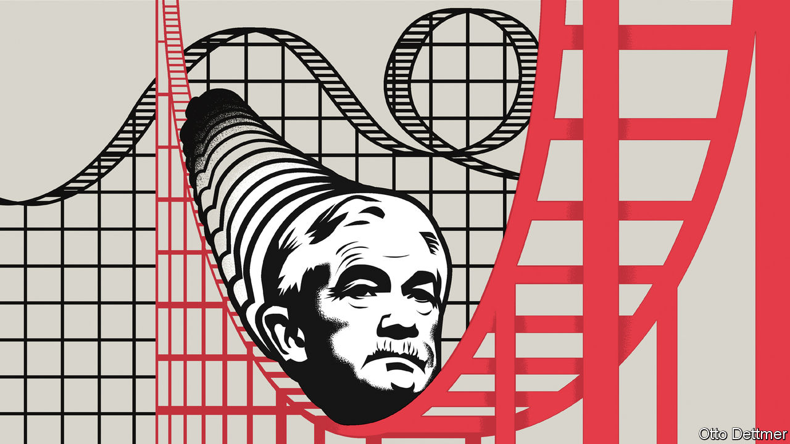

## Free exchange

# Americans need more guidance from the Fed

> Spelling out the future path of policy would help

> Jul 9th 2020

YOU MAY think that central banking is a sort of macroeconomic engineering—tweaking an interest rate here or a financial regulation there. But psychology enters into it, too. In order to achieve strong growth, people need to spend today as if the health of tomorrow’s economy were assured. That makes communication critical. Early on Jerome Powell, the chairman of America’s Federal Reserve, showed signs of an aptitude for managing collective confidence. He is plain-spoken, with a charm that often eludes economic policymakers. But now he faces a truly forbidding environment. Both his legacy and the trajectory of America’s recovery depend on how he wields the credibility he has earned.

When Mr Powell took over as chairman in 2018, expectations of him were modest. President Donald Trump chose him rather than offering Janet Yellen—a respected economist—a second term, even though she had done the job ably. Mr Powell had studied law not economics, and spent most of his career in finance. Though a Republican, he had been nominated to the Fed’s Board of Governors by Barack Obama, Mr Trump’s predecessor, as a concession to Congressional Republicans, who habitually stonewalled his Democratic nominees.

In fact the early Powell years proved surprisingly good. The economic expansion he had inherited stretched into the longest on record. By early 2020 America’s unemployment rate had sunk to 3.5%, the lowest level in half a century. In 2018 the central bank launched a review of its tools and communications, which included “Fed Listens”, a series of public events. These ran the risk of being little more than a public-relations exercise. Instead, they seem to have made a meaningful impression on Mr Powell. He credits them for the insight, frequently mentioned in his speeches, that low-income workers are often the last to benefit from economic expansions. A single-minded focus on low inflation can thus systematically impose hardships on working-class households.

It is difficult to be sure, but this lesson seems to have influenced policy. The Fed cut its benchmark interest rate by 0.75 percentage points in the second half of 2019 despite warnings—some from within—that doing so when unemployment was historically low and asset prices high could fuel inflation or provoke financial instability. Assessing America’s impressive employment figures in November, Mr Powell reckoned there was “still plenty of room for building on these gains”. When the pandemic struck, he moved quickly to limit its economic damage. The Fed launched an armada of lending programmes to keep financial markets functioning, swiftly slashed its main policy rate back to zero, and bought nearly $3trn in assets using newly created money. Congress acted too, passing legislation to help struggling firms and households. Amid America’s flailing institutions, however, Mr Powell’s Fed at times seemed uniquely competent.

The nature of the covid-19 downturn is now changing. The first steps towards reopening helped the economy claw back some of the enormous output losses sustained between February and May. But the early rebound masks a grim long-run outlook. Although employment jumped by nearly 5m in June, an astounding rise, the level is still nearly 15m below that in February. The number of permanent job losers rose by nearly 600,000. Forecasts have become gloomier. New projections by the Congressional Budget Office suggest that America’s economy will not return to operating at full capacity until 2028 at the earliest. Even by 2030, the unemployment rate may be no lower than when Mr Powell took over.

Mr Powell thus finds himself in a position uncomfortably similar to that of Ms Yellen and Ben Bernanke, who served as chairman in 2006-14: of having exhausted conventional monetary tools just as a long period of economic weakness looms. Like them, Mr Powell has emphasised that more fiscal stimulus is needed. But he seems in no rush to try unconventional policy tools, such as setting caps on long-term interest rates, cutting short-term rates below zero or talking more explicitly about the path of future policy (known as forward guidance). Mr Powell seems to be reticent not because he thinks the costs of such tools outweigh the benefits, but because he believes he has done enough. “I would say that we think that monetary policy today is currently well positioned,” he noted in June. The reluctance may seem sensible. Further reductions to already-low interest rates would provide a modest boost to demand at best. The logic of forward guidance is that the promise to tolerate above-target inflation tomorrow encourages spending today. But in the short run, the danger posed by covid-19 is quite clearly the greatest impediment to rapid recovery. The Fed can do nothing about that.

Inaction is riskier than it seems, however. The Fed cannot easily make things better for as long as the pandemic rages, but it can make things worse. Without clear guidance from the central bank on the sorts of conditions that would justify a rise in interest rates, expectations of rate rises and a slow recovery—like the last one—could become entrenched. Mr Powell has cultivated a reputation as a champion of full employment; this could allow him to make a credible commitment to keeping policy accommodative even as a rapid rebound unfolds. He could even borrow a trick from Mr Bernanke, for instance, who in retirement has argued that when interest rates fall to zero, central bankers should consider adopting a temporary price-level target, promising to make up for any shortfalls in inflation that occur during a recession, and tolerating temporary periods of above-target inflation.

Too little communication on policy could mean more permanent job losses, entrenched pessimism and the erosion of Mr Powell’s credibility. Few would blame him if another devastating downturn is followed by another anaemic recovery. But he may just be able to persuade Americans to expect something better. ■

Editor’s note: Some of our covid-19 coverage is free for readers of The Economist Today, our daily [newsletter](https://www.economist.com/https://my.economist.com/user#newsletter). For more stories and our pandemic tracker, see our [hub](https://www.economist.com//news/2020/03/11/the-economists-coverage-of-the-coronavirus)

## URL

https://www.economist.com/finance-and-economics/2020/07/09/americans-need-more-guidance-from-the-fed
