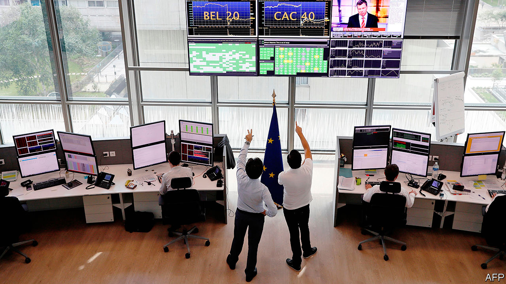

## Down time

# Europeans quibble about long trading hours: the finance edition

> Europe’s stockmarkets are open for longer than anywhere else

> Jul 9th 2020PARIS

IN THE POPULAR imagination, Americans toil endlessly in the office while their European counterparts arrive late, lunch at leisure and depart punctually. If that were ever true equity traders were never let in on the scheme. Opening hours on stockmarkets in Europe are some of the longest in the world, keeping financiers at their Bloomberg terminals far longer than those following American or Asian bourses. Despite that, a proposal to cut back trading hours is making little headway.

That European markets open early and close late is partly a function of geography. Frankfurt, London and Paris (among others) aspire to be a kind of bridge between Asia, where stock exchanges close as Europe opens, and America, which gets going towards the end of its trading day. But that means eight-and-a-half hours of trading, from 9am to 5:30pm. That is two more than at the New York Stock Exchange, where vastly more shares switch hands. Tokyo’s market is open for just six hours, interrupted by lunch.

Late last year trade groups representing investors that buy shares and bankers that sell them had together suggested to operators of European stockmarkets that the working day be shortened. Opening an hour later and closing half an hour earlier, say, would concentrate buying and selling in a shorter window. Far from cutting traded volumes, they argued, the smaller and more liquid trading window might even entice more activity.

Starting an hour later and finishing a bit earlier would certainly mean less stress for traders, who have to be at their desk at least an hour before markets open. That might attract more diverse staff, notably women, not just in trading but in all the finance jobs that surround it. The pulse of the financial day—when companies release results, for example—is dictated in part by when markets open and close.

By and large, though, the stock exchanges are not keen. In recent weeks they have either rejected the idea outright or kicked it into the long grass. They argue that retail investors would find it harder to place their orders outside their own working hours. The overlap with Asia, though minimal, gives Europe special status in the financial world, even as the old continent’s markets are dwindling in relative importance. And if the days are too long for traders, perhaps they could simply work in shifts instead.

Surprisingly, the push for shorter hours is coming from the Anglo-Saxons of the City. The London Stock Exchange is the only bourse to have responded warmly to the pitch for shorter days. That could be because London opens an hour earlier, at 8am, in order to synchronise with continental exchanges. And hours will only be cut if everyone agrees to make the shift simultaneously.

Part of the reason for exchanges’ reluctance is that they worry that banks are angling to match buyers and sellers of shares themselves, as they do outside trading hours. Plenty of investors may even be wondering whether humans need to be involved, given that most financial transactions these days are conducted by machines. Flesh-and-blood traders angling for shorter hours may soon find they will be working none at all. ■