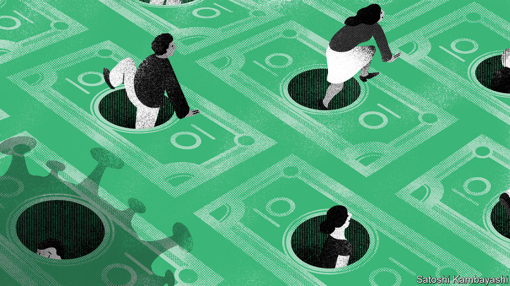
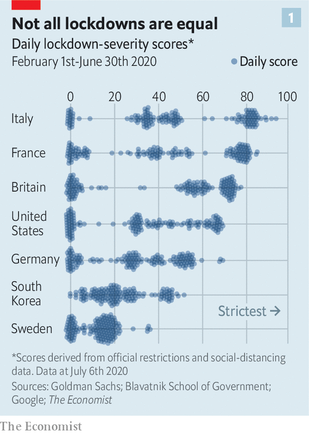
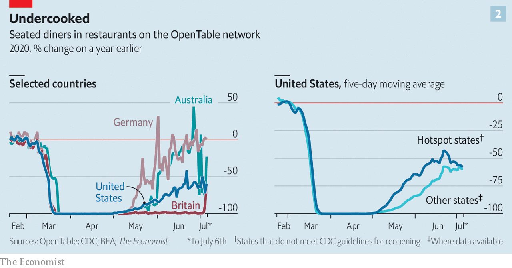

## How to feel better

# Some economies are bouncing back. But recoveries can easily go wrong

> Our analysis shows just how fragile consumer confidence can be

> Jul 11th 2020ORFORD

ORFORD NESS, on Britain’s east coast, was a site for military tests in the 20th century. Large pagodas on the shoreline, still standing today, were designed to prevent blasts from doing damage to the surrounding wetlands. On July 4th the area braced itself for another sort of explosion. “Super Saturday” marked the opening of pubs and restaurants for the first time since lockdown began. But in Orford the beery bomb never detonated. The Jolly Sailor, a pub near the quay, had only a handful of customers in the garden. Across Britain it was the same story. Restaurant reservations remained 90% lower than they were the year before.

The fate of the Jolly Sailor hints at the difficulties that rich countries face as they lift lockdowns. Most forecasters reckon that advanced-economy output, after plunging in the first half of 2020, is likely to regain its pre-crisis level some time after 2021. But not all recoveries will be equal. Some rich countries, such as Germany and South Korea, look best placed to bounce back—a “V-shaped recovery”, in the jargon. The path of GDP elsewhere may look more like an L or a W. The Economist’s analysis of real-time mobility data also shows how easily economic recoveries can go wrong, as consumers react to the possibility of fresh outbreaks.

Some countries have a tougher job on their hands because their output has fallen more since February, when lockdowns started to be imposed. No one knows for sure yet who has fared well or badly. GDP data for the second quarter are not yet available, and in any case will probably be subject to large revisions over time, as is often the case in downturns. But industrial structure is one indication. Surveys of economic activity in Germany suggest that it held up better between March and May than it did in France, Italy or Spain. That may be because of its heavy reliance on manufacturing, where maintaining both output and a social distance is easier than, say, in retail or hospitality services. Capital Economics, a consultancy, argues that Poland will experience Europe’s smallest contraction in GDP this year in part because it relies little on foreign tourists.

The stringency of official lockdowns, and changes to people’s behaviour, has clearly played a huge role. Research by Goldman Sachs, a bank, finds that lockdown stringency—in terms of both the strength of official rules and how enthusiastically people practised social distancing—is strongly correlated with the hit to economic activity, as measured by surveys. By this measure, Italy had the tightest lockdown for the most time (see chart 1). A back-of-the-envelope calculation suggests that its GDP for the first half of 2020 is likely to come in about 10% lower than it would have been otherwise—a lot of ground to make up for a country that struggled to grow even before the pandemic. By contrast, South Korea’s GDP looks likely to fall by 5%.

The lifting of lockdowns is now boosting economic activity. By how much, however, varies from country to country. Real-time activity data suggest that America and Spain are laggards, not only in terms of visits to restaurants but also to workplaces and public-transport stations. Others are powering ahead. By the end of June, economic life in Denmark and Norway had pretty much returned to normal. Danish retail sales actually rose by more than 6% year-on-year in May (compared with a double-digit decline in Britain). Germany’s restaurants were closed in May. But in recent days they have returned to full capacity (see left-hand panel of chart 2).

A number of factors influence how fast an economy can bounce back. The state of households’ finances is one. Government support has shored these up: in places where stimulus payments have been large and focused on families, people have built up large cash reserves, which they can now spend. Take the case of South Korea. Households quickly spent over 80% of a 10trn-won (0.5% of GDP, or $8.4bn) emergency handout. As a result, its economy might suffer less than other big advanced economies. Aggregate household income in Japan is forecast to rise this year, thanks in part to generous emergency payments from the state. By contrast, fiscal stimulus in Italy, which had staggeringly high government debt going into the crisis, has been less generous.

All this is nothing without consumer confidence. Americans have oodles of stimulus cash in their pockets (see [article](https://www.economist.com//united-states/2020/07/06/americas-huge-stimulus-is-having-surprising-effects-on-the-poor)). Even so, they are cautious. A raft of evidence shows that if consumers are fearful, then lifting lockdowns makes little difference to economic outcomes. An analysis of American counties by Austan Goolsbee and Chad Syverson of the University of Chicago, for instance, finds that a higher number of deaths from covid-19 is associated with lower consumer activity.

That seems to be the case at the country level too. Those with a smaller number of deaths from covid-19 per million people have bounced back more decisively, according to an analysis by The Economist using data from Google on visits to retail outlets, workplaces and public-transport stations. Confidence today may also be shaped by the length of time spent under lockdown. Norway took just ten days to halve the intensity of its lockdown from its peak level. Many other European countries took ten weeks, however. That perhaps explains why Britons and Spaniards are still so cautious.

The latest mobility figures show precisely how fragile consumer confidence can be. People in American hotspot states, such as Arizona, Florida and Nevada, where the virus is surging, seem to have become more cautious (see right-hand panel of chart 2). A high-frequency measure of American credit-card spending maintained by JPMorgan Chase, a bank, stopped growing around June 21st—and a closely watched measure of weekly retail sales has barely increased since May. More ominously, high-frequency measures of the labour market suggest that employment in small businesses is once again declining. The risk of relapse is not confined to America. A huge drop in Australian restaurant diners in early July coincided with a large coronavirus outbreak in Victoria. Until the virus is stamped out, only one thing can be said about the recovery with certainty: it will be shape-shifting. ■

## URL

https://www.economist.com/finance-and-economics/2020/07/11/some-economies-are-bouncing-back-but-recoveries-can-easily-go-wrong
