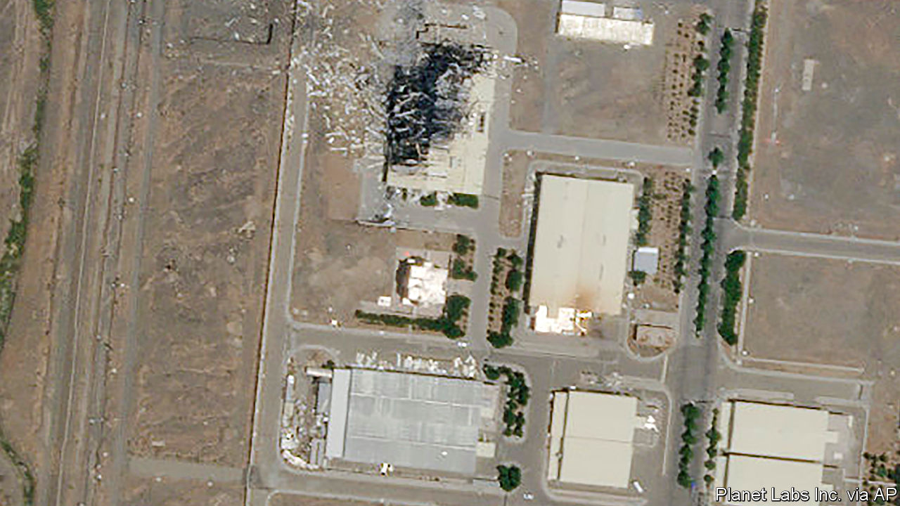

## Explosions and suspicion

# A better way to contain Iran’s nuclear programme

> Sabotage might set it back. A deal would limit it

> Jul 11th 2020

MUCH MYSTERY still surrounds the fire that broke out at an important nuclear facility in Iran on July 2nd. Some of the region’s spooks say the blaze was the result of a cyber-attack. Others insist it was a bomb. Suspicion has fallen on Israel and America, which have a history of sabotaging Iran’s nuclear programme. Other episodes have raised eyebrows in recent months—explosions at power plants and near military sites, a gas leak at a chemical plant. Some of these may also have been the work of saboteurs (see [article](https://www.economist.com//middle-east-and-africa/2020/07/09/what-to-make-of-a-series-of-odd-explosions-in-iran)).

It is safe to say that America and Israel are pleased by the outcome: Iran says that the latest incident caused “significant damage”. But what looks like a tactical success is actually evidence of strategic failure. Iran’s nuclear activity had been constrained by the agreement that it signed with world powers in 2015. President Donald Trump, with encouragement from Israel, yanked America out of the accord and heaped sanctions on Iran, claiming that he would be able to negotiate something better. Not only has Mr Trump failed to get a better deal, he has pushed Iran into dangerous new territory.

Iran is hardly blameless. It often threatens to destroy Israel, while being coy about its nuclear programme. International inspectors say Iran is hiding activity. It was developing new centrifuges at the facility that was damaged on July 2nd. The devices are needed to enrich uranium, which can be used to make power—or, if highly enriched, a bomb. Iran has enough of the stuff to produce a single weapon. So there was a case for pre-emptive action, which has proved effective before. A bit of malware called Stuxnet, believed to be an American-Israeli cyber-weapon, wreaked havoc on Iran’s nuclear programme a decade ago.

Sabotage might set back the programme some months. But it is no match for a deal that constrained Iran for at least a decade. Under the accord, Iran gave up 97% of its uranium fuel (enough to make over a dozen bombs) and kept its stockpile well below the one-bomb threshold. It was subject to tough inspections. Even America said it was complying. Compare that with the results of Mr Trump’s “maximum pressure”. Iran now has about eight times as much enriched uranium as allowed under the agreement. It is stonewalling inspectors. Every month it moves further from the deal, which other signatories have tried to save.

Mr Trump’s policy has failed in other ways, too. He said he wanted an accord that curbed Iran’s missile programme and halted its support to proxy militias in the region. Some in his administration seemed bent on regime change. Yet Iran says it has built underground “missile cities”. From Syria to Iraq, its adventurism continues. Maximum pressure may produce a leadership change—but not the kind America wants. American sanctions have caused a backlash against Iranian politicians who engaged with the West, such as President Hassan Rouhani. Hardliners now want to impeach him.

Despite the calls for talks, Mr Trump and his administration have done all they can to poison relations. Iran is betting that he will be voted out of office in November. Its actions, though, are making it difficult for any future president to jump back into the nuclear deal or negotiate a new one. More rounds of dull, arduous negotiations, like those that took place in Vienna in 2015, will be needed. They would not grab headlines like a sabotage campaign, nor would they produce a perfect agreement. But it is increasingly clear that the alternative is worse. ■