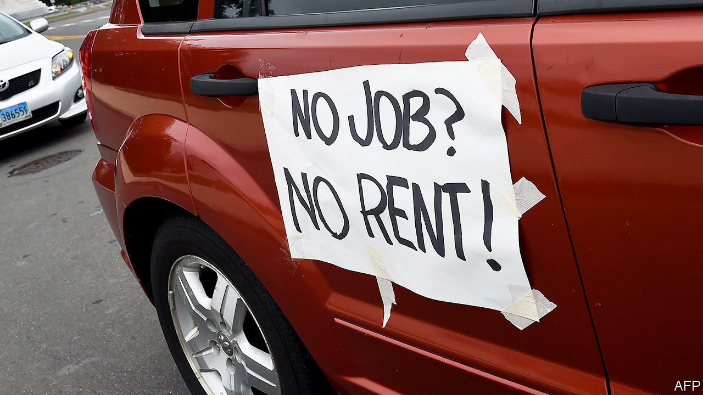
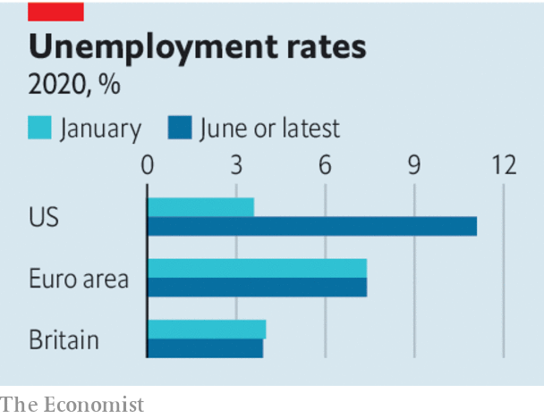

## Tapering without the tantrum

# As the economy recovers fiscal policy has to shift

> Is it time to wind down emergency stimulus?

> Jul 11th 2020

Editor’s note: Some of our covid-19 coverage is free for readers of The Economist Today, our daily [newsletter](https://www.economist.com/https://my.economist.com/user#newsletter). For more stories and our pandemic tracker, see our [hub](https://www.economist.com//news/2020/03/11/the-economists-coverage-of-the-coronavirus)

AS THEY FIRST battled the pandemic with lockdowns earlier this year, governments in the rich world pumped cash into the economy almost indiscriminately. Output was collapsing and the speed and scale of support rightly trumped any worries about its cost, accuracy or side-effects. Now lockdowns are easing, there are tentative signs of economic recovery (even in places where covid-19 is still raging) and political debate has shifted to whether, when, and how far to pare back these dauntingly expensive emergency fiscal policies. America’s unemployment top-up scheme expires on July 31st, Britain’s furlough scheme at the end of October. What should governments do?

They should start by acknowledging that the largesse worked. Massive fiscal support has proved remarkably effective. Nothing could have prevented a sudden stop in activity as lockdowns were imposed. But generous top-ups to unemployment benefits and direct cheques from Uncle Sam meant that in April household incomes in America were 12% above their level a year earlier, even as joblessness reached its highest level since the Depression. Remarkably, the poverty rate has fallen since the start of this year (see [article](https://www.economist.com//united-states/2020/07/06/americas-huge-stimulus-is-having-surprising-effects-on-the-poor)). In Britain and the euro area, where governments have channelled stimulus through furlough schemes, the share of people in unemployment is no higher than in January.

However, the recovery is fragile. Not only is the virus still spreading rapidly in much of America’s south and west; localised outbreaks are also happening in countries where caseloads have fallen. And even without full lockdowns, rising infection rates will weaken the recovery. The latest real-time mobility data from Australia and America suggest that supposedly gung-ho consumers get spooked fast when infection rates spike (see [article](https://www.economist.com//finance-and-economics/2020/07/11/some-economies-are-bouncing-back-but-recoveries-can-easily-go-wrong)).

Why not just continue the stimulus? One reason is the staggering cost. Rich-country governments have collectively launched stimulus programmes worth 10% of GDP, with one-third of that either subsidising work or compensating people who lose it. Before the year is out, government deficits in these countries will easily be in double digits.

It also makes no sense to freeze the economy for too long. All the signs are that life in the 2020s will be different from life in 2019—think of the surge in e-commerce and remote working; or the expectation of a long-term dampening of demand for air travel; or the reality that customers in pubs may no longer be allowed to elbow their way through crowds to order pints. Workers will have to leave their old jobs, and find new ones. In Europe a fifth of furloughed workers have jobs in industries that seem likely to shrink over time, such as hospitality and leisure.

As governments grapple with this, lots of bad ideas are creeping in. In June the French government said it would extend its furlough scheme to two years, in return for reductions in working hours. France also makes extra allowances for the tourism trade, even though Parisian guides and Club Med windsurfing instructors may face a permanent drop in demand. Meanwhile on July 8th Britain’s chancellor, Rishi Sunak, said he would cut value-added taxes for hospitality and leisure firms and introduce a scheme that cuts up to £10 ($12.60) off restaurant bills on Mondays to Wednesdays (soft drinks are included, but not the hard stuff). Some economists have called for wage subsidies for the worst-hit industries.

Instead of giveaways and gimmicks, the right way to taper depends on the type of support already in place. America has funnelled cash to people through unemployment insurance, extending the duration of benefits, and topping up their amount by $600 a week. Letting the extension lapse when unemployment still exceeds 10% would be cruel, yet because the support is so generous, three-quarters of claimants are making more from benefits than they did from work. The solution, as a group of former White House advisers has proposed, is to taper benefit payments as unemployment falls. Linking the generosity of payments to states’ unemployment rates would steer stimulus to worst-hit areas—including those that experience fresh bouts of covid-19. In Europe the risk is that employers and workers are frozen in an unproductive relationship for too long. The best approach is to taper furlough payments which, for example, cover more than four-fifths of wages in France. They would then converge towards unemployment insurance, which does not shackle the claimant to an employer. That is how Germany’s Kurzarbeit scheme operates in normal times.

There will be repeated flare-ups of the virus, and it is hard to predict how much that will scare consumers. Hence, even as governments trim stimulus, they must stand prepared to crank up support again. Early on, their aim was simply to throw cash at the economy. Now it is to use finite resources to help workers and firms through the pandemic and adjust to a brave new world. ■

## URL

https://www.economist.com/leaders/2020/07/11/as-the-economy-recovers-fiscal-policy-has-to-shift
