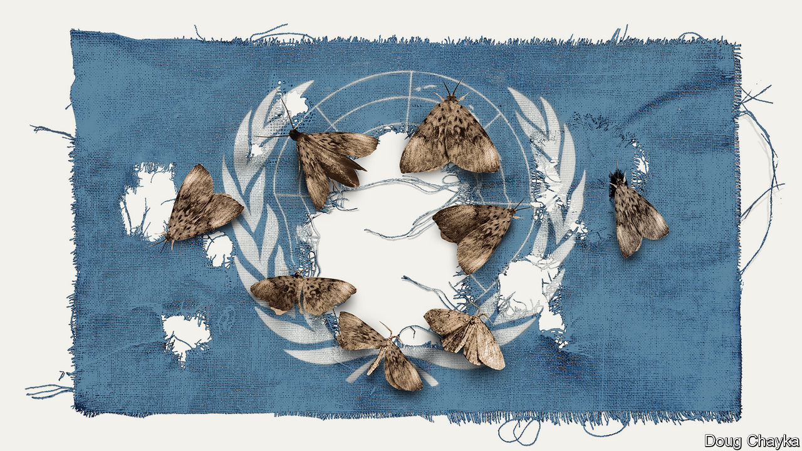
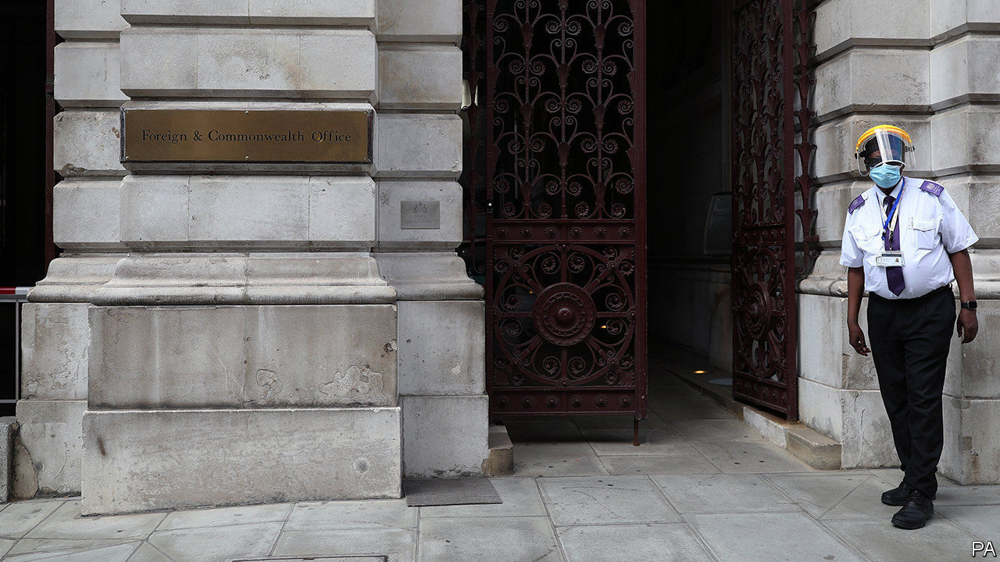
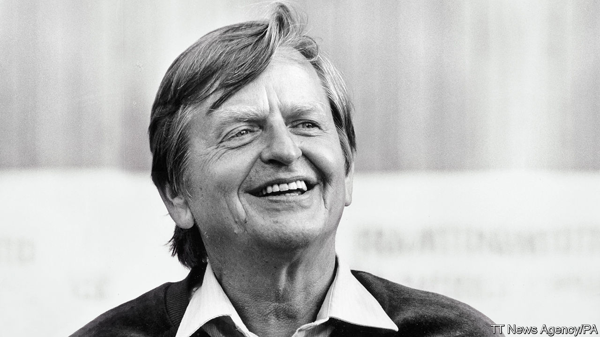

## On the UN, foreign aid, Olof Palme, green investing, China, coronaspeak

# Letters to the editor

> A selection of correspondence

> Jul 11th 2020

Your special report on the UN ([June 20th](https://www.economist.com//special-report/2020/06/18/global-leadership-is-missing-in-action)) outlined several “great fractures” that could lead to worldwide bedlam. One scenario missing from the list is the possibility of China annexing Taiwan. This would confirm the UN’s impotence. Just as America vetoes any resolution condemning Israel, China can veto any resolution condemning its actions, even if those actions are condemned by every other UN country.

Your call for a summit of the five permanent members of the Security Council is timely. But with at least four of those five showing little of the statesmanship that created the UN and much of the thuggery, self-interest and bloody-mindedness that could destroy it, few could have any confidence that such a gathering would resolve that, or any other, crisis.

Instead, it is time for “we the people” of the digital world to harness our borderless technologies to prevent delusional governments from pushing us into collective suicide through war, resource depletion or climate change. In this regard, the UN High-level Panel on Digital Co-operation, led by Melinda Gates and Jack Ma, has a role in sorting out the new world disorder you speak of.

DAVID WOOLLCOMBEFounder and presidentPeace Child InternationalBuntingford, Hertfordshire

The digital era has enabled governments to engage in aggressive finger-pointing through social media, making calmer, less-public efforts at consensus-building more difficult. Yet the wider benefits of digital connections have not been fully explored by diplomats. A collective, virtual telediplomacy would work away from the glare of trolls and memes. If tele-education and telemedicine can bring mutual benefits through engagement, why not a permanent telediplomacy platform?

Leaders engage in diplomacy because it is to their advantage, to produce shared actions that meet shared interests. Platforms of diplomatic engagement do not evolve accidentally. We knew before covid-19 that the UN needed to reform; the pandemic has shown that diplomacy needs new options for constant real-time interaction.

PAUL HAREPardee School of Global StudiesBoston University

One cause of the UN’s tragic mistakes in peacekeeping and other missions is the fact that it has immunity. This means that it conducts its operations without any accountability to the people whose lives it is directly affecting. Immunity does give the UN the necessary space to carry out its tasks, but there is no justification for it not to be accountable to those who are harmed by its actions. The responsibility for correcting this lack of answerability rests with the leadership of the UN Secretariat and its specialised agencies. They need to create an independent accountability mechanism with the authority to investigate complaints, report its findings directly to the secretary-general and to make the report publicly available.

This may be a big step for the UN but it is not unprecedented. Such independent accountability mechanisms have existed in many multilateral development banks for decades.

PROFESSOR DANIEL BRADLOWCentre for Human RightsUniversity of Pretoria

I read your article about which government department in Britain should allocate aid money (“Will charity begin at home?”, [June 20th](https://www.economist.com//britain/2020/06/19/british-diplomats-and-donors-are-told-to-merge)). The more critical question is, what happens to aid money when it reaches a poor country? Downing Street has proclaimed zero tolerance for corruption, and aid contracts normally contain anti-corruption clauses.

Our statistical analysis shows that aid money does affect corruption, but not in the direction those donors would like. Transparency International’s Corruption Perceptions Index is 14 points lower in countries in which aid is the highest proportion of national income than in countries receiving no aid.

In addition to enriching senior politicians, foreign aid also encourages a culture of corruption at the grassroots. Where aid is most important, it increases the likelihood of individuals paying bribes for services, such as health care and education, by 18%.

PROFESSOR RICHARD ROSEUniversity of StrathclydeGlasgow

It is true that Olof Palme considered himself a democratic socialist and improved diplomatic relations with the Soviet Union and Cuba (“Who killed Olof Palme?”, [June 13th](https://www.economist.com//europe/2020/06/11/sweden-unmasks-a-prime-ministers-assassin)). He was also an opponent of the South African apartheid regime, his awareness of racial oppression a result of his travels in the American South as the first Swedish leader to receive a university education in the United States. But Palme was, like nearly all social democrats of his generation, a staunch anti-communist. He publicly criticised Swedish student radicals and elements in the labour movement in the 1960s for their naive support of communism. Indeed, he presided over an administration that controversially registered communist sympathisers through a branch of Swedish military intelligence (the IB Affair).

Palme did indeed oppose America’s war in Vietnam, referring rather bluntly to the Nixon government as “bloody murderers” in the wake of the Christmas bombing campaign of North Vietnam in 1972, but if anything his views on the North Vietnamese (and the Cubans) were rooted in a strong sense of the right of smaller nations to determine their own fate even in the shadow of superpowers, rather than any kind of pro-communist sentiment. This is why Palme was so strong in his denunciation of the Soviet Union’s puppet states in eastern Europe.

STEFAN ANDREASSONBangor, Down

Green investing* Your leader rightly tackles the importance of the global energy transition challenge and the nexus between capital investment, climate and energy systems developments ("The trouble with green finance", [June 20th](https://www.economist.com//leaders/2020/06/20/green-investing-has-shortcomings)). Whilst pointing out that public discourse is often full of “woolly thinking, marketing guff and bad data” you omitted to say that the grand transition represents the largest capital reallocation in the history of mankind and that accelerating the process is not solely about new supply.

The World Energy Council has been using scenarios for almost two decades to navigate the “disruption as usual” nature of the grand transition era. Our latest covid-19 scenarios highlight that the human qualities of ambition and trust could be the determining factors in deciding the future of the global energy landscape and the direction and speed of the transition process.

Put simply, what degree of trust and ambition do investors, governments and, increasingly, other stakeholders have to address is the need to rethink resilience, enable sustained behavioural change and to move away from the single-issue and siloed quick-wins agenda? High-quality, inclusive and informed debate—covering the whole systems experience, analysis and co-operation—will play a critical role in shaping the energy landscape of the future.

ANGELA WILKINSONSecretary General and CEOWorld Energy CouncilLondon

China’s casual approach to casualties it may have suffered reminded me of a story about the old communist regime (“Death valley”, [June 20th](https://www.economist.com//asia/2020/06/18/india-and-china-have-their-first-deadly-clashes-in-45-years)). Perusing a mandarin’s feasibility study of a dam project, Mao Zedong underlined the report’s sentence that “Such measures would benefit the citizens”, then scrawled a rhetorical question in the margin, “What is a citizen?” Appropriate demotion was swiftly meted out to the study’s author.

BUSH GULATIToronto

I was amused by Johnson’s survey of the pandemic panglossary ([June 27th](https://www.economist.com//books-and-arts/2020/06/27/the-rules-of-coronaspeak)). Yet it struck me that a calendar term for this new epoch was missing. How else am I to refer to the normal days of having a drink: BC (Before Corona)? I am aware that this may mask an existing nomenclature, but we have to move with the times.

ULRICH ATZNew York

Though it may have become popular again during the pandemic, the word “smizing” was coined in 2009 by Tyra Banks on an episode of “America’s Next Top Model”. Credit where it is due.

CHARLES HAWKINGSWashington, DC

Here in New York, people who refuse to wear masks or practise social distancing are known as coronassholes. And quite rightly, too.

JOHN S. MAJORNew York

* Letters appear online only

## URL

https://www.economist.com/letters/2020/07/11/letters-to-the-editor
