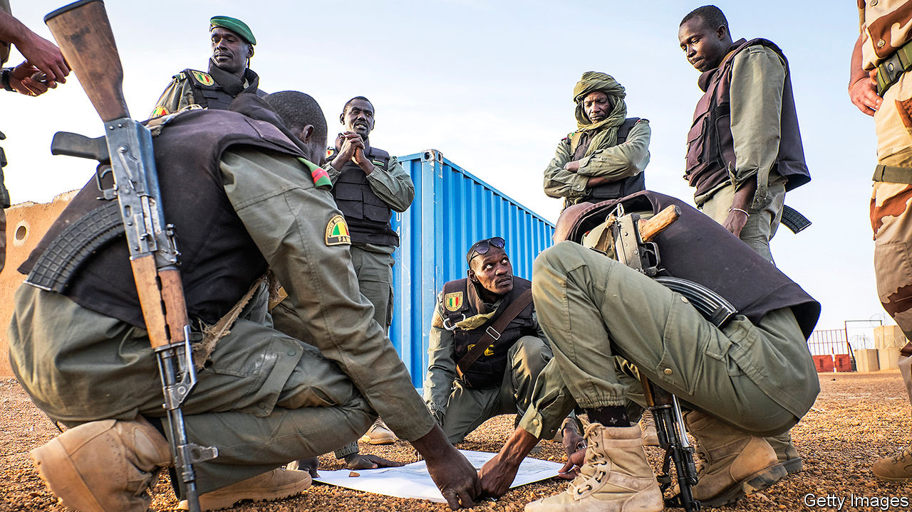
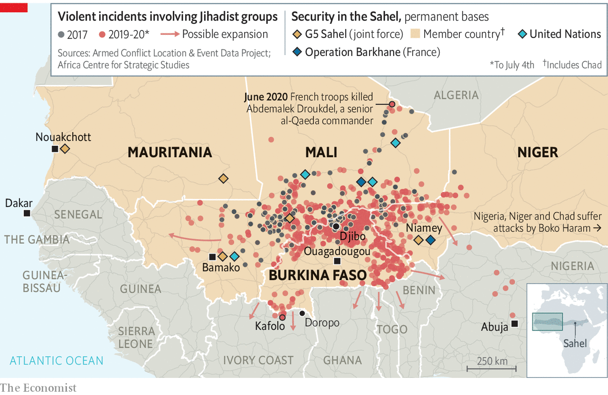

## War south of the Sahara

# Jihadists in the Sahel threaten west Africa’s coastal states

> Thousands of soldiers are struggling to stem the violence

> Jul 9th 2020OUAGADOUGOU AND PARIS

“YOU MAY think you’re safe,” says a 57-year-old resident of Doropo in northern Ivory Coast. “But jihadists are like ants, they can come in without being noticed.” On June 11th, just three weeks after Ivory Coast’s army reassuringly declared that its northern frontier with war-torn Burkina Faso was “under control”, a band of armed insurgents proved it wrong. Some 20 men on motorbikes descended on an army-and-police outpost near the border at Kafolo. The attackers killed 14 soldiers before roaring away into the bush.

The attack was the worst since 2016, when gunmen killed 19 people in a beach resort in Grand-Bassam, east of Abidjan, Ivory Coast’s commercial capital. It shows that even west Africa’s most populous countries, along the Atlantic coast, have become vulnerable to the predations of jihadists spilling out of failing states farther north in the Sahel, that vast swathe of land on the rim of the Sahara desert.

Jihadists seized control of chunks of Mali in 2012 and were stopped from overrunning Bamako, its capital, only after thousands of French troops were hurriedly flown in. The insurgents have since pushed across the border into Niger and Burkina Faso (see map). In those three countries alone, 4,800 people lost their lives in the conflict last year. Fully 1.7m people have been forced to flee their homes. Now the war is beginning to jump borders again, putting at risk some of Africa’s fastest-growing economies, including Benin, Ghana and Ivory Coast.

This war in the Sahel has been growing rapidly. Ten times more people were killed last year than in 2014 (excluding deaths in north-eastern Nigeria, which faces its own jihadist insurgents). Two main jihadist groups are behind most of the fighting: the Islamic State in the Greater Sahara (ISGS); and Jama’at Nasr al-Islam wal Muslimin (JNIM), which is linked to al-Qaeda. These groups have extended their reach, even though thousands of international peacekeepers and local and Western soldiers have been deployed to stop them. France has sent some 5,100 troops to the Sahel, while the United States has provided another 1,200. In addition, the UN has 15,000 blue helmets there, including about 350 Germans, plus 250 British soldiers who are soon to arrive. With American forces leaving Afghanistan, the Sahel will soon be the West’s biggest combat zone.

Progress is patchy. Emmanuel Macron, France’s president, claims that the coalition forces are achieving “spectacular results”. In June they killed Abdemalek Droukdel, a senior al-Qaeda commander. But such successes have not made civilians safer. In the first half of this year more than 4,200 people have been killed, two-thirds more than in the same period last year.

Worse, the jihadists are expanding in three directions at once. To the south they threaten Benin, Ghana, Ivory Coast and Togo. To the west there has been a spate of attacks in Mali close to its border with Senegal; and to the east with Nigeria’s insurgent groups. The jihadists already have a “de facto safe haven in northern Mali”, says General Dagvin Anderson, in charge of America’s commandos in Africa. He frets that as they expand they will have more scope to plan attacks on American soil.

The weakness of governments and the feebleness of their public services are helping the jihadists. In the neglected hinterlands of the Sahel the rebels offer themselves as an alternate state, serving up sharia and medical aid. Some 70% of people in the northern reaches of Ghana are classed as very poor, compared with a national rate of 25%. Ghana and Ivory Coast face divisive elections. So do Burkina Faso and Niger.

Moreover, the jihadists have been adept at exploiting ethnic faultlines, for instance between largely Muslim and seminomadic Fulani herders and more settled farming communities, which have their own armed groups of traditional hunters known as Dozos. Tit-for-tat attacks on civilians have led to young men joining jihadist groups or militias such as the Dozos. Similar tensions threaten Ghana and Ivory Coast, where farmers and herders have clashed in the past. Many Fulani in Ivory Coast are not even recognised as citizens.

Trade and commerce also provide an incentive for the jihadists to expand their reach. The migration corridor between Burkina Faso and Ivory Coast is the busiest in Africa. Jihadists cash in by taxing traders and smuggling stolen livestock, drugs and guns. The gold mines in Burkina Faso have become a target. Much of the gold is smuggled out through Togo, which officially exported seven tonnes of the metal to the United Arab Emirates in 2018, despite mining very little itself. Gold is also pulling jihadists towards Senegal.

Meanwhile ISGS is trying to create a corridor to link up with its allies in Nigeria. Islamic State’s propaganda now refers to the two Sahelian groups as one and the same.

As French forces have targeted ISGS, some of its fighters have sought sanctuary across other borders. The group already recruits from Benin, Ivory Coast and Togo, says Héni Nsaibia of Menastream, a research consultancy. Internecine fighting between ISGS and al-Qaeda may be scattering fighters over borders, too. The French army insists it is weakening the jihadists, not just pushing them south.

Though the jihadists stunned many by the speed of their advance through Mali and Burkina Faso, they face a tougher fight in the coastal states. The security forces of Ivory Coast, Ghana and Senegal are beefier than those of their neighbours in the Sahel. But Togo and Benin offer the jihadists softer targets. And Ivory Coast’s army, made up of fighters who were on different sides in a vicious civil war, may prove brittle. A recent raid was scuppered after an Ivorian officer leaked the plans.

The coastal states must avoid the mistakes of their Sahelian neighbours, whose security forces have often been brutal. This year, more civilians in the Sahel have been killed by government soldiers than by jihadists, says José Luengo-Cabrera of the International Crisis Group (ICG), a Brussels-based NGO. “When soldiers kill the head of the family, they almost throw his sons and nephews into the arms of bearded men in shorts hiding in the bush,” one villager told Human Rights Watch, a global monitor. It says in the town of Djibo alone, in Burkina Faso, evidence suggests government forces have murdered 180 men—many of them were blindfolded and had their hands bound before they were shot.

Governments in the Sahel recognise the problem but offer few solutions. According to cables seen by The Economist, a diplomat in Ouagadougou, Burkina Faso’s capital, reported that the president, Roch Marc Christian Kaboré, privately admitted that some of his citizens may feel safer living among terrorists than with their own country’s security forces. Mr Kaboré reportedly said that he could not ensure that his army’s abuses would stop altogether.

Governments in the region and some Western forces have made matters worse by supporting militias. In 2018 the French army allied itself with Tuareg militias from Mali to fight against ISGS. They clobbered the jihadists but also killed scores of civilians, aggravating ethnic tensions and fuelling recruitment by the insurgents. Coastal countries will face similar dilemmas. Security forces in Ivory Coast also have a history of working with local armed groups.

It is sometimes hard to avoid ruining livelihoods in the name of fighting terrorism. In northern Niger the authorities have banned motorbikes, which are the jihadists’ favourite mode of travel. But locals like to ride them to work. The authorities have annoyed people by closing markets and border crossings, raising youth unemployment. By contrast, the authorities in Niger’s south have subsidised the provision of motor tricycles, which get people to work but which the jihadists consider too slow to use in hit-and-run raids.

Above all, governments need to regain legitimacy by providing services and holding themselves to account. “It is not possible to win the war if there is not trust from the population,” says Niagale Bagayoko of the African Security Sector Network, an academic group founded in Ghana. Mass protests in Bamako have called for Mali’s president, Ibrahim Boubacar Keïta, to resign.

But good governance and decent services in the region are scarce. At a meeting of Sahelian leaders with Mr Macron in Mauritania on June 30th, there were congratulatory claims of military progress as well as talk of “a return of the state”. Yet the state must offer more than the jihadists are offering, including justice and development, says Rinaldo Depagne of the ICG. Foreign donors should abandon their dogmatic insistence on building infrastructure in densely populated areas to maximise returns. Even so, restoring the state in the face of an insurgency is hard. In Burkina Faso alone, the jihadists have forced about 2,500 schools to close.

As security worsens, calls are growing for negotiations with the jihadists. Mali has offered to talk to JNIM, which has agreed to do so once foreign troops have left. Yet the jihadists have little incentive to make concessions while they are winning on the battlefield. Their fighters are “cutting off Bamako to the north and slowly encircling Ouagadougou”, says General Anderson. The outlook is bleak. ■

## URL

https://www.economist.com/middle-east-and-africa/2020/07/09/jihadists-in-the-sahel-threaten-west-africas-coastal-states
