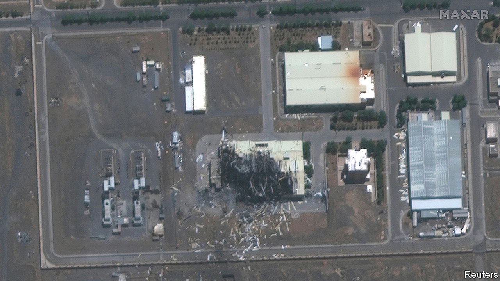
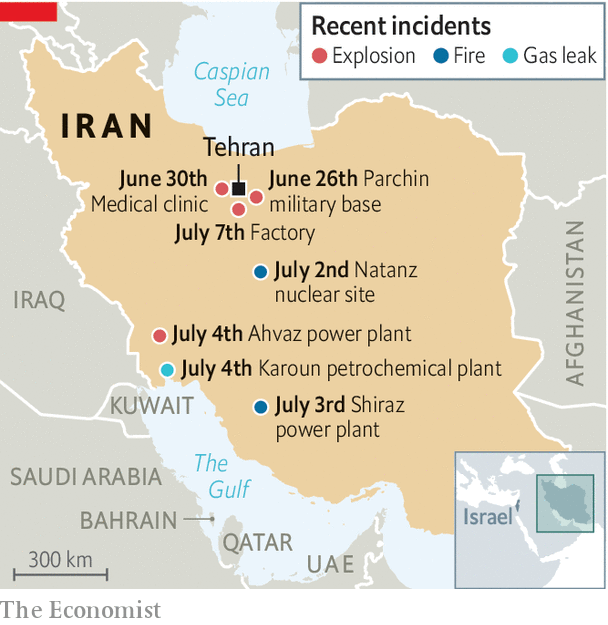

## Booms in the night

# What to make of a series of odd explosions in Iran

> Do they augur a return to the shadow war over its nuclear programme?

> Jul 9th 2020BEIRUT AND JERUSALEM

IN THE EARLY hours of July 2nd a building caught fire in the grounds of the nuclear plant at Natanz in central Iran. Officials downplayed it as an accident in an unfinished shed. But photos showed a building with machinery on the roof. Satellite images added more doubt: scattered debris looked consistent with an explosion, not a fire. The cover story was short-lived. A spokesman for Iran’s nuclear agency soon admitted it was a factory for centrifuges used to enrich uranium. The damage, he said, could slow work on advanced models.

The apparent blast was one in a string of unusual incidents around Iran this summer (see map). On June 26th there was an explosion near Parchin, a military base south-east of Tehran that produces ballistic missiles. It was big enough to light the night sky in the capital. There have also been fires or explosions at power plants, clinics and other facilities. Some have innocuous explanations, like gas leaks.

But others look intentional. The blasts at Parchin and Natanz raise suspicions of an Israeli hand. For months the conflict over Iran’s nuclear programme has been overshadowed by covid-19. Now the virus may have helped resurrect it. President Donald Trump’s botched handling of America’s outbreak has put his re-election in doubt, and Israel may feel the clock is ticking on an administration committed to “maximum pressure” on Iran.

Not that anyone will confirm this. Save for rare exceptions, Israel does not take responsibility for covert operations in Iran. Officials settle for cryptic remarks like those made by Gabi Ashkenazi, the foreign minister, on July 5th: “We take actions that are better left unsaid.” That same day Binyamin Netanyahu, the prime minister, extended the tenure of Yossi Cohen, the Mossad chief. Ten days before, the army had awarded medals to Unit 8200, which oversees high-tech warfare, for “secret operational activity”; in May Iran’s main port was paralysed by a cyber-attack.

Even without these sly jabs, the explosions would have been ascribed to Israel, which has spent years fighting a low-intensity war against Iran. Stuxnet, a computer worm thought to be a joint effort by American and Israeli spies, sent Iran’s centrifuges spinning out of control. Israel has allegedly assassinated Iranian nuclear scientists with “sticky bombs” planted on their cars.

The deal that Iran signed with world powers in 2015, called the Joint Comprehensive Plan of Action (JCPOA), was meant to replace these tactical bites with a durable arms-control regime. Mr Trump withdrew from it two years ago and restored economic sanctions. After a year of restraint, Iran began to lash out last summer. It downed an American drone and attacked Saudi oil facilities. The new year brought the American assassination of Qassem Suleimani, Iran’s top commander, and a retaliatory missile strike by Iran on airbases in Iraq. Since then the conflict has gone quiet.

Mr Netanyahu is anxious to draw attention back to Iran, which has begun to shirk its own obligations under the JCPOA. It has exceeded both the deal’s limit on its heavy-water stockpiles and the cap on enriched uranium. It has also boosted enrichment to 4.5% purity, above the prescribed 3.67% threshold, though far below the 90% level at which it becomes weapons-grade.

The Israeli prime minister is mindful of the changing mood in America. “Netanyahu has finally realised that Trump won’t be around for much longer, and it’s more important for him to use this time to push Iran, rather than annex the West Bank,” says an Israeli intelligence official.

He may also wager that Iran will find it hard to retaliate, with its regional allies in a mess. Bashar al-Assad won the war in Syria but is losing the peace: his regime can barely feed its people. Lebanon defaulted in March and is struggling to keep the lights on. Iraq’s new prime minister, Mustafa al-Kadhimi, is taking on pro-Iranian militias.

Mr Trump’s opponent, Joe Biden, supports re-entering the JCPOA (if Iran starts complying again). Though even if America elects Mr Biden, Iran may be heading in the other direction. President Hassan Rouhani, a moderate by Iranian standards, will leave office next summer. Voters are frustrated with his camp, because of a miserable economy and a sense that “reformists” are not actually allowed to reform much.

That could augur well for Iran’s hardliners, who have already taken control of two branches of government. Parliament’s new speaker is a former Revolutionary Guard commander, and the chief justice was Mr Rouhani’s opponent in the past election. In a speech to Iran’s new parliament on July 5th, Muhammad Javad Zarif, the pragmatic foreign minister, was heckled. Several MPs chanted “death to a liar”.

When Mr Trump left the JCPOA, critics feared he would fail to replace it. If he leaves office in six months they will probably be proved right. He will have achieved little except raising tensions to their highest level since the 1980s. Mr Biden may find Iran in little mood for concessions. And he will have other problems to occupy his time. That leaves a return to covert war—and more booms in the night. ■

## URL

https://www.economist.com/middle-east-and-africa/2020/07/09/what-to-make-of-a-series-of-odd-explosions-in-iran
