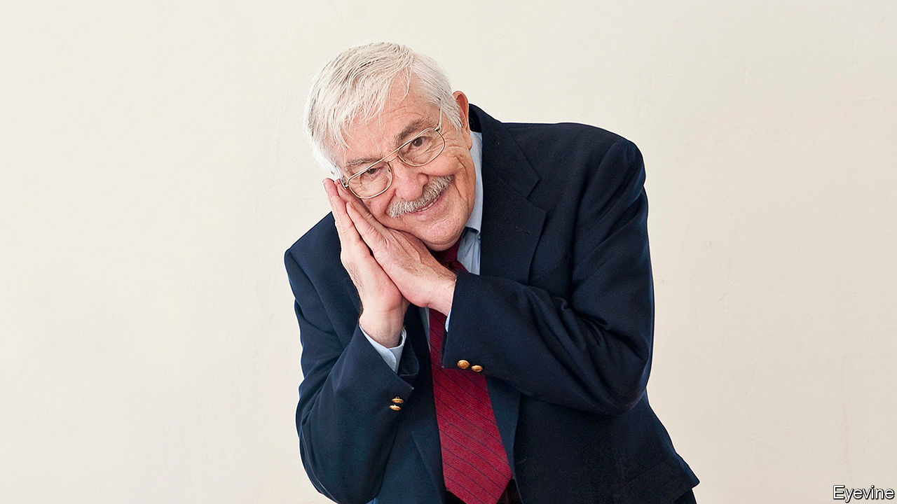

## Perchance to dream

# William Dement died on June 17th

> The pioneer of sleep science and founder of the world’s first sleep clinic was 91

> Jul 9th 2020

THERE SEEMED nothing much wrong with Stanford, as far as William Dement could see. To someone like him, who had left New York in January 1963 with his car buried in snow, this university—with its palms, its Spanish-colonial buildings and its skies of unbroken blue—looked like paradise. He and his wife strolled about and ate ice creams, in January, in a state of wonder.

Yet all was not quite perfect. When he made a scientific study of the students later, he found that 80% were dangerously sleep-deprived. That did not surprise him. In America, the problem was general. Adults longed for the sweet, peaceful slumber of children; but night after night they tossed and turned, lay awake for hours, contended with continually restless legs, and faced the new day feeling horrible. Worse, they woke up in debt: a debt of sleep, which like the financial kind was cumulative, making them more and more unhealthy until, at worst, they could barely function.

The result was a national plague of drowsiness. People blamed warm rooms or boring lectures for the fact that they kept nodding off in the daytime; but this was their sleep debt being called in. And the results, he warned them with increasing urgency, could be catastrophic. Someone who drowsed was mere seconds from sleep. The grounding of the Exxon Valdez, the near-meltdown at Three Mile Island, the loss of the space shuttle Challenger, had all been caused totally or in part by sleepy people. A horrendous number of the fatal accidents on America’s roads, especially among the young, were caused by drivers falling asleep at the wheel.

More shocking to him was the fact that, well into the 1990s, America’s medical establishment barely noticed. It did not matter that sleep made up a third of human life. It was such a profound state of disengagement from the sensory world that, once their patients were in it, doctors lost interest, too. At the start of the decade, when he was appointed chairman of a federal commission that went through thousands of medical records, he found an estimated 40m Americans suffering from sleep problems that were undiagnosed and thus untreated. In 1993 Congress set up a National Centre on Sleep Disorders Research, but progress was slow. Five years later, when he gave evidence to the health and environment subcommittee, he reckoned that almost half America’s adults had insomnia and as many as a quarter had obstructive sleep apnea, which stopped their breathing hundreds of times a night. That could prove fatal. Yet the lack of awareness in society, and the indifference of doctors, remained “pervasive and complete”, as if almost everyone apart from himself was still in Morpheus’s thrall.

His pursuit of the sleeping self had long been fairly solitary. In the 1950s he began to study dreaming—that strange activity which, every night, allowed him to be quietly and safely insane—at the University of Chicago and then at Mount Sinai in New York. There his apartment was his laboratory, where volunteers, including Rockettes from Radio City Music Hall and a girl he was especially sweet on, were fitted with electrodes and regularly roused to see if they recalled their dreams. He discovered that in REM sleep, where eye movements were rapid and sleep shallower, the eyes followed what people were observing in their dreams, though all their limbs stayed still. This was intriguing; but since he had come no closer to unveiling the purpose of dreams, and never did, he arrived in Stanford with his focus already turned to sleep.

It was a good moment. At a heady time of protest and upheaval he was nicely alternative, a shaggy-haired professional bass-player as well as a scientist, who had jammed with Quincy Jones and Stan Getz on his houseboat when he was at college in Seattle. In 1970 he set up a sleep clinic in Stanford, probably the world’s first and now one of its biggest, where he tested insomniac volunteers. In summer he ran sleep camps, deploying more electrodes. To study narcolepsy, the uncontrollable urge to sleep most of the time, he brought in a dozy French poodle called Monique and, in a while, established a much-loved sleepy-dog colony.

His Sleep and Dreams class was phenomenally popular right from the start, in 1971. So many signed up for the first lecture that no space was big enough except Memorial Church. And the class, which he went on teaching past 90, became famous, a sort of true-believers’ gathering, where heavy-eyed students would be sprayed awake with his trusty squirt gun and made to shout “Drowsiness is red alert!”, the motto of the cause. He looked on his students as an army of proselytisers, and in the end word spread: by this year there were more than 3,000 sleep clinics in America, and medical schools increasingly took the subject seriously. Not least, his small home town of Walla Walla, Washington, which he had used as a test case, had become the Healthy Sleep Capital of the world.

So what did he advise himself to ensure blissful slumber? His several books and his website, “The Sleep Well”, offered all kinds of tips. Most of them quickly became familiar: ergonomic pillows, a cool dark room, warm baths, no daytime naps, no alcohol or caffeine within four hours of bedtime. If sleep had not come in 20 minutes, it was best to sit quietly in the dark or read something dull, like the warranty on the refrigerator, until the eyelids closed. The best response when caught napping in the office was: “And I especially thank you for my excellent boss. Amen.”

He hoped, however, that people would determine their own sleep requirement and best practice. His was relaxed. He loved to watch favourite films again, especially “Lilies of the Field”, even if he already knew that the nuns would make Sidney Poitier build them that church; or read favourite books again, in his case the detective stories of Rex Stout, even if he already knew how every single one turned out. Re-runs of the sit-com “Everybody Loves Raymond” sent him off with wonderful ease. So much for no screens before bed. He drifted away by 10pm or so and was up by 5am, bright-eyed and bushy-tailed, with not a trace of sleep-debt.

Almost inevitably, he died in his sleep. What transformations he might have discovered then, after that first so-simple and daily one, it would have been nice to know. ■

## URL

https://www.economist.com/obituary/2020/07/09/william-dement-died-on-june-17th
