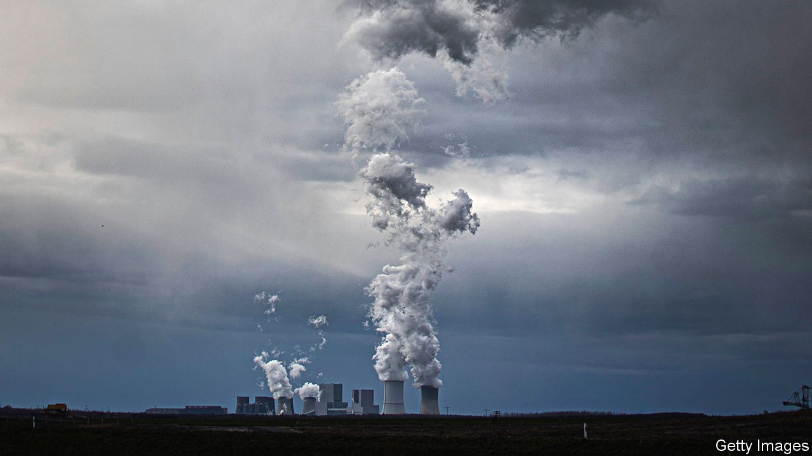
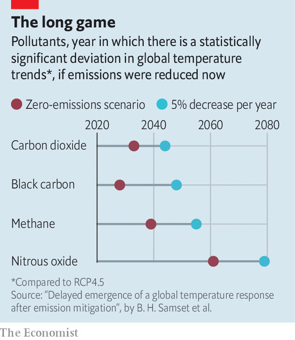

## Climate action

# Emissions slashed today won’t slow warming until mid-century

> Mitigation policies remain essential, but governments need to be wary of public perceptions

> Jul 11th 2020

MUCH OF the international effort thus far to combat climate change has focused on cutting emissions of greenhouse gases, chief among them carbon dioxide. That is, of course, a rational approach. Global average temperatures are roughly 1.1°C warmer today than in pre-industrial times and CO2 is the main culprit. It and other greenhouse gases are produced when fossil fuels are burned to generate energy or power engines, in steel and cement-making, by farming and deforestation. In the long term, eliminating these emissions is the only sustainable solution for stopping the inexorable warming of the planet.

But greenhouse-gas emissions do not cause an instantaneous rise in global temperatures, and neither does cutting them result in instantaneous cooling. Instead, it will take decades for today’s policy efforts to result in measurable impacts on global temperature—as illustrated in a study published this week in Nature Communications.

Using climate models, Bjorn Samset and his colleagues at Norway’s Centre for International Climate Research probed hypothetical futures in which emissions of nine different industrial pollutants, including carbon dioxide and methane, were either eliminated instantly or phased out at a rate of 5% each year, starting in 2020. In order to isolate their respective effects, each chemical was knocked out individually while the rest were allowed to keep evolving as they would broadly if governments stuck to current climate pledges. Thus, the experiment tested how quickly additional efforts, as required by the Paris Agreement, would be seen in the rate of global warming.

Running these simulations over and over again in order to get statistically reliable results suggests that cutting CO2 emissions could slow the rate of warming as early as 2033, but only if they are ended worldwide in 2020. In effect, that would mean eliminating 80% of the world’s energy sources, including shutting down all fossil-fuel power stations, overnight—clearly not a realistic or desirable scenario.

Reducing CO₂ by 5% per year, starting this year, would produce a statistically significant deviation from what temperatures would have otherwise been only in 2044. And yet, even that rate of CO2 reduction is ambitious, on a par with the 4-7% drop estimated this year as a result of the covid-19 pandemic and widespread economic shutdowns. Before this, annual emissions were creeping up. Without concerted efforts from governments, they are likely to rise again as economies reopen.

One reason for the delayed effect of slashing emissions is natural variability in the climate. Whether one year is warmer or cooler than the previous is not simply down to greenhouse gases. Large-scale natural climate effects also play a role (El Niño and La Niña are perhaps the best-known examples), warming and cooling the planet in a cyclical fashion by fractions of a degree. Depending on their phase, the warming of greenhouse gases is either masked or compounded by these kinds of natural effects. As emissions begin to drop, natural variability will also mask any slowdown of global warming that results. Dr Samset’s modelling took this into account.

In addition, more than 90% of the energy trapped by the greenhouse-gas emissions produced in the past half-century has been stored in the ocean and released to the atmosphere as heat only slowly. Even if all emissions were cut tomorrow, that process would continue to warm the air above for many years to come.

The main reason for the delay, however, is that carbon dioxide emitted today will remain in the atmosphere for decades to centuries before it is reabsorbed by vegetation and the oceans. That is not true of other industrial emissions. Each molecule of methane warms the planet 84-87 times more, averaged over 20 years, than carbon dioxide, but it stays aloft for merely years instead of decades or centuries. This has resulted in calls for immediate action to slash methane emissions, for instance by plugging leaks in natural-gas infrastructure, and reducing emissions from farming. But even then, Dr Samset’s work suggests that eliminating all sources of methane pollution in 2020 would not affect warming trends before 2039.

Tragically, the pollutant that could have the most immediate impact is one that currently keeps the world cooler. Sulphur oxides are a by-product of burning some fossil fuels, including coal and dirty bunker fuel, and are a target of policies to clean up maritime emissions and urban air pollution. In the atmosphere, they bounce a portion of solar radiation back out into space, producing a cooling effect. Because they are dragged back to Earth by rain within days of being emitted, cutting them out of industrial activities could boost warming by the end of the decade.

In spite of all this, mitigating emissions remains crucial to the stability of the global climate and the only way of meeting the Paris Agreement targets of limiting global warming to 1.5-2°C. But Dr Samset argues that temperature may not be the best yardstick to measure the effectiveness of climate mitigation, at least not until the 2040s. Instead, direct measurements of the concentrations of greenhouse gases in the atmosphere may be better, as they will remove the confounding effect of natural variability. And without clever messaging, there could be a public backlash against seemingly ineffectual policies.

More fundamental, however, results like these underline that even as economies begin to decarbonise, governments and societies need to drastically step up efforts to adapt to the inevitable warming that lies ahead.■

For more coverage of climate change, register for The Climate Issue, our fortnightly [newsletter](https://www.economist.com//theclimateissue/), or visit our [climate-change hub](https://www.economist.com//news/2020/04/24/the-economists-coverage-of-climate-change)

## URL

https://www.economist.com/science-and-technology/2020/07/11/emissions-slashed-today-wont-slow-warming-until-mid-century
