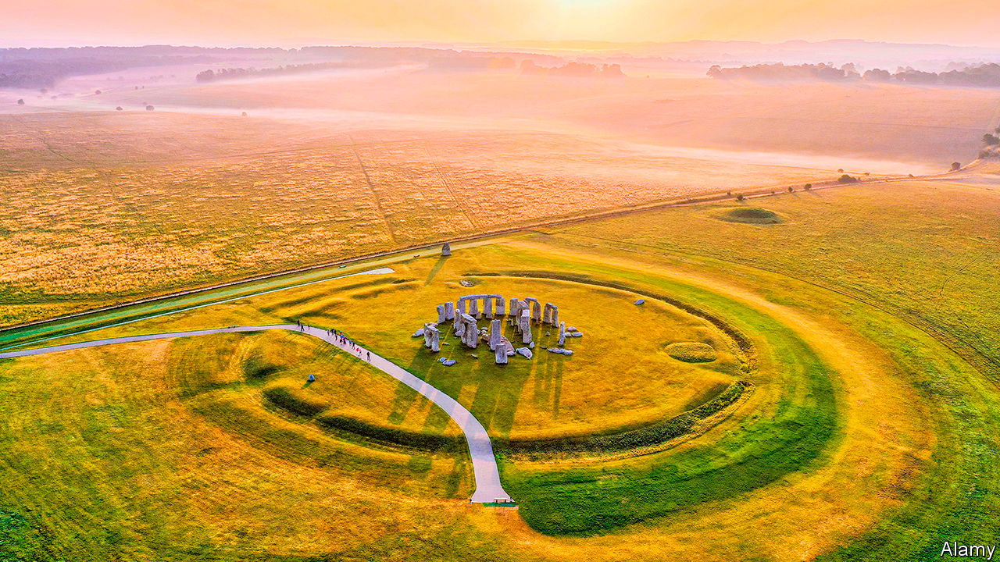

## How illuminating

# Measuring luminescence helps to date a remarkable new discovery at Stonehenge

> High-tech archaeology

> Jul 11th 2020

FOR MORE than 4,000 years Stonehenge has stood on Salisbury Plain in southern Britain. The landscape surrounding the Neolithic monument contains many secrets, with features dating back to much earlier times. Having surveyed more than 18 square kilometres in the vicinity, archaeologists continue to make surprising discoveries. The latest, a series of deep pits forming a vast circle more than two kilometres in diameter, shows how technology makes it possible to peer even further back into time.

Along with their shovels, trowels and brushes, archaeologists have put together a toolbox of new technologies. Using magnetometers, which can detect how different materials in the ground cause slight changes in Earth’s magnetic field, they found a series of anomalies forming circular disturbances in the ground on a broad arch around Durrington Walls, the remains of another large henge three kilometres north-east of Stonehenge. These were thought to be old filled-in ponds.

But ground-penetrating radar, another archaeological tool, raised questions about that notion. This technique, which reflects radio waves off underground structures, showed that far from being shallow, as ponds would have been, the anomalous features had deep vertical sides. They were some ten metres across and five metres or more deep. Up to 20 shafts were identified, but there may have been 30 or more as some of the land is now covered by buildings and roads. The archaeologists thought it was time to take a closer look with more high-tech tools.

Vince Gaffney of the University of Bradford and a team of researchers from Britain, Austria, Sweden and Norway, drilled into three of the sites to extract core samples. Fragments of shell and bone were found. As these fragments are organic materials containing carbon, they could be subjected to radiocarbon dating. This measures the presence of carbon-14, a mildly radioactive isotope created naturally in the atmosphere by cosmic rays. As this element decays, older samples have less carbon-14 in them than modern ones, and because the rate of radioactive decay is predictable, a date for the sample can be calculated.

The dates, though, varied widely; up to 6000BC for some of the shells and around 1300BC for some bones. Moreover, if a pit had been gradually filled in over the years, older material would have appeared at the bottom and younger material near the top. But some of the dates were inverted, showing older material near the top.

To work out what might have gone on, the archaeologists reached for one of their newest tools: optically stimulated luminescence (OSL). This measures when fragments of rocks made of quartz or feldspar, two of the world’s most common groups of minerals, were last exposed to sunlight.

The OSL process can be likened to measuring the power in a rechargeable battery, explains Tim Kinnaird, who tested the samples from the shafts at his lab at the University of St Andrews. When quartz and feldspar are removed from sunlight and buried, electrons start to accumulate in defects in their crystal structures from exposure, in the ground, to low levels of environmental radiation. When the minerals are re-exposed to the outside world, the electrons are stimulated with enough energy to escape their traps and they go on to release photons of light. As the intensity of this luminescence is directly proportional to the amount of environmental radiation absorbed by the minerals, this can be used to work out when they were last exposed to sunlight.

As they report in Internet Archaeology, the OSL analysis allowed the researchers to put the various radiocarbon dates and the different layers in their core samples into some context. The shells were considered outliers, as they probably contained material from earlier times. The inverted dates seemed to be caused by later earthworks, which might have exposed minerals to light and reset their timeclocks. One pit appears to have been recut in the Bronze Age. But there was enough of a reliable sample to date the pits to around 2500BC, which means they would have been dug by the same people who built Stonehenge.

What purpose the pits served remains speculation. They would have required a massive effort to build, with tools made from stone, wood and bone. They may have been boundary markers, possibly containing large totem-like poles. Henges have cosmological significance and some think Stonehenge was a site for the dead while Durrington Walls, which had wooden structures, was a site for the living. The archaeologists hope to open up trenches throughout the pits to discover more.

Elsewhere, OSL is proving successful in some surprising areas. Eren Sahiner of Ankara University in Turkey used the technique to date Ata Agac (Grand Tree), an ancient olive tree in western Turkey. The age of a tree can normally be determined by counting its growth rings, but the centres of ancient trees have often rotted away, making estimates difficult. Dr Sahiner carefully dug six holes to collect mineral samples from around the tree’s roots. His analysis, published in Journal of Quaternary Science, showed that quartz and feldspar in the soil were last exposed to sunlight up to around 3,000 years ago. That, reckons Dr Sahiner, means Ata Agac was probably planted during the Iron Age by early Greeks who valued olive oil imported from other regions and were keen to plant trees to produce their own. Which just goes to show how illuminating a photon can be.■