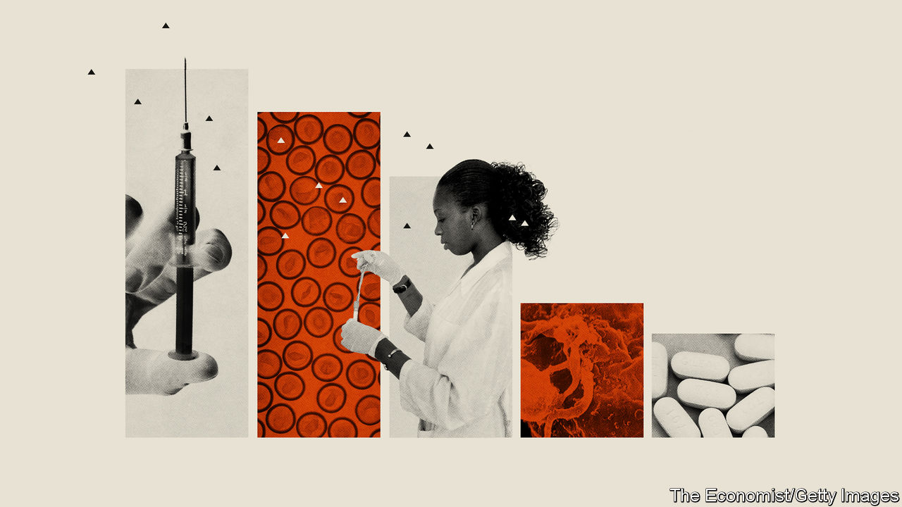
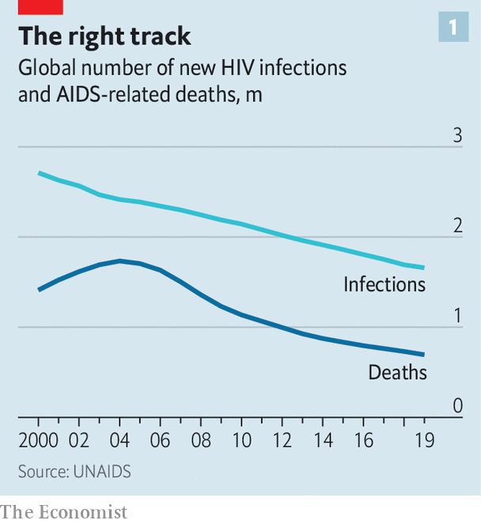
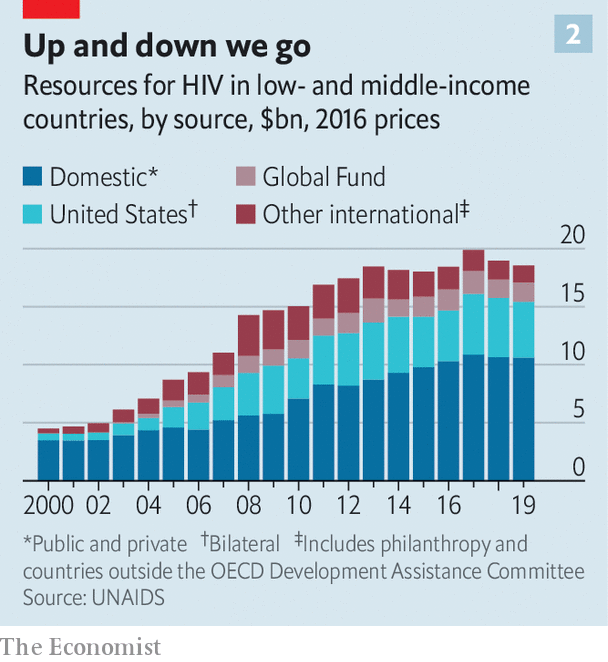

## The 23rd International AIDS Conference

# This year’s AIDS conference has brought snippets of good news

> But the HIV pandemic is nowhere near over yet

> Jul 8th 2020NOT SAN FRANCISCO AFTER ALL

EVEN IN THE days of the internet, conferences remain the lifeblood of science. Young thrusters can meet old fogeys and lobby them for jobs. Ideas can be swapped in the knowledge that no electronic trail will come back to haunt you. And journalists can swoop, scoop up a bundle of interesting stories and, with luck, provide an update to their readers and viewers of developments in whatever field the conference was about.

The International AIDS Conferences, the first of which was held 35 years ago, in Atlanta, Georgia, have done all these jobs well. But they have also had two others. One is to bang a drum which reminds the world that AIDS is still a curse on humanity—hence the particular welcome offered to journalists. The second is to mix experts and activists from rich countries and poor for the better exchange of problems and solutions. Much of this mixing is serendipitous face-to-face contact. It is therefore poignant that one consequence of a different viral pandemic, covid-19, is that the organisers of this year’s AIDS conference decided not to hold it in San Francisco after all. Instead, they transferred everything to cyberspace.

A paradox of AIDS is that it has dropped off many people’s radar screens precisely because the response to it has been so successful. That risks neglect of the problem, which in turn risks a rebound of the disease. UNAIDS, the United Nations’ agency charged with combating the HIV pandemic, released its latest report on July 6th, the day the conference began. On the face of things, it makes grim reading. Though the error bars are wide, some 1.7m people were newly infected in 2019 and 690,000 of those already infected died. At the end of the year that left 38m people living with the virus, of whom 25.4m were taking antiretroviral (ARV) drugs of one sort or another to keep their viraemia under control. But, though these numbers are huge, they are all heading in the right direction (see chart 1).

The world’s AIDS establishment is also coming closer to achieving its next self-imposed target, known as 90:90:90. This is to identify 90% of those infected, treat 90% of those so identified, and suppress to undetectability the viral load of 90% of those so treated. The aim, set by the UN in 2014, was to do all that by the end of this year. It always seemed ambitious, and is most unlikely to happen. At the end of 2019 the central estimates of the numbers in question were 81%, 82% and 88% respectively.

But again, things are moving in the right direction. Fourteen countries, including Botswana, Cambodia, Rwanda, Zambia and Zimbabwe, report that they have reached the 90:90:90 goal. Two of them, Switzerland and Eswatini (formerly Swaziland) report 95:95:95—which is actually the target for 2030. Though Eswatini is a small country, it has the highest prevalence of infection on the planet (27% among 15- to 49-year-olds), so that is a welcome success.

There are still worries. As chart 2 shows, the cash available to deal with HIV in poor and middle-income countries—the places where it is most prevalent—has been falling for the past couple of years. That is an especial problem in the case of this virus, for one of the costs involved, the supply of ARVs to those living with it, inevitably increases with success, since each life saved must be sustained by drugs indefinitely.

Another concern is the effect of covid-19. The economic downturn caused by the new coronavirus means HIV may not keep its priority status among finance ministers. And, more immediately, covid-19 poses a threat to the continued flow of ARVs. By July 1st 36 countries had made reports to the World Health Organisation of disruptions to services which provide these drugs. Together, these places are home to 11.5m recipients of ARVs—about 45% of the world’s total. In 24 of them, home to 8.3m users, stocks were reported as “critically low”. UNAIDS suggested in May that a six-month-long disruption to ARV treatments in sub-Saharan Africa might cause around 500,000 deaths.

With luck, covid-19 will be a blip. In the longer term, though, the search continues for better ways both to treat those currently infected with HIV and to stop others joining their numbers.

A vaccine seems as far away as ever, and little news emerged at the conference to change that assessment. Another means of prevention has, however, been advancing with impressive speed. This is a technique called pre-exposure prophylaxis (PrEP). It works by offering specially tailored formulations of ARVs to people at high risk of contracting HIV.

The established version of PrEP uses a combination of two drugs, emtricitabine and tenofovir, known collectively as Truvada. According to UNAIDS almost 600,000 people (mostly gay men) took Truvada at least once in 2019. As is often the case with new medicines, cost has dictated that a lot of these people live in rich countries.

Truvada is now, however, being deployed in poor countries, too. According to PrEPWatch, a not-for-profit clearing house for PrEP-related information, as of April this year about 56,000 people in Kenya were taking the drug combination—just under half the target set for that country by PEPFAR, the body that disburses much of America’s AIDS-related foreign aid.

And PrEP is getting better. A drug called cabotegravir is being tested for the purpose. Cabotegravir is an integrase inhibitor—meaning that it works by stopping HIV copying its genome into the chromosomes of its host cells, an important stage in its life cycle. Unlike Truvada, which must be taken daily, by mouth, prophylactic cabotegravir is delivered as an injection once every two months.

Cabotegravir also seems to be more effective than Truvada. A trial of 4,600 volunteers (gay men and transgender women) spread across Africa, Asia and North and South America was so successful that it was stopped in May, 22 months before its scheduled end. A parallel trial on women volunteers, which began more recently, is now being watched closely to work out if it is having a similarly positive outcome.

Periodic injections rather than daily pills may also be on the cards for the treatment of those already infected. Once again, cabotegravir is involved. Two trials which reported last year, of a combination of it and another antiretroviral, rilpivirine, suggest that this formula is just as effective, when injected once a month, as are standard oral drugs taken daily.

Advances in prevention and treatment, then, are clearly on the cards. One of the conference’s most intriguing announcements, though, concerned the tantalising possibility of a cure.

Until now, only two people were thought to have been cured of AIDS. In this case the term “cure” means a patient can stop taking ARVs without the virus emerging from the chromosomes in which it has been hiding. Ricardo Diaz of the Federal University of São Paulo, in Brazil, thinks that there may now be a third example.

The two established patients, who, though no longer anonymous, are still widely known as the Berlin and London patients, were recipients of carefully chosen bone-marrow transplants intended to treat blood cancers that they were suffering from. With the recipients’ consent these were made from donors who had a rare genetic mutation which confers immunity to HIV infection. This is not a realistic route to a routine treatment, though, because it is far too dangerous and expensive. What happened to the São Paulo patient, as he will no doubt come to be known, may be. Dr Diaz’s hope is that this man has been cured using workaday drugs.

The method Dr Diaz employed is called “kick and kill”. The “kick” part involves activating all cells with HIV genes integrated into their chromosomes, in order to switch those genes on and thus turn the cells into virus factories. Cells with integrated HIV genes are invisible to the immune system. Those where HIV is active are not. They will be sought out and destroyed—the “kill” part of the treatment.

The trick is to find a suitable combination of molecules to do the kicking without the now-activated virus getting out of control. Dr Diaz’s mixture is a pair of potent ARVs called dolutegravir and maraviroc, and a derivative of vitamin B3 called nicotinamide. He administered dolutegravir, maraviroc and nicotinamide to a group of five volunteers, for 48 weeks, as part of a wider investigation into possible treatments for HIV. Results from one of these volunteers suggested that the treatment might have worked and this patient stopped taking HIV medicine altogether in March 2019. His blood is still virus-free.

Caution is needed here. Dr Diaz has not sampled solid tissue such as lymph nodes where HIV tends to hide, nor has his claim that his patient’s blood is virus-free been independently verified. But if confirmation comes, and the patient continues to do well, then this would be an important result. A safe, permanent alternative to a lifetime on ARVs would be a wonderful thing.

So, did the enforced transfer to cyberspace work? As a one-off, certainly. More than 20,000 people registered, a number similar to previous meetings, and the lectures themselves were well attended. As to those who came, Gopal Shrestha, a Nepalese who was the first HIV-positive person to climb Mount Everest, said he found the meeting fruitful. And Mark Dybul, the founding head of PEPFAR, while regretting the difficulty of remote networking, observed that future conferences could have the best of all worlds by permitting both physical and virtual attendance. If that happens, then some virtue may have come out of what was a necessary decision. ■

## URL

https://www.economist.com/science-and-technology/2020/07/08/this-years-aids-conference-has-brought-snippets-of-good-news
