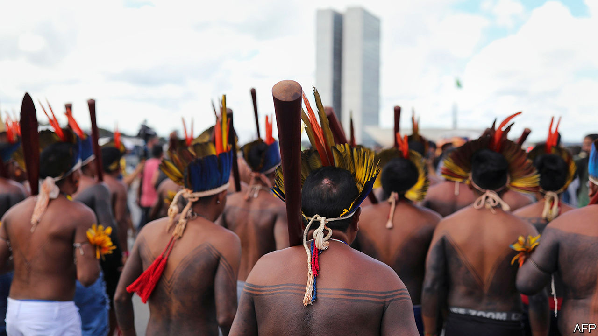
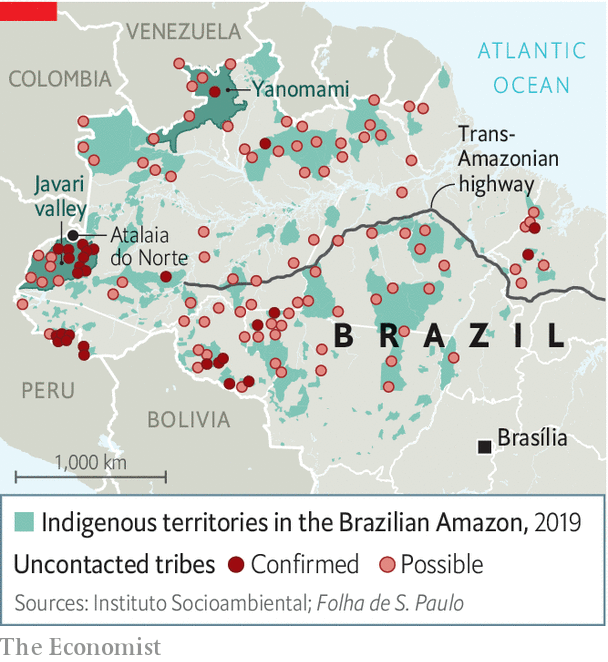

## Christianity, covid, contact

# A religious challenge to “no contact” with isolated indigenous groups

> Missionaries want to win souls in the Amazon. Brazil’s president is on their side

> Jul 9th 2020SÃO PAULO

MARCOS MAYORUNA found Jesus 15 years ago. The son of a cacique (chief) from the Vale do Javari, an indigenous territory in the Brazilian Amazon larger than Austria, he was converted by a missionary from another ethnic group and became a pastor himself. After seminary in Rio de Janeiro he went home to spread the word of God to the Mayoruna and other tribes.

He sometimes worked with Brazilian and American missionaries, swapping his local knowledge for donations to his humble seminary in Atalaia do Norte, a dusty town in the northern part of the valley. But, he says, the missionaries seemed more interested in reaching isolated peoples, indigenous groups that, unlike the Mayoruna, have little or no contact with the societies that surround them. Worldwide, 100 probably exist today, says Survival International, an NGO. The largest concentration, of perhaps 16, is in the Javari valley.

They owe their survival to a decision by Brazil’s government in 1988. It discourages contact with isolated tribes, except to prevent medical emergencies, warfare between tribes or other catastrophes. The policy’s father is Sydney Possuelo, a revered sertanista, or Amazon explorer, who led contact missions for Brazil’s military government in the 1970s and 1980s. Development projects like the construction of the Trans-Amazonian highway cleaved through forest inhabited by scores of indigenous groups (see map). In some, 50-90% of their members died from diseases like measles and flu. Horrified, Mr Possuelo persuaded the government to adopt the no-contact policy. It has become a model for other countries in the region.

From the start, it encountered resistance, chiefly from people who want to farm and mine on indigenous land. Now, for the first time, Brazil has a president, Jair Bolsonaro, who is a critic of the policy. An evangelical Christian, he shares the proselytising zeal of the missionaries whom Mr Mayoruna has encountered. He is also sympathetic to businessmen who want to develop the Amazon. Though still on the books, in practice the no-contact policy is being dismantled.

One of Mr Bolsonaro’s first decrees transferred power to demarcate indigenous reserves from the indigenous agency (FUNAI) to the agriculture ministry, which is friendlier to farmers. The Supreme Court annulled it. This year he nominated Ricardo Lopes Dias, a former missionary, to oversee the part of FUNAI that deals with its policy on isolated tribes. Mr Possuelo says that Mr Bolsonaro poses the biggest threat to those groups since the no-contact policy began. “Contact is a road of no return,” he says. The alarm is heightened by covid-19, which could hurt indigenous people more than those with access to modern health care. Mr Bolsonaro, who revealed this week that he had tested positive for the coronavirus, has shown little interest in shielding Brazilians from it.

Even before his presidency, the no-contact policy was under threat. Between 1987 and 2013, FUNAI contacted only five isolated groups. But illegal logging, mining and drug smuggling have pushed non-isolated groups towards isolated ones. Tensions between them have drawn in the state. FUNAI has led as many contact missions since 2014 as it did in those previous 26 years. In 2015 it drew criticism for initially ignoring pleas from the Matis in the Javari valley to make contact with the isolated Korubo, whose members had killed two Matis leaders. FUNAI contacted the Korubo only after the Matis killed eight Korubo in revenge.

With Mr Bolsonaro in charge, religious pressures reinforce commercial ones. “I haven’t met an Indian who wants to be naked, and it’s a crime to keep them that way,” says an American missionary who lives in Atalaia do Norte. Edward Luz, the president of the New Tribes Mission of Brazil (MNTB), whose 480 missionaries evangelise “unreached ethnic groups”, wrote in an email to The Economist that contact will improve their health. Fear and worry “will be replaced by confidence and they will smile, procreate, have their cultural practices and grow in numbers again,” he prophesied.

Mr Lopes was once an MNTB missionary. His appointment to FUNAI is like “putting a fox in charge of the hen house”, says Beto Marubo, an indigenous activist. He fears that Mr Lopes will share secret information about tribes’ locations with proselytising friends. If contact is needed, it should be done by the government, not missionaries, said Mr Lopes in an email.

Missionaries deny that they are trying to contact isolated tribes. Their actions suggest otherwise. Ethnos360, the American partner of MNTB, raised more than $2m to buy a helicopter to “open the door to reach ten additional people groups living in extreme isolation” in the Javari valley. Mr Luz says the helicopter, which arrived in January, will help MNTB in areas where it already works, like Vida Nova, a Marubo village where it built a church in the 1950s. FUNAI has reported Andrew Tonkin, an American, to the police for flying a seaplane into the Javari valley. Indigenous leaders say he was searching for isolated groups. He denies this and denounces what he sees as FUNAI’s paternalism. “What about [indigenous peoples’] right to invite who they want to their community?” he emailed. “To worship God freely?”

It is not just missionaries and miners who challenge the no-contact policy. In an editorial in Science in 2015, two anthropologists, Kim Hill and Robert Walker, suggested that, given governments’ inability to protect indigenous lands, isolated groups are “not viable in the long term”. “Controlled contact” would be a better policy, they wrote. “If we can guarantee them protection from exploitation they would all choose contact tomorrow,” says Mr Hill. His research shows that by at least one measure they would be better off: among the Ache of Paraguay, half of children living isolated in the forest died before reaching adulthood. After contact in the 1970s, child mortality rates spiked for a few years, but are now 2-3%.

The Science article caused a furore. The idea of controlled contact ignores native peoples’ right to self-determination, say defenders of no contact. Many groups returned to isolation after traumatic encounters, such as enslavement by rubber tappers in the early 1900s. Uncontacted groups “know there’s a world out there,” says Mr Marubo. “They are making a choice by isolating themselves.” Many people doubt that any contact could be controlled, and that it would be accompanied by medical follow-up. “Can you trust that a government won’t think about what gold is there, what oil is there, what trees are there?” asks Glenn Shepard, an ethnobotanist.

Even if controlled contact were possible, now seems a bad time to initiate it. The prevalence of covid-19 among indigenous people in cities is five times that among white Brazilians. Mr Hill agrees contact should not happen until there is a vaccine and Mr Bolsonaro is no longer president.

Yet evangelists see the disease as a reason to initiate it. Congress’s evangelical lobby tacked on to a law that allocates money to protect indigenous people from covid-19 an amendment that allows missionaries to remain on indigenous lands. After a court ordered the government to evict 20,000 gold miners from the remote Yanomami territory, the army dropped off face masks and hydroxychloroquine, an antimalarial drug that Mr Bolsonaro thinks is effective against covid-19.

Mr Mayoruna, who left the forest because “I wanted to know who God was”, recently broke ties with the missionaries. He thinks it is a matter of time before the remaining isolated groups are confronted with modern Brazil, but says it is wrong for pastors to push the pace. “You can’t force anyone to convert,” he says.■