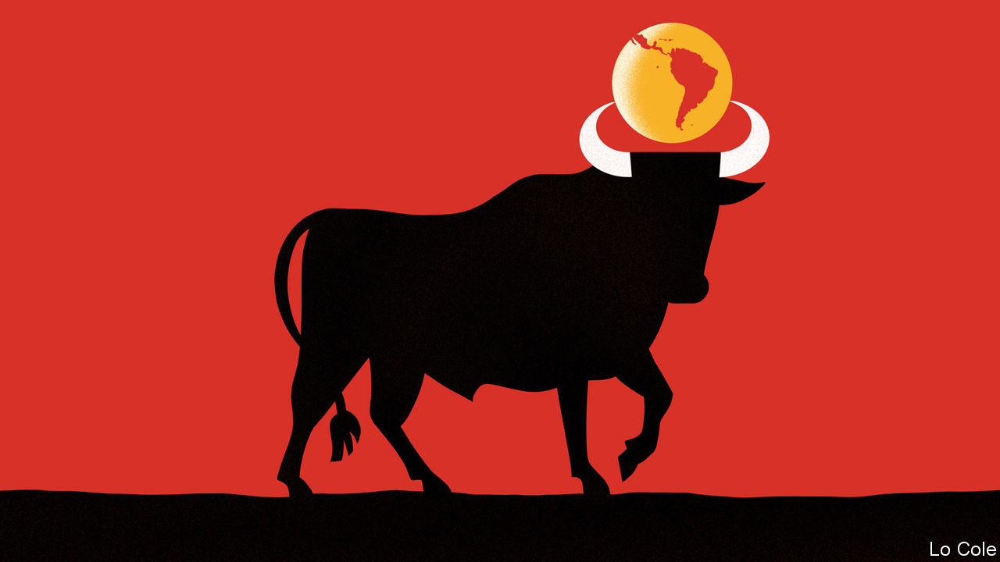

## Bello

# Spain’s complicated relationship with Latin America

> The former colonial power wants to play a useful role, but undermines its own influence

> Jul 9th 2020

THEY HAVE gained few headlines and have barely been noticed even in Spain. But over recent weeks the Spanish government has organised six virtual ministerial meetings with its counterparts in Latin America to share experiences of dealing with the pandemic that has hit their countries so hard. These gatherings culminated in a video get-together on June 24th in which Pedro Sánchez, Spain’s prime minister, was joined by nine presidents. They agreed to work together to try to ensure that international financial institutions have more money to lend to Latin America as it struggles to support its economies.

This is a new and useful chapter in a relationship that has often promised more than it has delivered. In many ways, Spain and Latin America are close. They share ties of language, culture and history (though this does not apply to the same extent to Portuguese-speaking Brazil). But the political dialogue between them has had ups and downs over the past 40 years. Spain’s transition to democracy in the late 1970s influenced Latin America as it, too, shook off dictatorship. Felipe González, Spain’s Socialist prime minister from 1982 to 1996, forged close ties with the region’s leaders. Together with Mexico, in 1991 Spain launched the first of what would become regular “Iberoamerican” summits, which include Portugal, too. Spanish companies piled into Latin America, often by buying privatised firms. In 2005 Spain set up an Iberoamerican secretariat (known as SEGIB) to implement initiatives agreed upon at the summits.

It is a low-key outfit that does useful things, like arranging the portability of professional titles and social security, and acts as a vehicle for small-scale aid projects worth some €23m ($26m) a year, to which countries contribute as they wish. In a modest way, it works.

For Latin America, where the United States and China loom large, ties with Spain are a way of diversifying friendships. The heart of Spain’s political offer to Latin America is to portray itself as the region’s advocate in Brussels, which increases its own weight there. In fact, big countries like Brazil and Argentina often have no need of an intermediary. But Spain was important in easing visa requirements for the Schengen area for Latin Americans and in clinching a trade agreement between the European Union and Mercosur, the bloc based on Brazil and Argentina. In May Spain’s foreign minister, Arancha González Laya, organised with Josep Borrell, her predecessor who is now the EU’s foreign-policy chief, a successful conference of donors to support the needs of Venezuelan migrants.

But the past casts a shadow. When last year Mexico’s populist president, Andrés Manuel López Obrador, demanded that Spain apologise for its invasion of 1519, Spaniards were angered while many Latin Americans privately cheered. Latin American diplomats say that Spain tends to take the region for granted. SEGIB has sometimes seemed a vehicle through which to outsource policy towards the region, or not to have one. Once a big donor to Latin America, Spain slashed development aid after its economic slump of 2009-12. Some of its companies are now retreating from Latin America.

Spain’s biggest diplomatic failure has been over Venezuela’s slide into dictatorship under Nicolás Maduro. It was left to Norway to try to broker an agreement last year between the government and the opposition. Spain is hobbled by the antics of José Luis Rodríguez Zapatero, a Socialist former prime minister, who claims to be a mediator in Venezuela. The country’s opposition considers him a stooge for Mr Maduro. Because of Mr Zapatero, Spain “has lost a lot of prestige”, says a Latin American former foreign minister. Podemos, the far-left member of Mr Sánchez’s coalition, is also friendly towards Mr Maduro’s regime. So domestic politics undermines Spanish diplomacy on one of the most important issues in a region it claims is a priority.

Rebeca Grynspan, SEGIB’s boss, points out that the Iberoamerican summits are the only place where all the governments of Latin America sit down together. That reflects a region that is more divided than for decades, in which the presidents of Argentina and Brazil do not speak to each other and about which Mr López Obrador doesn’t care. It is a dereliction of duty that Latin America’s leaders have failed to come up with a joint position on many of the region’s pressing issues, starting with how to get international support to rebuild their economies. To Spain’s credit, on that at least, it has stepped into the breach.