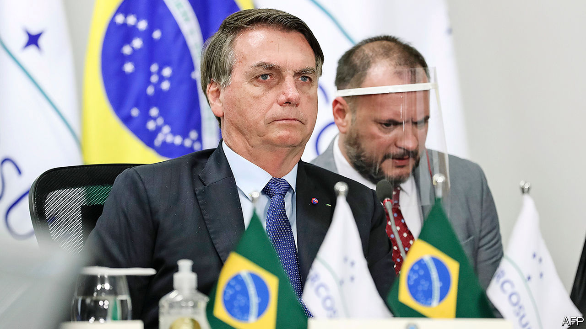
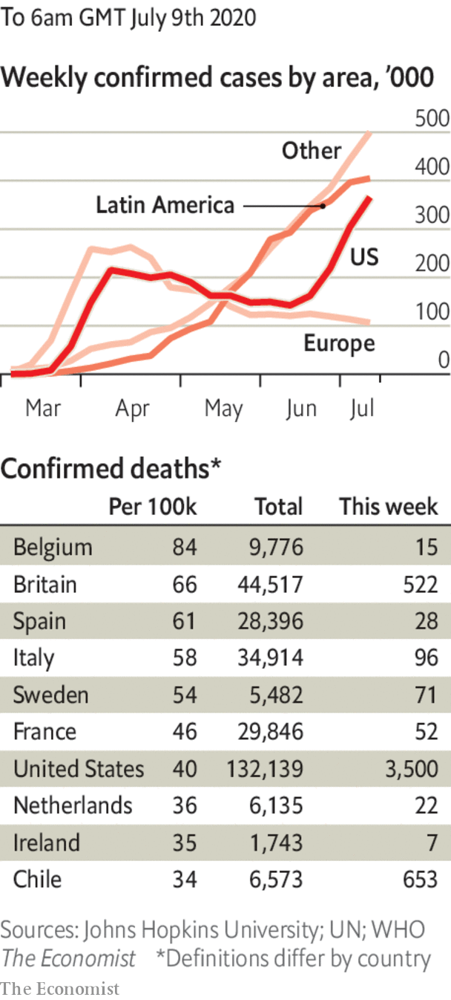

# Politics this week

> Jul 11th 2020

Brazil’s president, Jair Bolsonaro, who has downplayed the threat of covid-19, flouted social-distancing guidelines and said that his “athletic history” would protect him, tested positive for the coronavirus.

Luis Abinader, a businessman from the centre-left Modern Revolutionary Party, won the Dominican Republic’s presidential election. His victory ends 16 years of rule by the Dominican Liberation Party. The vote, originally scheduled for May, was delayed because of covid-19. See [article](https://www.economist.com//the-americas/2020/07/08/the-dominican-republic-changes-its-ruling-party).

Fabián Gutiérrez, who was a secretary to Cristina Fernández de Kirchner, Argentina’s president from 2007 to 2015 and now its vice-president, was murdered. Mr Gutiérrez had agreed to co-operate with the prosecution in the “notebooks” scandal, centred on bags of cash delivered to officials during Ms Fernández’s presidency, and to her home. She denies wrongdoing. Mr Gutiérrez’s murder is not thought to be politically motivated.

A British judge ruled that Venezuela’s de facto president, Nicolás Maduro, cannot access $1.8bn-worth of gold held in the Bank of England because Britain recognises the leader of the opposition, Juan Guaidó, as the president.

The Trump administration gave formal notice to the World Health Organisation that America will withdraw from the body on July 6th 2021. Joe Biden said he will scrap that decision and “rejoin” the WHO if he is elected president in November.

Brian Kemp, the governor of Georgia, called up the National Guard to deploy to Atlanta, where tensions are running high over policing. Mr Kemp issued his order after a sharp increase in criminal shootings and homicides, including that of an eight-year-old girl.

In a rare instance of unanimity, the justices on America’s Supreme Court ruled that members of the electoral college who vote against the presidential candidate chosen by the popular vote in their state can be punished.

China’s central government set up an office in Hong Kong to oversee enforcement of a new national-security law. Its staff includes secret police from the mainland. Hong Kong’s government formed a committee on national-security policy and gave the police sweeping new powers. A senior mainland official is an “adviser” on the body. Australia suspended its extradition treaty with Hong Kong and urged its citizens there to consider leaving. See [article](https://www.economist.com//china/2020/07/11/under-a-new-national-security-law-hong-kong-is-already-a-changed-city).

Police in Beijing detained a prominent law professor, Xu Zhangrun. Mr Xu has long been one of the Communist Party’s most outspoken critics.

Widespread flooding killed dozens of people and displaced millions in several Chinese provinces. The city of Wuhan, where covid-19 first took hold, issued a flood alert.

Koike Yuriko was re-elected the governor of Tokyo with 60% of the vote. Ms Koike, who used to be a member of the ruling Liberal Democratic Party but now leads an opposition party, has won plaudits for her handling of the covid-19 crisis in the city, boosting her national profile.

Rescue workers said there was little hope of finding any more survivors from a landslide at a jade mine in northern Myanmar that killed at least 170 people. Many of the dead were scouring the mine’s rubble for remnants of the gemstone.

President Emmanuel Macron reshuffled his cabinet following disappointing results in local elections. Despite being well-regarded, France’s prime minister, Edouard Philippe, was replaced by a little-known technocrat, Jean Castex. See [article](https://www.economist.com//europe/2020/07/09/an-unknown-prime-minister-reinforces-macrons-centralised-presidency).

Iran said a fire at a nuclear facility in Natanz caused significant damage. It did not say what caused the blaze, but spooks in the region believe it was a bomb. Suspicion has fallen on Israel and America, which have sabotaged Iran’s nuclear programme in the past. Other mysterious incidents, including recent explosions at power plants and factories, remain unexplained. See [article](https://www.economist.com//node/21789076).

Hisham al-Hashimi, one of Iraq’s most prominent security analysts, was shot dead in Baghdad. An expert on armed groups, he had strongly supported moves by Iraq’s prime minister, Mustafa Kadhimi, to challenge Iranian-sponsored militia groups. Mr Hashimi had reportedly been threatened by some of those militias, as well as Islamic State.

At least 180 men have been murdered by security forces in Burkina Faso, according to Human Rights Watch. See [article](https://www.economist.com//middle-east-and-africa/2020/07/11/jihadists-in-the-sahel-threaten-west-africas-coastal-states).

Gunmen killed eight construction workers building Africa’s largest gas project in northern Mozambique. A growing jihadist insurgency in the country has claimed more than 1,000 lives since 2017.

Amadou Gon Coulibaly, the prime minister of Ivory Coast, died, casting a shadow over the presidential election scheduled for October. Mr Coulibaly was the ruling party’s candidate to replace Alassane Ouattara, who had said he would not run for a third term.

High-altitude balloons started providing internet services in Kenya, offering a new way of allowing people in remote villages to get online. The service is operated by Loon, which is owned by Google’s parent company, Alphabet.

The WHO admitted that the risks from airborne transmission of covid-19 may be higher than it had thought.

A senior health official resigned in Israel as the number of new daily cases passed 1,000. The head of a panel of advisers said the government had “lost control” of the virus.

India passed Russia to record the third-highest cumulative number of coronavirus infections. A recent increase in testing capacity may help authorities get a better picture of the progress of the disease. See [article](https://www.economist.com//asia/2020/07/11/infections-in-india-are-soaring-but-increased-testing-will-help).

 Melbourne, Australia’s second-biggest city, went back into lockdown. The border between the states of Victoria and New South Wales was closed. See [article](https://www.economist.com//node/21789134).

There were riots outside Serbia’s National Assembly when lockdowns were reimposed and the government threatened a curfew.