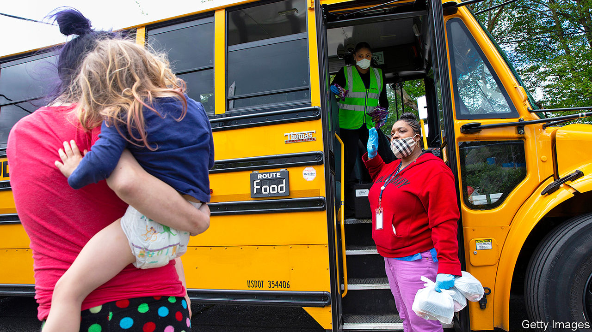
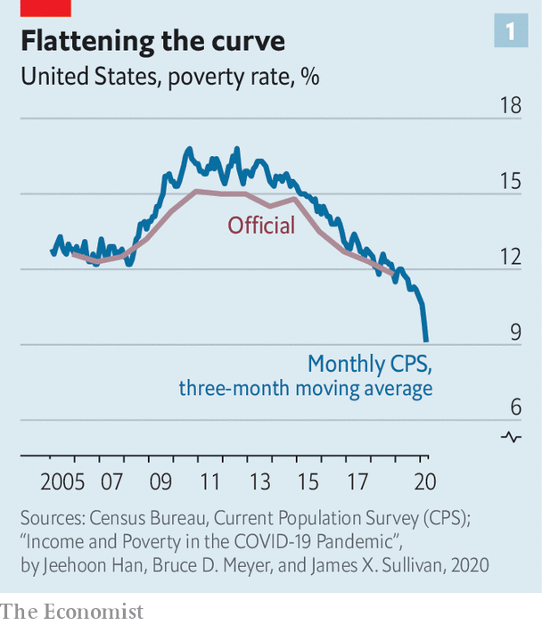
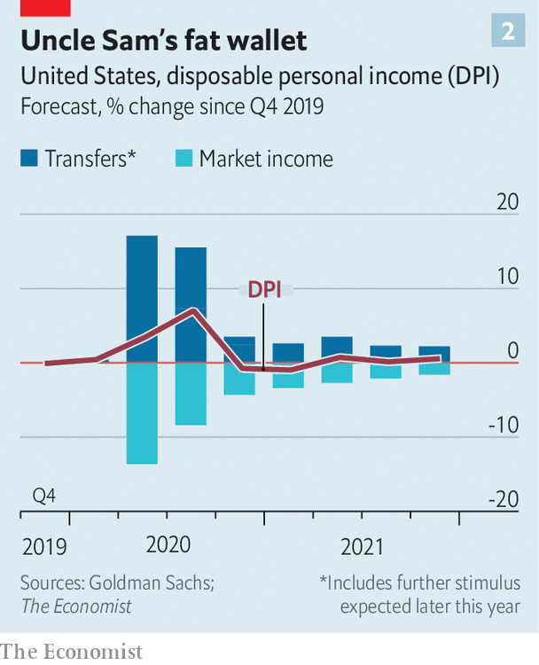

## The covid bonus

# America’s huge stimulus is having surprising effects on the poor

> Though severe deprivation is rising, not everyone is worse off

> Jul 6th 2020

NO ONE WELCOMES a recession, but downturns are especially difficult when you are poor. Rising unemployment means rising poverty: the recession of 2007-09 prompted the share of Americans classified as poor, on a widely used measure, to jump from 12% to 17%. That economic shock, as bad as it was, pales in comparison with what America is seeing today during the coronavirus pandemic. The jobs report for June, published on July 2nd, showed that unemployment remained well above the peak of a decade ago.

Severe deprivation is certainly on the rise. According to a new survey from the Census Bureau, since the pandemic began the share of Americans who “sometimes” or “often” do not have enough to eat has grown by two percentage points, representing some 2m households. An astonishing 20% of African-American households with children are now in this position. Meanwhile, the proportion of Americans saying that they are able to pay the rent is falling. Many more people are typing “bankrupt” into Google.

Yet these trends, bad as they are, do not appear to be part of a generalised rise in poverty. The official data will not be available for some time. A new paper from economists at the University of Chicago and the University of Notre Dame, however, suggests that poverty, as measured on an annual basis, may actually have fallen a bit in April and May, continuing a trend seen in the months before the pandemic hit (see chart 1).

Why? The main reason is that fiscal policy is helping to push poverty down. The stimulus plan passed by Congress is twice the size of the one passed to fight the recession of a decade ago. Much of it, including cheques worth up to $1,200 for a single person and a $600-a-week increase in unemployment insurance (UI) for those out of work, is focused on helping households through the lockdowns. At the same time, unemployment now looks unlikely to rise to 25% or higher, as some economists had predicted in the early days of the pandemic, thereby exerting less upward pressure on poverty than had been feared.

The upshot is that the current downturn looks different from previous ones. Household income usually falls during a recession—as it did the last time, pushing up poverty. But a paper in mid-June from Goldman Sachs, a bank, suggests that this year nominal household disposable income will actually increase by about 4%, pretty much in line with its growth rate before the pandemic (see chart 2). The extra $600 in UI ensures, in theory, that three-quarters of job losers will earn more on benefits than they did in work.

By international standards, America’s unexpected success at reducing poverty nonetheless remains modest. Practically every other rich country has a lower poverty rate. It is also a fragile accomplishment. The extra $600-a-week payments are supposed to expire at the end of July. The authors of a recent paper from Columbia University show that poverty could rise sharply in the second half of the year, which seems likely if unemployment has not decisively fallen by then. Goldman’s paper assumes that Congress will extend the extra unemployment insurance, but that the value of the payment will drop to $300. Even then, household disposable income would probably fall next year.

Whether extra stimulus would help those at the very bottom of America’s socio-economic ladder—including people not able to buy sufficient food—is another question. Six per cent of adults do not have a current (checking), savings or money-market account, making it difficult for them to receive money from Uncle Sam. Some may have been caught up in the delays which have plagued the UI system, and a small number may be undocumented immigrants not entitled to fiscal help at all. Others report not being able to gain access to shops closed under lockdowns. The best way to remedy this would be to get the virus under control and the economy firing on all cylinders once again. But that still looks some way off.■

To keep up with our coverage of the pandemic, visit our coronavirus [hub](https://www.economist.com//news/2020/03/11/the-economists-coverage-of-the-coronavirus). Some of our covid-19 coverage is free for readers of The Economist Today, our daily [newsletter](https://www.economist.com/https://my.economist.com/user#newsletter).

## URL

https://www.economist.com/united-states/2020/07/06/americas-huge-stimulus-is-having-surprising-effects-on-the-poor
