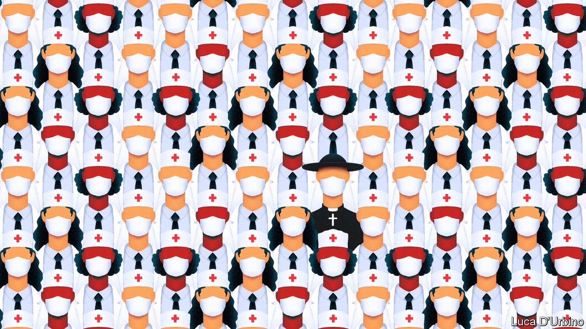

## Civil rites

# As fewer Americans go to church, chaplains are finding work elsewhere

> The hospital chaplain has become a key figure in the treatment of covid-19 patients

> Jul 11th 2020

ONE OF THE toughest things about covid-19 for Pamela Lazor, as for workers in hospitals across the world, has been watching patients die without a loved one close by. As a chaplain at Cedars-Sinai Medical Centre in Los Angeles, part of her job is making sure dying patients have the company of a relative or a chaplain if they have signalled a wish for it. As the virus spreads, hospital chaplains are playing a crucial role in the care of patients, their families and the medical staff who treat them. This reflects the expansion of chaplaincy in America more broadly. As fewer people go to church, more of those who would once have become church ministers have become chaplains instead, says Wendy Cadge, a professor of sociology at Brandeis University and founder of the Chaplaincy Innovation Lab (chaplains are spiritual advisers attached to secular institutions such as hospitals or schools).

In the process, chaplaincy has become increasingly professionalised. In the past 20 years a quarter of theological colleges have started chaplaincy degree programmes. Though the only institutions legally required to have chaplains are federal prisons, the armed forces and the Veterans Administration, they are now found in veterinary clinics, fire stations, shopping malls and offices. A recent national survey found that 20% of Americans had engaged with a chaplain in the past two years.

Most hospitals now have chaplains on their payroll. Though many are ordained, they differ from other ministers in significant ways. No matter what their tradition, they are trained to tend to people of any faith or none, are familiar with hospital systems, and work closely with doctors and nurses. Arif Kamal, a palliative-care expert at Duke University and a hospital doctor, says hospitals have seen that having a chaplain can reduce staff turnover, especially at stressful times. Currently, he says, chaplains are operating as a “relief valve”, doing some of the jobs made necessary by a highly contagious virus that medical staff are too busy to attend to.

As PPE supplies have improved, some hospitals, like Cedars-Sinai, allow one visitor when a patient is close to death. But most patients are still largely isolated from their families. Chaplains help organise online meetings and serve as go-betweens, speaking to relatives who are unable to reach a doctor or nurse.

Their particular speciality is death. A majority of Americans die in hospital. Yet because few anticipate this, they and their families are often unprepared for what it can involve. Dr Kamal says that people, especially from conservative religious backgrounds, worry about the ethics surrounding end-of-life care; whether a ventilator should be switched off, for example. Intensive-care doctors may not have the time to discuss such issues; outside ministers are unlikely to understand the way such decisions are made in hospitals, and may even make them more difficult.

Covid-19 is also prompting chaplains and medical staff to work together more closely. Houston Methodist, a hospital in Texas’s biggest city, is one of many in which chaplains are still unable to visit covid-19 patients. Stacy Auld, the director of spiritual care, says the hospital tries to find ways round that. When it became obvious recently that a patient, who had expressed a desire to be baptised, would shortly die, a chaplain guided a nurse from behind a glass screen as he performed the rite.

A few have visited patients with covid-19 throughout the pandemic. At its peak in Massachusetts, Brian Conley, a Catholic priest, administered the last rites to between three and five Catholic patients a day at Brigham and Women’s Hospital in Boston, more than five times his usual rate. He recited verses of the Koran and Jewish prayers for the dying when an imam or rabbi was not available. Being at the bedside of a patient dying from covid-19 is different from attending other deaths, he says, because he has to keep a six-foot distance and wear a face shield. Patients often remain hooked up to ventilators even after they have been switched off to reduce the threat of infection. “It can feel strange and distant,” he says. “But the need is the same.”■