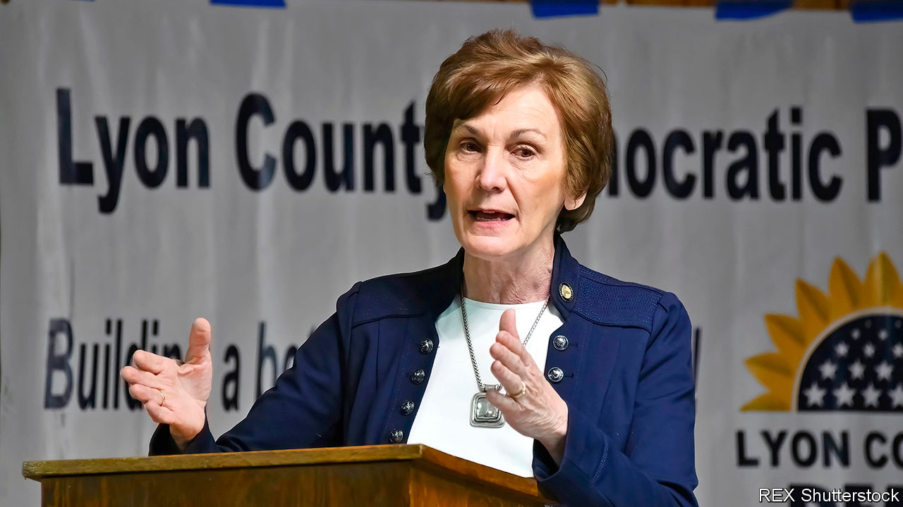

## The 88-year itch

# Could Democrats pick up a Senate seat in Kansas?

> The party has a strong candidate, but needs an FDR-like performance at the top of the ticket

> Jul 11th 2020

STALIN RULED the Soviet Union. George V occupied the British throne. America’s public was awed by a young Kansan, Amelia Earhart, who had become the first woman pilot to fly solo across the Atlantic. The year 1932 was memorable for many. But Democrats in Kansas recall it for a special reason: that was the last time their state elected a Democratic senator.

Could it happen again in November? Kris Kobach, a Republican and former secretary of state in Kansas, scoffs at the idea. He campaigned this week in Topeka, the state capital, after a weekend of attending Independence Day parades and picnics. “It won’t be 1932 again,” he said, predicting that he, or whoever else emerges from a crowded field of 11 in the Republican primary on August 4th, will go on to win the Senate race by ten percentage points.

Such confidence could be misplaced. The Democrats will field an unusually strong candidate. Barbara Bollier, a retired anaesthesiologist, has raised $3.7m this quarter, a hefty sum that dwarfs efforts on the Republican side. Democrats nationally are shovelling money into Kansas, as a victory there could help win control of the Senate—or the threat of one might at least distract Republicans from other battles.

Ms Bollier’s biography makes success seem possible. Until two years ago she was a moderate Republican in the state Senate. She was dismayed by a dire tax-cutting experiment under the previous Republican governor, Sam Brownback, and by her (former) party’s rightward lurch on social issues. She endorsed Laura Kelly, a Democrat, who won the race to be governor in 2018. Then she jumped party.

Having an ex-Republican doctor on the ticket should be an advantage as covid-19 spreads. Ms Bollier is making health care her main issue. That is astute: Republicans vow to repeal the Affordable Care Act, though polls suggest most Kansans want government-backed care expanded. If the pandemic worsens, voters may grow more concerned. Ms Bollier also has the advantage of coming from Johnson County, which includes some suburbs of Kansas City. Doing well there could be decisive.

Democrats are also encouraged by conniptions among Republicans after the incumbent, Pat Roberts, said he would retire. For months the national party tried to press Mike Pompeo, the secretary of state, to run. He eventually refused, but the long uncertainty sent a message that Mitch McConnell, the Senate leader, does not trust the local alternatives as a safe bet.

Most are nonentities. Easily the best-known is Mr Kobach, who may have a slight lead over his rivals because of a strong base of conservative backers. He was previously close to Donald Trump, but lost favour once Ms Kelly thumped him in the governor’s race. He has proved himself a poor fundraiser and his focus on the evils of immigration seems unsuited to the moment.

Mr Kobach retorts that Mr McConnell and other “establishment voices” fear him as an outspoken conservative, so are “trying to foist a pliable Republican” on the seat. Mr Trump has not endorsed anyone, but seems to be behind Roger “Doc” Marshall, an unexceptional congressman from rural western Kansas.

Complicating things is a former plumber, Bob Hamilton, who plunged into the primary and is mostly devoting himself to attacks on Mr Marshall. He is said to be spending $2m of his own cash on TV ads. He pitches himself as an even more conservative outsider. By attracting 15% support or more, he makes the result of the primary hard to guess.

As for the November election, polls show Ms Bollier as likely to win as any Republican. Her challenge is to sustain that after August, once she faces a single opponent. If she really is to end the Democrats’ 88-year losing streak in Kansas, she probably needs Mr Trump’s popularity to dip more. Because voters seldom now split their ballots between president and Senate, she needs more Kansans to think again about the top of the ticket. That was the formula in 1932, after all. Kansas last got a Democratic senator when FDR won a national landslide for his party. ■

Dig deeper:Sign up and listen to Checks and Balance, our [weekly newsletter](https://www.economist.com//checksandbalance/) and [podcast](https://www.economist.com//podcasts/2020/07/17/checks-and-balance-our-weekly-podcast-on-american-politics) on American politics, and explore our [presidential election forecast](https://www.economist.com/https://projects.economist.com/us-2020-forecast/president)

## URL

https://www.economist.com/united-states/2020/07/11/could-democrats-pick-up-a-senate-seat-in-kansas
