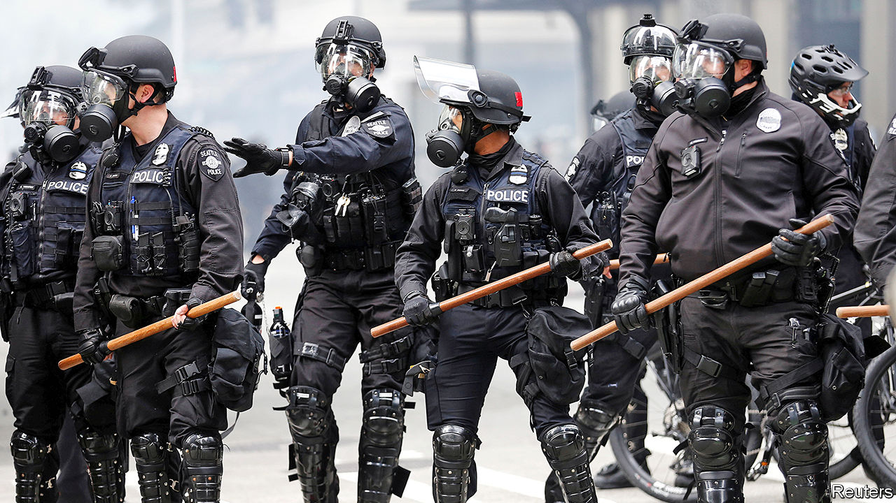

## Bands of blue

# Reining in police unions’ power in America

> Cities and states have begun to curb organisations that have been indulged from left and right

> Jul 9th 2020WASHINGTON, DC

“THE UNION forever defending our rights,” rhapsodises Billy Bragg, a British singer and activist, in his song “There is Power in a Union”. And that, indeed, is what unions do: they advance the interests of their members. That means pushing for better pay, benefits and working conditions. Unions representing police officers are no different: their efforts keep police pensions and salaries generous, and provide their members with broad protections against disciplining and oversight, to keep them in work. That has long frustrated many criminal-justice reformers—but, buoyed by calls for change in the wake of George Floyd’s death, some governments have begun to rethink those protections.

Law enforcement is among the most heavily unionised sectors in America, and police unions occupy a unique position. They tend to be conservative, unlike much of the labour movement. The International Union of Police Associations, for instance, has endorsed Donald Trump, even though it is affiliated with the AFL-CIO, a staunchly Democratic union federation.

Politically, police unions are shielded on both sides. The right dislikes confronting the police—in Wisconsin Scott Walker, a former Republican governor, specifically exempted police unions from a measure passed in 2011 that limited public unions’ collective bargaining rights—whereas the left is loth to take on unions. Governments often find it easier to give in on disciplinary and oversight matters, which incur no direct or noticeable costs, than on pay and pensions, which might require tax rises or service cuts elsewhere.

Union contracts for police forces in most of America’s 100 largest cities have provisions reducing police accountability. In Chicago, for instance, officers have 24 hours after a shooting to make a statement, which they can amend after watching video footage of a disputed incident. Chicago also bans anonymous complaints of misconduct, which a Justice Department report argues “creates a tremendous disincentive” to report it, since complainants fear they may be targeted. Other states and cities indemnify police against misconduct by paying their legal fees and settlement costs, allow officers access to information that citizens do not get which they can review before being interrogated, and eventually erase disciplinary records from officers’ files.

A forthcoming paper from Rob Gillezeau, an economist at the University of Victoria, British Columbia, who studies police practices, found that the spread of police collective-bargaining in America between the 1950s and 1980s led to what he calls “a meaningful increase in civilians killed by law enforcement, mostly among the non-white population.” He argues that, “it looks like the collective-bargaining process is being used to protect the ability of officers to discriminate.”

Some states have begun taking measures to boost police accountability and rein in union power. In late June, Oregon’s legislature passed bills requiring officers to report or prevent misconduct by their colleagues and limiting the ability of arbitrators to overturn disciplinary actions. Connecticut’s legislature plans to pass police-accountability legislation in a special session later this month that may include measures limiting officer indemnification and unions’ ability to negotiate over some disciplinary and oversight measures. Some prominent Democrats in California have asked the party to stop accepting contributions from police unions—a move that would limit the unions’ influence in what is, in effect, a one-party state.

Some unions are dug in for a long fight. But others see that times are changing. Daryl Turner, who heads Oregon’s police-advocacy organisation, recognises that “It’s important to evolve in policing...with the needs of your community and the nation.” Three large police unions in California have called for reforms including a national use-of-force standard and database of officers fired for gross misconduct—though of course those reforms would not curb their collective-bargaining power. ■