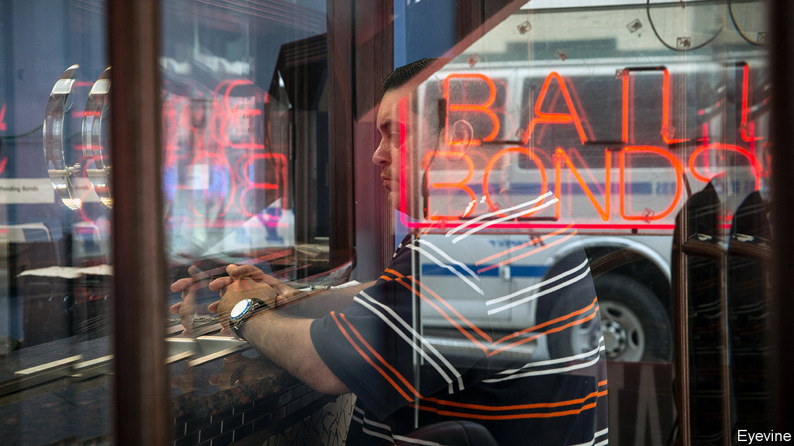

## Reform squared

# The challenges of reducing America’s jail population

> Cash bail is unpopular. But the replacements are not necessarily better

> Jul 9th 2020

IT MIGHT have been the most polite bank robbery in New York’s history. At half past five in the afternoon on January 10th a man in a Chicago Bulls baseball cap walked into a Chase Bank branch in Brooklyn and handed a note to the teller. “This is a robbery,” the message said, in handwritten red ink. “Big bills only.” He walked out with $1,000. The man accused of the heist is Gerod Woodberry. Less than four hours before the Brooklyn incident, Mr Woodberry had been released from police custody after being charged with similar offences. “I can’t believe they let me out,” he told a detective.

His release was thanks to New York’s new bail-reform law, effective since January 1st, which eliminated pretrial detention for misdemeanours and non-violent offences. Critics of the reform jumped on Mr Woodberry’s case. In April the state legislature amended the new law to increase the number of situations in which judges can impose cash bail, effective from July 1st. The Centre for Court Innovation, a think-tank, estimates that this will increase New York’s pretrial jail population by 16%.

Before the reform was reformed, New York had been the first state in the country to end pretrial detention for such a swathe of charges, enough to account for 90% of arrests. Bail-reform advocates say that keeping unconvicted people detained before trial violates the presumption of innocence. The money-bail system, in which defendants pay cash as a guarantee that they will show up in court, means that only those with spare dollars can wait for their trial at home. The poor must either turn to the $2.3bn commercial-bondsmen industry—companies, found only in America or the Philippines, which bail out defendants for a fee—or wait in pretrial detention. In 2016 two-thirds of inmates in local jails were defendants awaiting trial.

But if money bail is reformed, what replaces it? California abolished it in 2018, replacing it with risk assessments. But the new law pleased few people. It replaces the former system with “an overly broad presumption of preventative detention”, says the American Civil Liberties Union. The American Bail Coalition has sponsored a $3.7m campaign to repeal it. Risk-assessment tools “penalise people based on what they might do in future,” says Jeff Clayton of the bail-industry group. The law will be put to a referendum in November.

Debates about bail reform have forced people to think about what bail is really for, says Taryn Merkl of the Brennan Centre, a think-tank. Posting bail is no more of a guarantee than other incentives that someone will show up in court. The Bronx Freedom Fund is one of several charities that bail out poor defendants. Between 2013 and 2014 98% of the organisation’s clients showed up for their court dates, despite the lack of a personal financial incentive. Such data have pushed the case for abolishing cash bail, says David Feige, the Fund’s chairman. So public safety is also invoked—though, among the people awaiting trial in local jails, 68% are accused of nonviolent offences.

This is where risk assessments come in. Many states look to New Jersey as the example of what abolishing cash bail would look like. Money bail was severely restricted there in 2017. Instead, judges use an algorithm to determine how dangerous or likely to flee a person is. It is far from perfect. Although New Jersey has reduced the overall jail population, the algorithms used to determine who gets bailed and who does not are said to entrench the kind of racial discrimination that getting rid of cash bail was supposed to solve.

In both 2012 and 2018, 54% of inmates were black. One of the risk factors used in the New Jersey algorithm is a person’s criminal record. But in 2013 a black person in New Jersey was three times more likely than a white person to be arrested for marijuana possession, despite a similar rate of use among the two groups. The algorithm also factors in pending charges that have yet to result in a conviction.

“There is no doubt that risk assessments are biased,” says Megan Stevenson of the University of Virginia. “Anything that has data from a biased world will have a biased output.” But this means that “there is no way to test a risk assessment tool for fairness”, because any measures, such as if a bailed person is rearrested, can also be affected by racial bias in the justice system.

The challenge of bail reform is that “we haven’t been able to establish a baseline of best practice”, says Rashawn Ray of the Brookings Institution. But many jurisdictions are moving away from a cash-for-freedom system. Washington, DC has gone furthest. The risk-assessment tool it uses is opaque, but it releases 94% of defendants before trial. “There is no perfect alternative” to cash bail, observes Marie Ndiaye of the Legal Aid Society, a law firm. Many would like to see pretrial detention eliminated for all but a tiny minority of dangerous defendants. Still, despite the rollback of the New York reforms, Mr Feige of the Bronx Freedom Fund thinks things are moving in the right direction. He is closing his organisation to focus on national bail-reform efforts. “We are realising”, he says, “the dream of our own irrelevance.”■