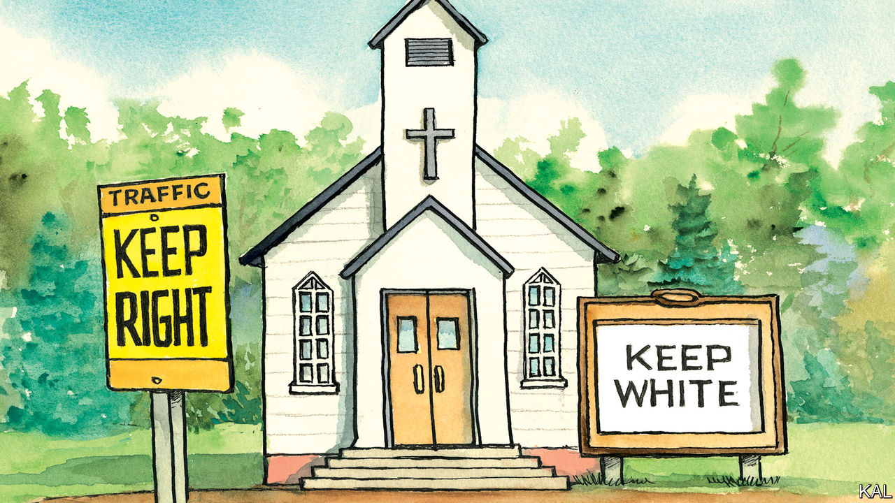

## Lexington

# The mark of Cain

> A Christian pollster argues that a reckoning is due in America’s churches

> Jul 11th 2020

FEW THINGS about Donald Trump’s rise are harder to explain than the fact that some of the most religious Americans were behind it. In 2016, 81% of white evangelicals voted for him. It seems no one was more astonished by this than those who knew him best. “He has no principles. None!” marvelled his sister Maryanne Trump Barry, according to a forthcoming family exposé by Mary L. Trump, the president’s niece.

The popular explanation for this strange nexus is that white Christians overlooked the president’s failings because of his willingness to fight their corner, by nominating conservative judges and opposing abortion. This always seemed about as persuasive as the comparisons between Mr Trump and the flawed biblical heroes it gave rise to (…Cyrus, David, you name it). Mr Trump’s Republican opponents would have nominated similar judges; no president can do much about abortion. Another explanation, argues a new book by Robert P. Jones, an authority on American religion and politics, and head of the Public Religion Research Institute, is that white Christians were especially receptive to Mr Trump’s race-baiting. Mr Jones also offers a grim theory for why this was the case.

Melding history, theology, statistical modelling and his own experience, as a Southern Baptist seminarian, Mr Jones suggests in “White Too Long” that white Christian traditions are so steeped in historic racism that “the norms of white supremacy have become deeply and broadly integrated into white Christian identity.” That will not be obvious to most of America’s white Christians (a group Lexington worships among and is sympathetic to). They probably condemn racism. Mr Jones finds white evangelicals especially likely to express goodwill to African-Americans. But dig into their unconscious biases, he claims, and you see a different picture emerge. “In survey after survey” white Christians are much likelier than non-religious whites to express negative attitudes towards minorities and complacency about the rough treatment of African-Americans, among other indicators of racism. Asked whether police killings of black men were isolated incidents, 71% of white evangelicals said they were, compared with 38% of non-religious whites.

This is a finding to which two qualifiers are often added. First, white evangelicals are likely to be old, conservative and live in the South—characteristics that point to unreconstructed views on race independently of religion. Second, while people who simply identify as white evangelicals might hold such views, the most pious do not. Mr Jones is unconvinced by either qualifier. He controls for age, partisanship and geography in his model—and finds the same pattern. And he finds that practising evangelicals score the highest on his index of racism. He concludes that white Christian identity is “independently predictive” of racist attitudes.

Such claims are shocking. But, Mr Jones argues, the history of American Christianity makes this likelier than it might sound. The dominant southern strains of white evangelicalism were formed amid and sometimes in response to slavery. The Southern Baptists, America’s biggest denomination, was launched to defend it biblically—which it did by representing black skin as the accursed “mark of Cain”. Many southern pastors were cheerleaders for the Confederacy, then shaped the culture of nostalgia and lament (the “religion of the lost cause”) that precluded a reckoning with Jim Crow’s legacy. The stained-glass windows of some southern churches still sparkle with Confederate flags. Almost 90% of white evangelicals consider the flag “more a symbol of southern pride than of racism”.

Post-war pessimism also led evangelicals to adopt a premillennialist theology, which viewed the world as irredeemable by man. Instead of wasting their time on social justice, it urged them to focus on their individual spirituality. The perverse effect, argues Mr Jones, was to imbue white evangelicals with “an unassailable sense of religious purity” that blinded them to their own behaviour. History records instances of white congregations pouring out of church to a lynching. And such scenes were not restricted to evangelicals or the South.

As African-Americans fled north, mainstream protestants and Catholics increasingly adopted the mores of southern evangelicals. The moral majority of the 1970s and 80s, fuelled by a Catholic aversion to abortion and common fears of the civil-rights movement, was the culmination of this fusion. Mr Jones’s model suggests the same racial attitudes are common to most white Christian traditions. Evangelicals are merely the most extreme case.

This is a bleak analysis. Perhaps the least that can be said for it is that Mr Trump, now tripling down on race-baiting, knows his base. So long as he can keep his white Christian voters happy, he has a chance, and harping on race looks like his likeliest means to do so.

If Mr Jones is right, a bigger question is whether churches can reckon with the bigotry the Trump era has brought to the fore. This will take more than a symbolic statement of guilt and desire for reconciliation. Most churches, to their credit, have been doing that sort of thing for decades. Mr Jones quotes a Baptist pastor in Georgia who is trying to go further as saying that the word “reconciliation” betrays a “desire to just kind of move through all the hard stuff.”

For him and his flock, the hard stuff involves trying to build a community with the black congregation next door, whose ancestors their ancestors owned. It might also mean revisiting the individualistic theology many traditions still adhere to. It could involve restitution—as slave-built Virginia Theological Seminary demonstrated, by launching a $1.7m fund for black seminarians.

This troubling past was always the real mark of Cain, Mr Jones writes. And “today God’s anguished questions—‘Where is your brother?’ and ‘What have you done?’—still hang in the air like morning mist on the Mississippi River.”■

Correction (July 12th 2020): A previous version of this article incorrectly named Virginia Theological Seminary. Sorry.

## URL

https://www.economist.com/united-states/2020/07/11/the-mark-of-cain
