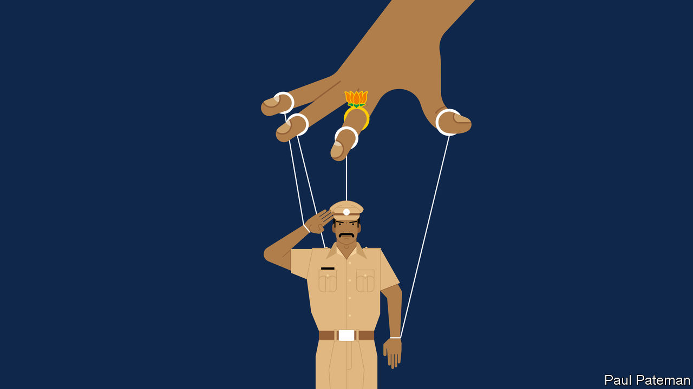

## Banyan

# India’s home minister is an unlikely champion of police reform

> Amit Shah seems more interested in keeping power than tempering it

> Jul 18th 2020

INDIA’S POLICE are generally better known for spit than polish. Yet even for a public inured to police violence, a slew of recent scandals has proved shocking. To punish a low-caste shopkeeper for staying open a few minutes after a local covid-19 curfew, for instance, officers in the southern state of Tamil Nadu spent a night torturing him and his son to death, in part by jamming nightsticks up the son’s anus. Far to the north in Uttar Pradesh a few days later, police “encountered” a local gang boss, which is to say, riddled him with bullets when he supposedly tried to escape from custody.

Such extra-judicial murders are common, and celebrated by some as rightful vengeance. This one stood out because the dead man’s gang had just killed eight cops on a bungled stake-out, following which five other members of his gang were “encountered” in rapid succession. But it also stood out for the sheer predictability of the gangster’s demise, mere hours after he had peacefully turned himself in, and for the brazen fakery of his “escape”.

In a Delhi courtroom, meanwhile, police have just as shamelessly been insisting they can find no proof that police or ruling-party politicians played any role in an ugly pogrom that shook the national capital in February. Disregarding copious video footage as well as the fact that most of the 53 who died were Muslim, investigators have instead invented a conspiracy by Muslim radicals and left-wing students.

In a tidier democracy, any one of these things might have cost the job not only of local police chiefs, but of their bosses’ bosses. Yet despite much talk about the need for a better police force, hardly a squeak has been uttered against the man who is ostensibly responsible for internal security, the home minister. This is not just because, though it exercises powerful influence, the central government does not control local forces in every state. The current minister, Amit Shah, also happens to be the closest and longest-standing lieutenant of Narendra Modi, the most powerful prime minister in a generation. Mr Shah is accomplished in his own right, too. As the top field commander of the Bharatiya Janata Party (BJP), he has won victory after victory in campaign after campaign. More than once he has even pulled victory from electoral defeat, luring opponents to defect just when rival parties thought they had won.

But if the silence surrounding Mr Shah reflects admiration, it also reflects fear. Before arriving in Delhi following the BJP’s triumph in national elections in 2014, Mr Shah had served, among other things, as Mr Modi’s home minister in BJP-ruled Gujarat. This was a time during which the state experienced bloody communal riots, as well as a rash of controversial police “encounters” of alleged Islamist terrorists. A number of officers who had saved Muslim lives during the worst violence in 2002 were transferred to lesser posts. Accused of complicity in one of the encounter killings, Mr Shah even spent a few months in prison himself before being (controversially) exonerated; several of the officers he commanded spent years behind bars and blamed him for hanging them out to dry.

That unpleasant experience seems to have strengthened the future minister’s resolve. Since arriving in Delhi, and particularly since his appointment as home minister last year, the tireless Mr Shah has been seen as the hidden hand turning virtually every agency of the state into a tool for keeping the government’s opponents in check. There is nothing new about the constitutionally questionable use of tax raids, or corruption probes, or claims of improper use of state property, or wielding of anti-terror laws, or myriad other pokes and prods of government authority for political ends. What is new is that it has become systematic and relentless. The police, it seems, are merely the most blunt of these instruments, and perhaps also the most malleable.

Whatever the need for police reform, then, it is unlikely to come from the home minister’s office. In a recent newspaper column Julio Ribeiro, former chief of police in both Gujarat and Mumbai, expressed dismay about the state of the force. “I know how dangerous it is for a straightforward police officer to oppose Shah’s diktats unless he is made of superior stuff, a rare occurrence today!” Or as a retired senior police officer recently lamented in a tweet, “It is so painful to see my service having become so subservient to vested, partisan interests that they are subverting the very foundations of our democracy.”