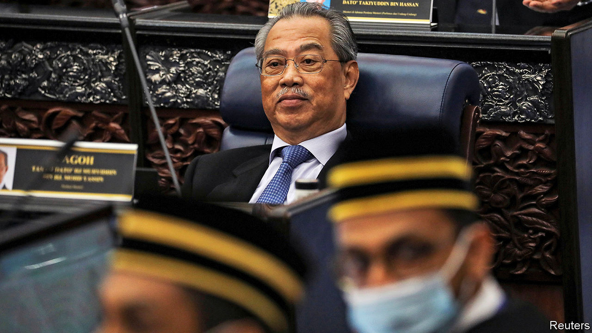

## A 70-minister mandate

# Malaysia’s government cobbles together a parliamentary majority

> But it is unlikely to last

> Jul 18th 2020

IT CAME DOWN to just two votes. On July 13th Malaysia’s prime minister, Muhyiddin Yassin, finally secured a parliamentary majority—more than four months after taking the top job. His coalition, Perikatan Nasional, plus an assortment of informal allies from the Malaysian part of Borneo, notched up 111 votes in favour of changing the speaker of the lower house; 109 opposed the move. Two more MPs on the government’s side couldn’t vote: one was absent and the other was presiding over the contest. The appointment of the new speaker means that a no-confidence motion, filed in May by the previous prime minister, Mahathir Mohamad, is unlikely to be debated.

Mr Muhyiddin’s reprieve is only likely to be temporary, however. He came to power by splitting Bersatu, the Malay nationalist party to which he and Dr Mahathir belong, as well as another party in Dr Mahathir’s coalition. The rebels joined forces with the United Malays National Organisation (UMNO), a much bigger Malay nationalist party booted from office after 61 years at the most recent election, in 2018. They also roped PAS, an Islamic outfit, into Perikatan Nasional. This messy process, and Mr Muhyiddin’s decision to keep parliament closed from March until now—save for a single day in May—cast a pall over the government’s legitimacy.

Mr Muhyiddin (pictured) used the period that Parliament was out of action to shore up his support within it. He created one of Malaysia’s largest-ever governments, with 70 ministers and deputy ministers. Other MPs snagged posts at government-linked companies.

Critics charge that Mr Muhyiddin’s government has also secured UMNO’s support by easing up on investigations of its leaders—a claim it denies. Musa Aman, a former chief minister of the state of Sabah, on Borneo, faced almost four dozen charges related to timber concessions, including corruption and money-laundering. Last month prosecutors withdrew all charges, citing a dearth of evidence. The prosecution of Najib Razak, a former UMNO prime minister and one of the government’s 111 votes, continues. Verdicts are expected soon on seven of the 40-odd charges against him, tied to a scandal at 1MDB, a state investment vehicle. America’s Department of Justice says some $4.5bn was siphoned out of the fund between 2009 and 2015.

“A narrow majority doesn’t give confidence that the government can stand for anyone, any side,” says Ibrahim Suffian, a pollster. Bersatu was founded as an alternative to UMNO for Malays, Malaysia’s biggest ethnic group. Now the two parties are aligned, Bersatu will struggle to differentiate itself from UMNO in voters’ eyes. UMNO, by contrast, is less afraid of an election, on the assumption that the bickering and back-stabbing of the past two years will have made at least some voters regret their decision to eject it from office. That gives it enormous leverage and makes the government inherently unstable. “If this situation persists,” says Mr Ibrahim, “then it makes an election more likely than not.” ■

## URL

https://www.economist.com/asia/2020/07/18/malaysias-government-cobbles-together-a-parliamentary-majority
