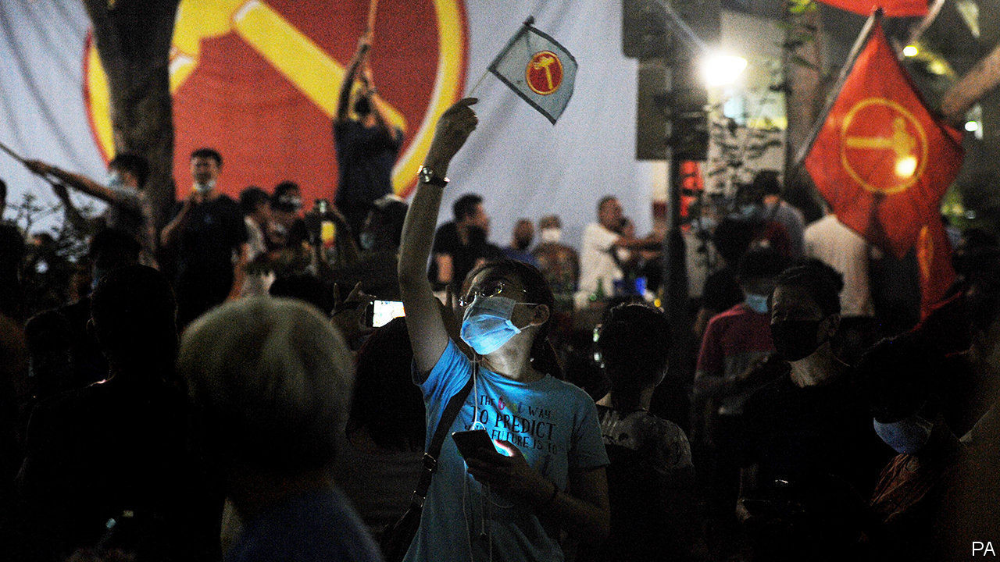

## Gluttons for punishment

# Why so many Singaporeans voted for the opposition

> Though not enough to boot out the ruling party

> Jul 18th 2020SINGAPORE

IN THE WEE hours after Singapore’s election on July 10th hundreds of supporters of the Workers’ Party (WP), the main opposition outfit, streamed onto the streets to celebrate, in defiance of the city-state’s strict social-distancing rules. One would have been forgiven for thinking that the WP had won the election. In fact it took a trifling ten seats out of 93. But in Singapore, which has been ruled by the People’s Action Party (PAP) since independence in 1965, this was the best performance by an opposition party ever in terms of seats won, and the worst by the PAP. The ruling party’s share of the vote sank from almost 70% at the previous election, in 2015, to 61%.

The greatest embarrassment of the night befell Heng Swee Keat, the anointed successor to the current prime minister, Lee Hsien Loong, who has said he will retire by his 70th birthday, in early 2022. The PAP slate headed by Mr Heng won its multi-member “group representation constituency” (GRC) with just 53% of the vote. Because he is the leader of the generation of PAP officials poised to take charge, who have been managing the response to covid-19, the result augurs badly for the party. Voters may have been expressing alarm at forecasts that the economy will shrink by 4-7% this year. At any rate, they did not appear grateful for stimulus packages worth almost 20% of GDP that Mr Heng, as finance minister, shepherded through Parliament.

Voters also seemed unmoved by the PAP’s system of carrots and sticks regarding public amenities. In 2006 Goh Chok Tong, a former prime minister, promised to spend S$100m ($63m at the time) sprucing up public housing in Hougang, in the north-east, if residents re-elected the PAP candidate. If they didn’t, he warned, their area would become a “slum”. By the same token, between 2009 and 2011, when the town council of a neighbourhood called Aljunied was in PAP hands, it got S$12m from CIPC, a government panel that hands out grants, says Pritam Singh, a WP MP. Between 2012 and 2018, when his party ran Aljunied, it received just S$680,000. This time would-be MPs promised to improve lifts in housing estates and to boost the internet—although the government also says it no longer favours PAP districts for housing upgrades.

In districts that spurn the PAP, the failed candidate nonetheless presides over naturalisation ceremonies, cuts the ribbon at new libraries and hosts “Meet the People” sessions, which in other constituencies would normally be a chance for residents to petition their MP for help. This is because in opposition districts the losing PAP candidate is invariably appointed a “grassroots adviser” by the People’s Association (PA), a body chaired by the prime minister. It is a position that comes with much responsibility; winning PAP candidates are appointed to it too. These advisers run residents’ committees, community clubs and, in opposition wards, decide whether MPs’ proposals for a new playground or jogging track merit consideration by the CIPC. Deen, a shopkeeper in Aljunied, likes Mr Singh, his MP, who often drops by for a chat. But for any sort of practical assistance, he says, “I go talk to the PAP.”

So why do Singaporeans bother to vote for the opposition? Although this week’s tally was especially high, about a third of the electorate has rejected the PAP at every election for decades. Most Singaporeans believe in checks and balances, says Eugene Tan, a law professor and former independent MP. Many voters view the PAP as arrogant and elitist, and complain about immigration, public housing and the cost of living, notes Netina Tan of McMaster University in Canada.

The WP, the ablest opposition outfit, has seized on such grievances. In 2011 it won Aljunied from the PAP—the first GRC ever to plump for the opposition. It was more than a protest vote. Residents felt that the incumbent PAP MPs “weren’t there for them,” says Chong Ja Ian of National University of Singapore. Low Thia Khiang, then the WP’s leader, put in the hours, attending funerals and weddings, and charming the area’s many ethnic Teochew Chinese by speaking to them in their native tongue. In 2015 the WP clung to the seat by a hair.

This time pundits thought that voters, worried by covid-19, might cleave more faithfully than normal to the devil they know. Aljunied’s fate was uncertain. Mr Low had retired. Mr Singh, his successor, although assiduous, does not speak Teochew. Yet the WP won Aljunied with 60% of the vote. It also held on to Hougang, a single-member seat and the WP’s first stronghold, with 61%. And it won a new GRC, Sengkang, with 52%.

The WP has managed to avoid the acrimonious in-fighting that has bedevilled other opposition parties undergoing a transition in leadership, notes Hoe Yeong Loke, author of “The First Wave”, a history of Singaporean opposition parties. The WP also proudly portrays its voters as “torchbearers of democracy in Singapore”, says Gillian Koh of the Institute of Policy Studies. The residents of Aljunied and Hougang wear their support for the WP as a “badge of honour”, says Eugene Tan. That kind of loyalty, he reckons, cannot be easily bought. ■