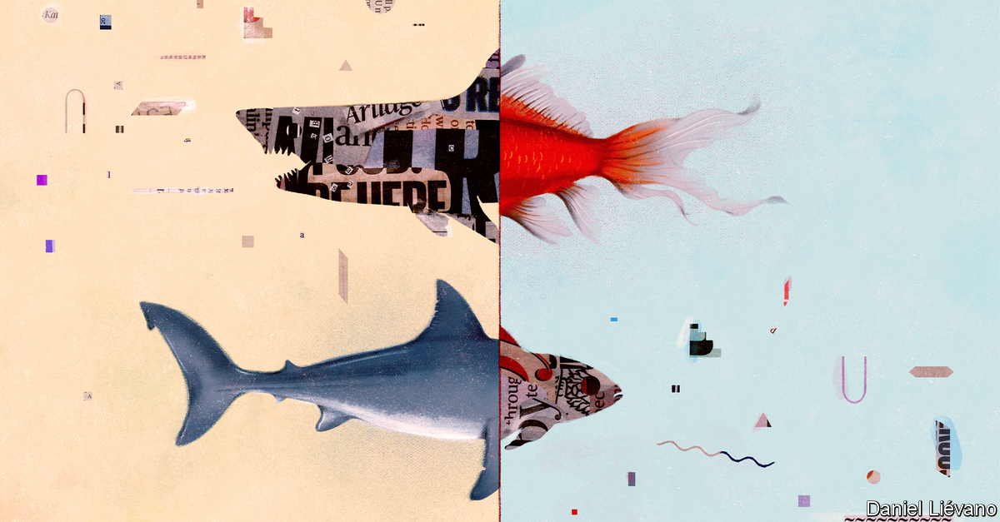
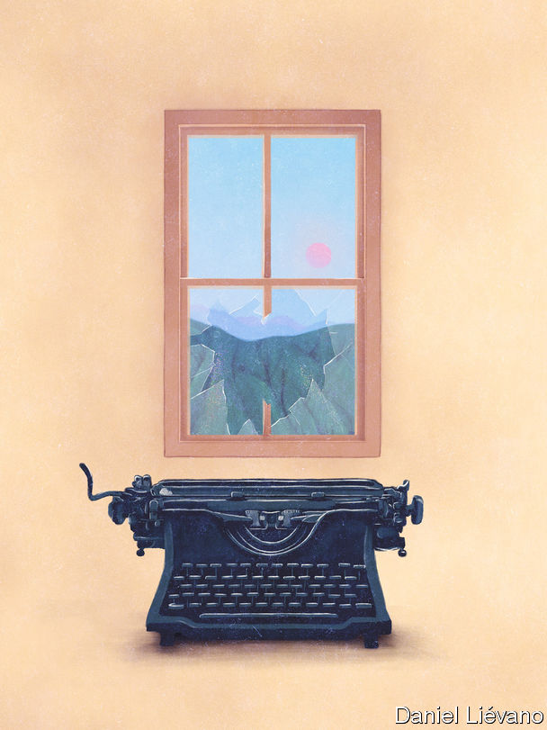

## Invisible men

# How objectivity in journalism became a matter of opinion

> In America, political and commercial strains have led to questions about its value and meaning

> Jul 16th 2020

HAVE YOU heard the news? It’s about the news. As correspondents covered the widespread protests on the streets of America in recent months, many were engaged in a parallel protest of their own—against their employers. On private Slack channels, public Twitter feeds and in op-ed columns, journalists revolted. Editors apologised, promised change and in some cases were sacked, their downfall promptly written up in their own papers.

The immediate cause of this rebellion is race: how it is reported and how it is represented among staff. More than 150 Wall Street Journal employees signed a letter saying that they “find the way we cover race to be problematic”. Over 500 at the Washington Post endorsed demands for “combating racism and discrimination” at the paper. Journalists at the New York Times tweeted that a senator’s op-ed advocating a show of military force to restore order “puts black @nytimes staff in danger”.

But at the heart of many of these arguments is another disagreement, about the nature and purpose of journalism. As a Bloomberg employee is said to have remarked at a recent meeting, reporters are meant to be objective, but to many the distinction between right and wrong now seems obvious. A new generation of journalists is questioning whether, in a hyper-partisan, digital world, objectivity is even desirable. “American view-from-nowhere, ‘objectivity’-obsessed, both-sides journalism is a failed experiment,” tweeted Wesley Lowery, a Pulitzer-winning 30-year-old now at CBS News. The dean of Columbia Journalism School described objectivity as an “inherited shibboleth” in a message to students. The Columbia Journalism Review pondered: “What comes after we get rid of objectivity in journalism?”

Objectivity hasn’t always been a journalistic ideal. Early American newspapers read a bit like today’s blogs, says Tom Rosenstiel of the American Press Institute (API), an industry group. Benjamin Franklin’s Pennsylvania Gazette and Alexander Hamilton’s Gazette of the United States were unashamedly partisan. As they sought wider audiences in the 19th century, newspapers became more concerned with what they called “realism”. Some of this was provided by the Associated Press (AP), founded in 1846, which supplied stories to papers of diverse political leanings and so stuck to the facts. As the news pages became more even-handed, publishers established editorial pages, on which they could continue to back their favoured politicians.

Only in the 1920s did objectivity truly gain currency. “A Test of the News”, by Walter Lippmann and Charles Merz, found that the New York Times’ coverage of the Russian revolution was rife with what today might be called unconscious bias. “In the large, the news about Russia is a case of seeing not what was, but what men wished to see,” they wrote. At the same time, as communism advanced, Joseph Pulitzer’s view of the centrality of journalism to democracy—“Our Republic and its press will rise or fall together”—gained adherents. These lofty aims overlapped with commercial ones. Advertisers wanted less partisan coverage to sit alongside their messages.

And so objectivity became journalism’s new lodestar. As Lippmann put it, the journalist should “remain clear and free of his irrational, his unexamined, his unacknowledged prejudgments in observing, understanding and presenting the news.”

A century later, four trends have put this principle under strain. (The Economist, a British publication, has grappled with most of them.) One is Donald Trump’s rise and the challenges it has posed to traditional reporting. Some of his statements can be accurately described as lies, or as racist. But such words are so seldom used of sitting presidents—except by partisans—that writers and editors have reached for euphemisms. After Mr Trump told four non-white congresswomen to “go back” to the “crime-infested places from which they came”, the Wall Street Journal called his words “racially charged”; the Times plumped for “racially infused”.

The Trump era has also exposed problems with journalistic notions of balance. Giving equal weight to both sides of an argument is an easy shortcut to appearing objective. Yet this “bothsidesism” has sometimes come to seem misleading. At an impeachment hearing in December, “the lawmakers from the two parties could not even agree on a basic set of facts in front of them,” reported the Times. Which facts were real? Readers were left to guess.

A second cause of doubts about objectivity is the changing make-up of the American newsroom. Amid more diverse recruitment, the share of the Times’ editorial staff who are white is falling; the proportion who are women is rising. Not only has this sharpened sensitivity to odd phrases like “racially infused”; it has also made some wonder if the “objective” viewpoint is in fact a white, male one. The “view from nowhere” is just the view of “a white guy who doesn’t even exist”, Dan Froomkin, an outspoken media critic, has argued.

Concerns like these might in the past have remained on the shop floor. But a third factor—the rise of social media—has given dissenters a megaphone. It has also highlighted the contrast between the detached style journalists are meant to adopt in print and the personal approach many employ online—something bosses seem unsure whether to encourage or deter. Readers, for their part, are bathed on the web in highly partisan content that whets their appetite for more opinionated news. The division between news and comment, clear on paper in American journalism, dissolves on the internet. A study for the API in 2018 found that 75% of Americans could easily tell news from opinion in their favoured outlet, but only 43% could on Twitter or Facebook.

The final reason for the turn against objectivity is commercial. The shift away from partisanship a century ago was driven partly by advertisers. Today, as ad revenues leak away to search engines and social networks, newspapers have come to rely more on paying readers. Unlike advertisers, readers love opinion. Moreover, digital publication means American papers no longer compete regionally, but nationally. “The local business model was predicated on dominating coverage of a certain place; the national business model is about securing the loyalties of a certain kind of person,” wrote Ezra Klein of Vox. Left-leaning New Yorkers may switch to the Washington Post if the Times upsets them. The incentive to keep readers happy—and the penalty for failing—are greater than ever.

These pressures are changing the way newspapers report. Last year AP’s style book declared: “Do not use racially charged or similar terms as euphemisms for racist or racism when the latter terms are truly applicable.” Some organisations have embraced, even emblazoned taboo words: “A Fascist Trump Rally In Greenville” ran a headline last year in the Huffington Post. Others are inserting more value judgments into their copy. A front-page news piece in the Times this month began:

Disenchanted with objectivity, some journalists have alighted on a new ideal: “moral clarity”. The phrase, initially popularised on the right, has been adopted by those who want newspapers to make clearer calls on matters such as racism. Mr Lowery repeatedly used the phrase in a recent Times op-ed, in which he called for the industry “to abandon the appearance of objectivity as the aspirational journalistic standard, and for reporters instead to focus on being fair and telling the truth, as best as one can, based on the given context and available facts.” The editor of the Times, Dean Baquet, called Mr Lowery’s column “terrific” in an interview with the “Longform” podcast. Objectivity has been “turned into a cartoon”, he said. Better to aim for values such as fairness, independence and empathy.

Back in the 1920s, Lippmann might have agreed with much of this. He saw objectivity not as a magical state of mind or a view from nowhere, but as a practical process. Journalism should aim for “a common intellectual method and a common area of valid fact”, he wrote. That does not mean using euphemisms in place of plain language, or parroting both sides of an argument without testing them. Indeed, when journalism has erred in recent years, it has often done so by misinterpreting objectivity, rather than upholding it. The most persuasive calls for moral clarity today articulate something close to Lippmann’s original conception of objectivity.

The danger is that advocates of moral clarity slide self-righteously towards crude subjectivity. This week Bari Weiss, a Times editor, resigned, criticising what she said was the new consensus at the paper: “that truth isn’t a process of collective discovery, but an orthodoxy already known to an enlightened few whose job is to inform everyone else.” Earlier Mr Rosenstiel warned, in a largely supportive response to Mr Lowery’s column, that “if journalists replace a flawed understanding of objectivity by taking refuge in subjectivity and think their opinions have more moral integrity than genuine inquiry, journalism will be lost.”

As reporters learn more about a subject, he adds, the truth tends to become less clear, not more so. Recognising and embracing the uncertainty means being humble—but not timid. ■