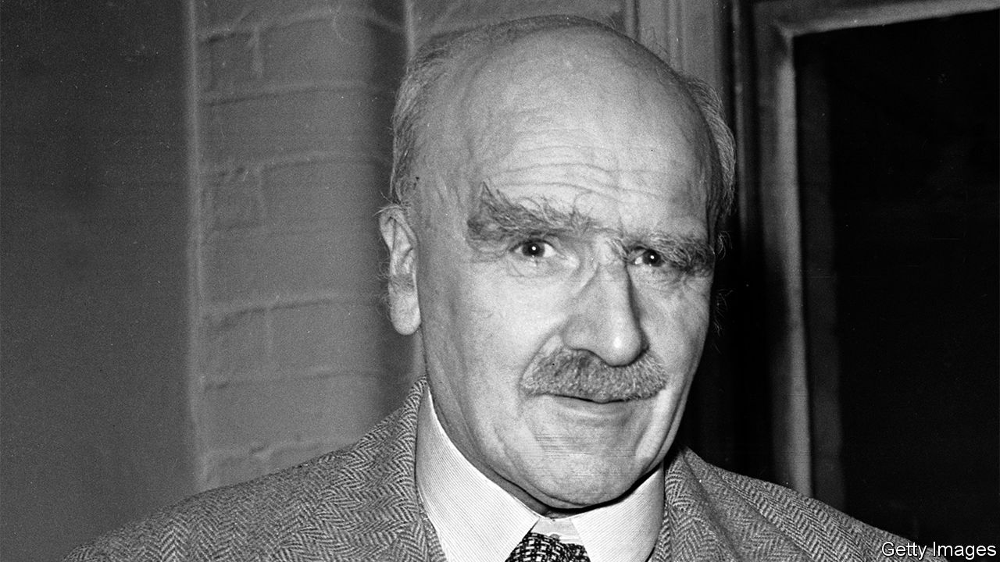

## Trial and error

# The flawed brilliance of J.B.S. Haldane

> The biologist knew that science and politics could never be separated

> Jul 18th 2020

A Dominant Character: The Radical Science and Restless Politics of J.B.S. Haldane. By Samanth Subramanian. W.W. Norton; 400 pages; $40. Atlantic Books; £20.

TOWARDS THE end of his life, J.B.S. Haldane was inseparable from a pebble that had been found in the Valley of Elah in Israel, where David felled Goliath with a similar projectile. A king-size man who towered over British biology for several decades in the middle of the 20th century, Jack Haldane—the “half-Dane”—was a more obvious Goliath, but he always took the side of the underdog.

That is the contradiction at the heart of Samanth Subramanian’s astute and sympathetic biography. An Eton- and Oxford-educated communist, who with a handful of others fleshed out Darwin’s theory of natural selection by marrying it to genetics and grounding it in maths, Haldane was born into privilege but came to identify himself with the masses. And if his unconscious sense of entitlement can sometimes be grating, it is more than offset by his humour, facility for language, intellectual generosity and—the product of all this—his giant contribution to the popularisation of science.

Science was his first and most enduring love. Aged three, studying blood trickling from a cut, he is supposed to have asked, “Is it oxyhaemoglobin or carboxyhaemoglobin?” Thus began a life of inquiry in which he was always either being experimented on—notably by his father, the physiologist J.S. Haldane—or experimenting on himself or others. Bertrand Russell thought that science could rarely be beautiful, but for Haldane beauty came through understanding. “Until I took to scientific plant-breeding”, he wrote, “I did not appreciate the beauty of flowers.”

Haldane wrote a great deal, in learned journals but also in the popular press and in response to letters from the scientifically curious, and on a breathtaking range of subjects. “Please send me no more caterpillars,” he pleaded on one of the many occasions that his mailbag threatened to overwhelm him. As he coped with his own and other people’s inquisitiveness, world events intruded. He wrote parts of a paper on genetic linkage—whereby two genes that sit close to each other on a chromosome are more likely to be inherited together—while serving in the trenches during the first world war.

It was in the trenches, too, that Haldane’s rejection of his birthright crystallised. As disappointed by the officer class as he was by army chaplains, he wrote to his mother that, when the revolution came, the people would “strangle the last Duke in the guts of the last parson”. But he was attracted to Marxism for more than just its egalitarian ideals; it struck him as practical, transparent—in short, scientific. Though he kept his distance from the Communist Party of Great Britain (CPGB) until 1942, MI5 had him down as a subversive from the time of his only visit to the Soviet Union, in 1928.

Haldane’s politics and his science clashed mightily in 1948, when as the CPGB’s foremost intellectual—and, by then, one of the most influential geneticists in the world—he refused to publicly condemn the pseudoscience of Trofim Lysenko. Stalin’s favourite agronomist claimed that he could drum desirable traits into wheat by altering its environment, just as Jean-Baptiste Lamarck had once believed giraffes had stretched their necks through practice. In the Soviet Union scientists who disagreed with Lysenko vanished. One of them, Nikolai Vavilov, had hosted Haldane in Moscow. Haldane’s own science contradicted Lysenkoism. Nobody who knew him could fathom his stance.

Mr Subramanian doesn’t defend it either. He makes it clear that Haldane ignored overwhelming evidence of Vavilov’s internment and death in the gulag. But he uses the episode to illustrate a wider truth, which is that science cannot be extricated from politics. Today many scientists describe their research as apolitical, but Haldane knew that was impossible: “I began to realise that even if the professors leave politics alone, politics won’t leave the professors alone.”

It meant that he was prepared to change his mind. Eugenics was a mainstream theory when he entered biology, and he partially embraced it. But he also warned that genetics was too young a science to be applied successfully. His ideas evolved until they fell into line with those of the scientists now wielding genetic-engineering tools to improve humanity (though they would reject the eugenics label).

Haldane changed his mind too slowly about the Soviet Union, but having done so he found new hope in India, where he moved in 1957. Its bureaucracy maddened him and he said so loudly and often—flashing his white male privilege like a peacock’s tail—but its tropical profusion provided him with a natural laboratory, and the climate was kinder to a body damaged by decades of self-experiment. When he died there in 1964, still holding the stone from Elah, it was no surprise to anyone that he donated his body to science. ■